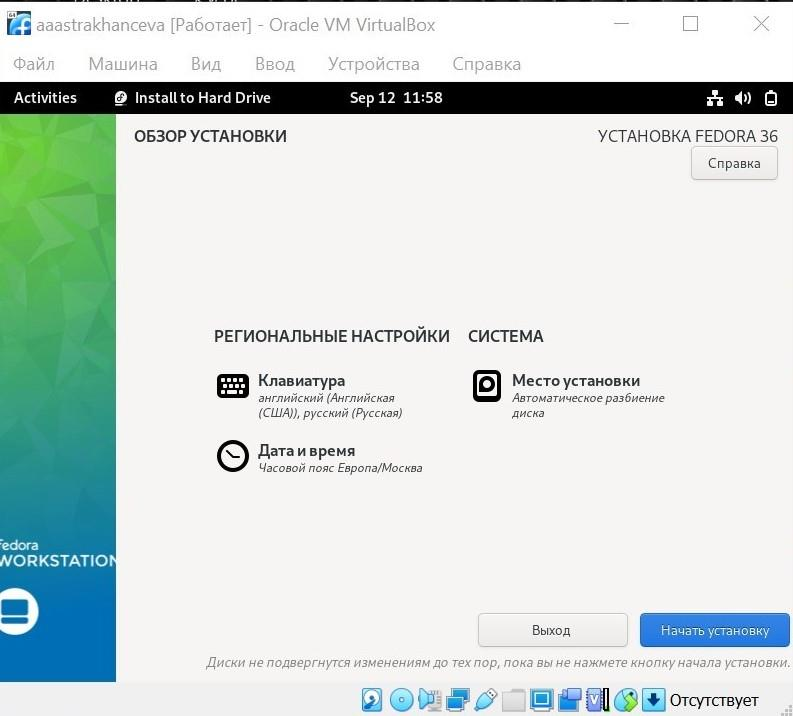

---
## Front matter
title: "Отчет по лабораторной работе №1"
subtitle: "Дисциплина: Операционные системы"
author: "Астраханцева Анастасия Александровна"

## Generic otions
lang: ru-RU
toc-title: "Содержание"

## Bibliography
bibliography: bib/cite.bib
csl: pandoc/csl/gost-r-7-0-5-2008-numeric.csl

## Pdf output format
toc: true # Table of contents
toc-depth: 2
lof: true # List of figures

fontsize: 12pt
linestretch: 1.5
papersize: a4
documentclass: scrreprt
## I18n polyglossia
polyglossia-lang:
  name: russian
  options:
	- spelling=modern
	- babelshorthands=true
polyglossia-otherlangs:
  name: english
## I18n babel
babel-lang: russian
babel-otherlangs: english
## Fonts
mainfont: PT Serif
romanfont: PT Serif
sansfont: PT Sans
monofont: PT Mono
mainfontoptions: Ligatures=TeX
romanfontoptions: Ligatures=TeX
sansfontoptions: Ligatures=TeX,Scale=MatchLowercase
monofontoptions: Scale=MatchLowercase,Scale=0.9
## Biblatex
biblatex: true
biblio-style: "gost-numeric"
biblatexoptions:
  - parentracker=true
  - backend=biber
  - hyperref=auto
  - language=auto
  - autolang=other*
  - citestyle=gost-numeric
## Pandoc-crossref LaTeX customization
figureTitle: "Рис."

listingTitle: "Листинг"
lofTitle: "Список иллюстраций"
lotTitle: "Список таблиц"
lolTitle: "Листинги"
## Misc options
indent: true
header-includes:
  - \usepackage{indentfirst}
  - \usepackage{float} # keep figures where there are in the text
  - \floatplacement{figure}{H} # keep figures where there are in the text
---

# Цель работы

Целью данной работы является приобретение практических навыков установки
виртуальной машины и операционной системы, настройки минимально необходимых
для дальнейшей работы сервисов.

# Задание

1. Установка и создание виртуальной машины.
2. Установка ОС на данную виртуальную машину.
3. Установка необходимого ПО для дальнейшей работы

# Теоретическое введение

3.1. Операционная система - комплекс программ, обеспечивающий управление
аппаратными средствами компьютера, организующий работу с файлами и выполнение
прикладных программ, осуществляющий ввод и вывод данных.
3.2 Linux — это семейство операционных систем (ОС), работающих на основе
одноименного ядра.
3.3 Дистрибутив (англ. distribute - распространять) — это форма распространения
программного обеспечения.

# Выполнение лабораторной работы

Для начала необходимо установить виртуальную машину VirtualBox на персональный
компьютер (рис. @fig:001).

{#fig:001 width=70%}

Запускаю приложение. Для начала нужно проверить в свойствах VirtualBox
месторасположение каталога для виртуальных машин (рис. @fig:002).

{#fig:002 width=70%}

Создаю новую машину. Указываю имя и тип ОС. Указываю имя в соответствии с
соглашением об именовании. Тип и версия - Linux, Fedora (рис. @fig:003).

{#fig:003 width=70%}

Указываю объем памяти. Он должен быть 4096 МБ (рис. @fig:004).

{#fig:004 width=70%}

Далее необходимо выбрать “Создать новый виртуальный жесткий диск (рис. @fig:005).

{#fig:005 width=70%}

Указываю тип файла (рис. @fig:006).

{#fig:006 width=70%}

Указываю формат храниения (рис. @fig:007)

{#fig:007 width=70%}

В настройках виртуальной машины во вкладке “Дисплей” >> “Экран” следует увеличить
доступный объем видеопамяти до 128 МБ.(рис 4.9.) В настройках виртуальной машины
во вкладке “Носители” добавить новый привод оптических дисков и выбрать образ.

Далее указываю имя, размер файла (рис. @fig:008).

{#fig:008 width=70%}

Вот так выглядит машина. Запускаю ее (рис. @fig:009). 

{#fig:009 width=70%}

После загрузки с виртуального оптического диска можно увидеть окно с двумя вариантами.
Нужно выбрать “Install to Hard Drive” (рис. @fig:010)

{#fig:010 width=70%}

Корректирую часовой пояс, раскладку клавиатуры (рекомендуется в качестве языка по
умолчанию указать английский язык). Место установки ОС оставляю без изменения. Последовательно проверяю настройки даты и времени, клавиатуры и места установки (рис. @fig:011-@fig:015)

{#fig:011 width=70%}

{#fig:012 width=70%}

{#fig:013 width=70%}

{#fig:014 width=70%}

{#fig:015 width=70%}

После установки всех настроек можно продолжить установку(рис. @fig:016).

{#fig:016 width=70%}

После окончания установки следует закрыть окно установщика и выключить систему (рис. @fig:017).

{#fig:017 width=70%}

После того, как виртуальная машина отключится, я изъяла образ диска из дисковода. После извлечения в дисководе должно быть пусто (рис. @fig:018 -@fig:019).

{#fig:018 width=70%}

{#fig:019 width=70%}

Далее выполним установку необходимого для дальнейшей работы ПО (рис. @fig:020 - @fig:021)

{#fig:020 width=70%}

{#fig:021 width=70%}

**Задания после установки**
Переходим в режим супер-пользователя и обновляем все пакеты (рис. @fig:022).

{#fig:022 width=70%}

Установка программы для удобства работы в консоли (у меня уже была установлена) (рис. @fig:023).

{#fig:023 width=70%}

Запуск автоматического обновления (рис. @fig:024).

{#fig:024 width=70%}

Запускаем таймер (рис. @fig:025).

{#fig:025 width=70%}

Далее необходимо отключить SELinux для этого правим файл `/etc/selinux/config` (рис. @fig:026).

{#fig:026 width=70%}

После этого перезагружаем виртуальную машину (рис. @fig:027).

{#fig:027 width=70%}

Далее устанавливаем пакет DKMS и вновь перезагружаем машину с помощью команды `reboot` (рис. @fig:028).

{#fig:028 width=70%}

осле этого настраиваем раскладку клавиатуры: переключаемся в режим супер-пользователя, редактируем конфигурационный файл 
`/etc/X11/xorg.conf.d/00-keyboard.conf` . После этого вновь перезагружаем виртуалтную машину (рис. @fig:029)

{#fig:029 width=70%}

Устанавливаем имя хоста и проверяем, что все выполнено верно (рис. @fig:030) 

{#fig:030 width=70%}

**Домашнее задание**

Получите следующую информацию:
1. Версия ядра Linux (Linux version) (рис. @fig:031).

{#fig:031 width=70%}

2. Частота процессора (Detected Mhz processor) (рис. @fig:032)

{#fig:032 width=70%}

3. Модель процессора (CPU0) (рис. @fig:033)

{#fig:033 width=70%}

4. Объём доступной оперативной памяти (Memory available) (рис. @fig:034)

{#fig:034 width=70%}

5. Тип обнаруженного гипервизора (Hypervisor detected) (рис. @fig:035)

{#fig:035 width=70%}

6. Тип файловой системы корневого раздела (рис. @fig:036)
У меня получился не очень хороший скриншот. Для того, чтоы вывести данную информацию я вволила команду `fdisk -l` в режиме супер-пользователя. 

{#fig:036 width=70%}

7. Последовательность монтирования файловых систем. (рис. @fig:037)

{#fig:037 width=70%}

**Контрольные вопросы**

1. Какую информацию содержит учётная запись пользователя?

Ответ: имя пользователя, пароль (зашифрован), индефикационный номер пользоваеля и инфецикационный номер группы пользоваетеля, домашний каталог пользователя, команндный интерпретатор пользователя.

2. Укажите команды терминала и приведите примеры:

Ответ: 

для получения справки по команде - man <название команды>

для перемещения по файловой системе - cd - переход в домашний каталог, cd <путь к каталогу через /> - переход к определенному каталогу

для просмотра содержимого каталога - ls

для создания каталогов - mkdir <название каталога>

для создания файлов - touch <название файла>

для удаления каталогов - rm <название каталога> 

для удаления файлов - rm -r <название файла> 

для задания определённых прав на файл / каталог - chownn <имя пользователя> <название каталога/файла>

для просмотра истории команд - history

3. Что такое файловая система? Приведите примеры с краткой характеристикой.

Файловая система (ФС) - часть операционной системы,представляющая собой совокупность организованных наборов данных,
хранящихся на внешних запоминающих устройствах и программных средств,гарантирующих именованный доступ к этим данным и их защиту. Данныеназываются файлами, их имена - именами файлов.

Ext2, Ext3, Ext4 -  является стандартом для Linux. Как следствие, это самые распространенные системы. Они редко обновляются, но зато стабильны. Ext2 создавалась специально под Linux 

JFS - Журналируемая ФС — первая альтернатива для ФС группы Ext. Ее разработали в IBM специально для операционной системы AIX UNIX. Главные плюсы этой системы: стабильность и минимальные требования для работы. 

ReiserFS - Подходит исключительно под Linux, чаще всего ее используют в качестве возможной замены Ext3. Главные особенности: увеличенная производительность и более широкие возможности.

XFS - Еще одна журналируемая ФС. Однако, в отличие от аналогов, в логи записывает исключительно те изменения, которые претерпевают метаданные. Разработана для ОС в Silicon Graphics. Важные особенности: быстро работает с файлами сравнительно большого размера, умеет выделять место в отложенном режиме, а также менять размеры разделов в процессе работы. 

Btrfs - Современная ФС, главной особенностью которой является высокая отказоустойчивость. Из дополнительных «бонусов»: удобна для сисадминов и поддерживает сравнительно простой процесс восстановления данных. 

4. Как посмотреть, какие файловые системы подмонтированы в ОС?
Ввести комнаду mount 

5. Как удалить зависший процесс?
Ввести команду kill

# Выводы

Я приобрела практические навыки установки виртуальной машины и операционной
системы, настройки минимально необходимых для дальнейшей работы сервисов.

# Список литературы{.unnumbered}

1. https://blog.skillfactory.ru/glossary/linux/
2. https://ru.wikipedia.org/wiki/%D0%9E%D0%BF%D0%B5%D1%80%D0%B0%D1%86%
D0%B8%D0%BE%D0%BD%D0%BD%D0%B0%D1%8F_%D1%81%D0%B8%D1%81%D1
%82%D0%B5%D0%BC%D0%B0
3. https://www.virtualbox.org/
