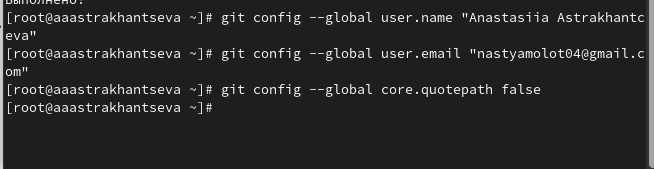
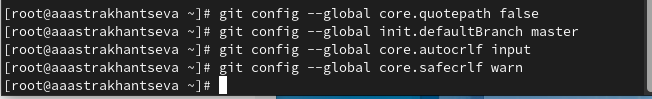
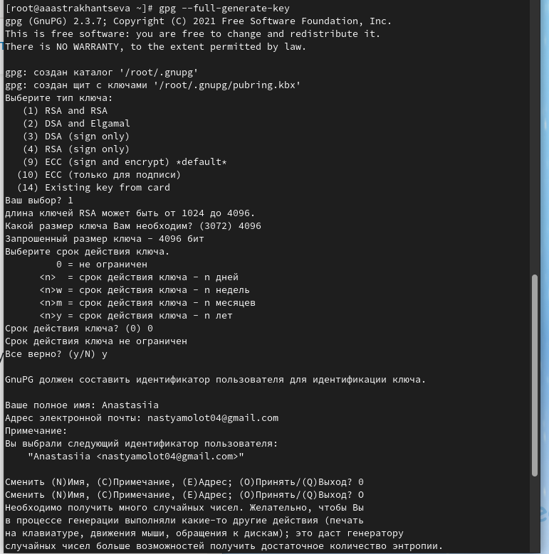
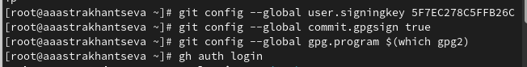
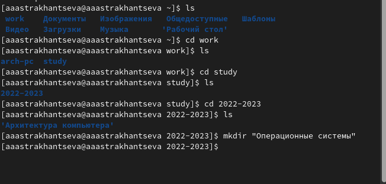
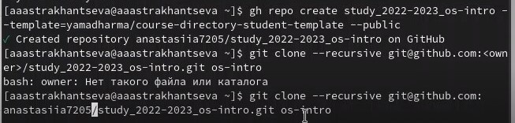

---
## Front matter
lang: ru-RU
title: "Отчет по лабораторной работе №2"
subtitle: "Дисциплина: Операционные системы"
author:
  - Студентка группы НКАбд-01-22 Астраханцева А. А.
institute:
  - Российский университет дружбы народов, Москва, Россия
date: 13 февраля 2023

## i18n babel
babel-lang: russian
babel-otherlangs: english

## Formatting pdf
toc: false
toc-title: Содержание
slide_level: 2
aspectratio: 169
section-titles: true
theme: metropolis
header-includes:
 - \metroset{progressbar=frametitle,sectionpage=progressbar,numbering=fraction}
 - '\makeatletter'
 - '\beamer@ignorenonframefalse'
 - '\makeatother'
---

## Цели работы

1. Изучить идеологию и применение средств контроля версий.

2. Освоить умения по работе с git.

## Задания

1. Создать базовую конфигурацию для работы с git.

2. Создать ключ PGP.

3. Настроить подписи git.

4. Создать локальный каталог для выполнения заданий по предмету.

# Выполнение лабораторной работы

## Создание базовой конфигурации для работы с git.

## Создание базовой конфигурации для работы с git.

Далее задаем имя начальной ветки, будем называть ее master. Задаем параметры `autocrlf`, `autocrlf` 

## Создание ключа  PGP

Из предложенных опций выбирем: тип RSA and RSA, размер 4096, выберите срок действия; значение по умолчанию — 0 (срок действия не истекает никогда) 

## Настройка подписей git

Используя введёный email, указываем Git применять его при подписи коммитов:

##  Создание локального каталога для выполнения заданий по предмету.

Создаем каталог "Операционные системы" в каталоге `~/work/study/2022-2023` 

Создаем репозиторий 

## Выводы 

В ходе выполнения лабораторной работы мною были изучены идеология и
применение средств контроля версий и освоены умения по работе с git.

## Список литературы

1. О системе контроля версий [электронный ресурс] – Режим доступа:
https://git-scm.com/book/ru/v2/Введение-О-системе-контроля-версий

2. Введене в системы контроля версий [электорнный ресурс] - Режим доступа:
https://htmlacademy.ru/blog/git/version-control-system

3. Системы контроля версий Выполнил Горвиц Евгений, ВМИ-301 [электорн-
ный ресурс] - Режим доступа: https://glebradchenko.susu.ru/courses/bachelor/engineering/20

