---
## Front matter
title: "Отчет по лабораторной работе №2"
subtitle: "Дисциплина: Операционные системы"
author: "Астраханцева Анастасия Александровна"

## Generic otions
lang: ru-RU
toc-title: "Содержание"

## Bibliography
bibliography: bib/cite.bib
csl: pandoc/csl/gost-r-7-0-5-2008-numeric.csl

## Pdf output format
toc: true # Table of contents
toc-depth: 2
lof: true # List of figures

fontsize: 12pt
linestretch: 1.5
papersize: a4
documentclass: scrreprt
## I18n polyglossia
polyglossia-lang:
  name: russian
  options:
	- spelling=modern
	- babelshorthands=true
polyglossia-otherlangs:
  name: english
## I18n babel
babel-lang: russian
babel-otherlangs: english
## Fonts
mainfont: PT Serif
romanfont: PT Serif
sansfont: PT Sans
monofont: PT Mono
mainfontoptions: Ligatures=TeX
romanfontoptions: Ligatures=TeX
sansfontoptions: Ligatures=TeX,Scale=MatchLowercase
monofontoptions: Scale=MatchLowercase,Scale=0.9
## Biblatex
biblatex: true
biblio-style: "gost-numeric"
biblatexoptions:
  - parentracker=true
  - backend=biber
  - hyperref=auto
  - language=auto
  - autolang=other*
  - citestyle=gost-numeric
## Pandoc-crossref LaTeX customization
figureTitle: "Рис."

lofTitle: "Список иллюстраций"

## Misc options
indent: true
header-includes:
  - \usepackage{indentfirst}
  - \usepackage{float} # keep figures where there are in the text
  - \floatplacement{figure}{H} # keep figures where there are in the text
---

# Цель работы

1. Изучить идеологию и применение средств контроля версий.

2. Освоить умения по работе с git.

# Задания

1. Создать базовую конфигурацию для работы с git.

2. Создать ключ PGP.

3. Настроить подписи git.

4. Создать локальный каталог для выполнения заданий по предмету.

# Теоретическое введение

**Системы контроля версий**

Системы контроля версий (Version Control System, VCS) применяются при работе нескольких человек над одним проектом. Обычно основное дерево проекта хранится в локальном или удалённом репозитории, к которому настроен доступ для участников проекта. При внесении изменений в содержание проекта система контроля версий позволяет их фиксировать, совмещать изменения, произведённые разными участниками проекта, производить откат к любой более ранней версии проекта, если это требуется.

Среди классических VCS наиболее известны CVS, Subversion, а среди распределённых — Git, Bazaar, Mercurial. Принципы их работы схожи, отличаются они в основном синтаксисом используемых в работе команд.

Мы будем работать с системой контроля версий Git, далее рассмортим подробнее данную систему.

**Примеры использования git**

1. Система контроля версий Git представляет собой набор программ командной строки. Доступ к ним можно получить из терминала посредством ввода команды git с различными опциями.

2. Благодаря тому, что Git является распределённой системой контроля версий, резервную копию локального хранилища можно сделать простым копированием или архивацией.

# Выполнение лабораторной работы

Поскольку git уже был установлен, начинаем выполнение ЛР с того, что задаем имя пользователя и email.
После этого настроим utf-8 в выводе сообщений git (@fig:001).

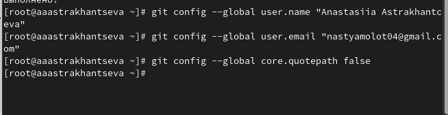{#fig:001 width=70%}

Далее задаем имя начальной ветки, будем называть ее master. Задаем параметры `autocrlf`, `autocrlf` (@fig:002).

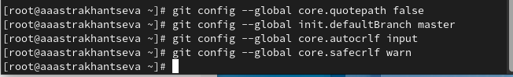{#fig:002 width=70%}

Создаем ключ pgp. Из предложенных опций выбирем: тип RSA and RSA, размер 4096, выберите срок действия; значение по умолчанию — 0 (срок действия не истекает никогда) (@fig:003).

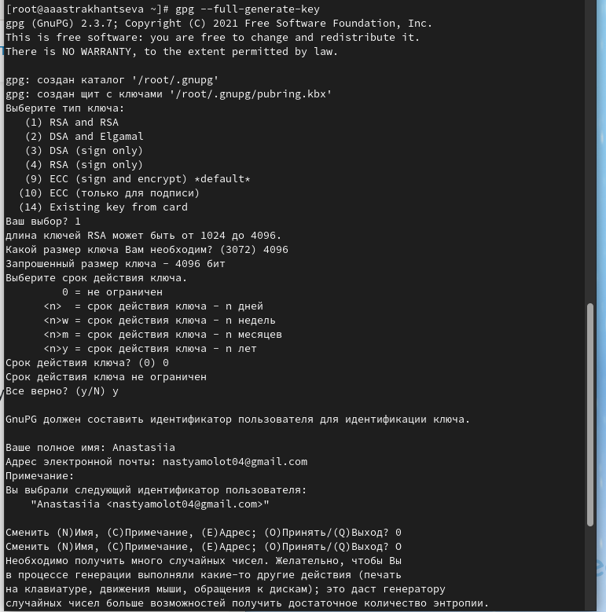{#fig:003 width=70%}

После этого выводим список ключей и копируем отпечаток приватного ключа. Отпечаток ключа — это последовательность байтов, используемая для идентификации более длинного, по сравнению с самим отпечатком ключа. (@fig:004)

Формат строки:

`sec   Алгоритм/Отпечаток_ключа Дата_создания [Флаги] [Годен_до]
      ID_ключа`:

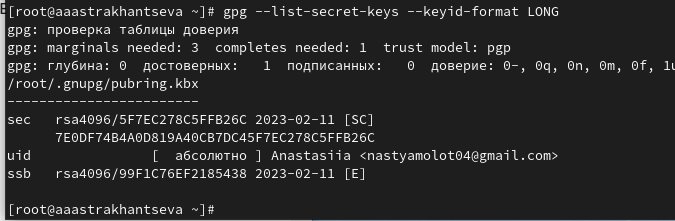{#fig:004 width=70%}

После этого копируем ключ в буфер обмена (@fig:005).

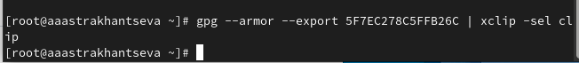{#fig:005 width=70%}

Используя введёный email, указываем Git применять его при подписи коммитов:(@fig:006).

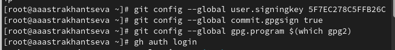{#fig:006 width=70%}

Для настройки авторизируемся (@fig:007).

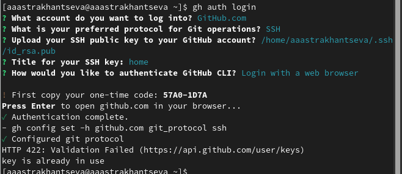{#fig:007 width=70%}

Создаем каталог "Операционные системы" в каталоге `~/work/study/2022-2023` (@fig:008).

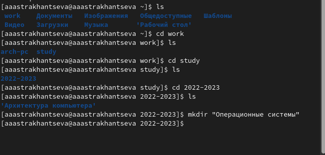{#fig:008 width=70%}

Создаем репозиторий (@fig:009).

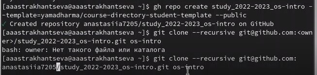{#fig:009 width=70%}

Далее переходим в каталог курса `os-intro`. Удаляем лишние файлы, сохдаем необходимые каталоги, отправлем файлв на сервер (@fig:010 - @fig:012).

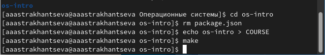{#fig:010 width=70%}

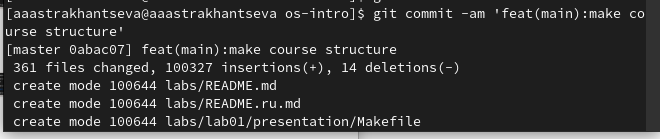{#fig:011 width=70%}

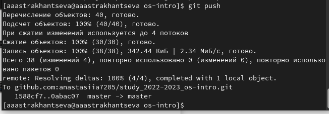{#fig:012 width=70%}

**Контрольные вопросы:**

1. Что такое системы контроля версий (VCS) и для решения каких задач они предназначаются?
Система контроля версий (Version Control System, VCS)- программное обеспечение для облегчения работы с изменяющейся информацией.

Системы контроля версий поддерживают возможность отслеживания и разрешения конфликтов, которые могут возникнуть при работе нескольких человек над одним файлом. Можно объединить (слить) изменения, сделанные разными участниками (автоматически или вручную), вручную выбрать нужную версию, отменить изменения вовсе или заблокировать файлы для изменения.

Системы контроля версий (Version Control System, VCS) применяются при работе нескольких человек над одним проектом. Обычно основное дерево проекта хранится в локальном или удалённом репозитории, к которому настроен доступ для участников проекта.
2. Объясните следующие понятия VCS и их отношения: хранилище, commit, история, рабочая копия.

Репозиторий - хранилище версий - в нем хранятся все документы вместе с историей их изменения и другой служебной информацией. 

Хранилище — это содержимое скрытой папки .git. В этой папке хранятся все версии рабочей области и служебная информация. Этим версиям система автоматически даёт название, состоящее из букв и цифр. 

Рабочая копия - копия проекта, связанная с репозиторием

commit - это команда, которая делает так, что новая версия проекта сохраняется и добавляется в хранилище. В файле с сохранением отображаются: все изменения, которые происходили в рабочей области, автор изменений и краткий комментарий, описывающий суть изменений. Каждый коммит хранит полное состояние рабочей области, её папок и файлов проекта.

История хранит все изменения проекта и позволяет при необходимости обратиться к ним.

3. Что представляют собой и чем отличаются централизованные и децентрализованные VCS? Приведите примеры VCS каждого вида.

Централизованные VCS: Одно основное хранилище всего проекта, каждый пользователь копирует себе необходимые ему
файлы из этого репозитория, изменяет и, затем, добавляет свои изменения обратно. Пример централизованных VCS: Subversion, CVS, TFS, VAULT.

Децентрализованные VCS: У каждого пользователя свой вариант (возможно не один) репозитория, присутствует возможность добавлять и забирать изменения из любого репозитория. Примеры децентрализованных VCS:  Git, Mercurial, Bazaar.

4. Опишите действия с VCS при единоличной работе с хранилищем.

Для начала создаем и подключаем удаленный репозиторй. По мере изменения проекта отправляем изменения на сервер.
 
5. Опишите порядок работы с общим хранилищем VCS.

Пользователь получает определнные файлы, произовдит различные изменения, после этого загружает измененные файлы обратно на сервер. При этом старые версии не удаляются, а хранятся в хранилище, к ним всегла можно вернуться. 

6. Каковы основные задачи, решаемые инструментальным средством git?

Хранение информации о всех внесенных изменениях, обеспечение удобства коммандной работы над проектом.

7. Назовите и дайте краткую характеристику командам git.

Создание основного дерева репозитория: `git init`

Получение обновлений (изменений) текущего дерева из центрального репозитория: `git pull`

Отправка всех произведённых изменений локального дерева в центральный репозиторий: `git push` 

Просмотр списка изменённых файлов в текущей директории: `git status`

Просмотр текущих изменений: `git diff`

Сохранение текущих изменений:

    добавить все изменённые и/или созданные файлы и/или каталоги: `git add` .

    добавить конкретные изменённые и/или созданные файлы и/или каталоги: `git add <имена_файлов>` 

    удалить файл и/или каталог из индекса репозитория (при этом файл и/или каталог остаётся в локальной директории):      `git rm имена_файлов`

Сохранение добавленных изменений:

    сохранить все добавленные изменения и все изменённые файлы: `git commit -am <'Описание коммита'>`

    сохранить добавленные изменения с внесением комментария через встроенный редактор: `git commit`

    создание новой ветки, базирующейся на текущей: `git checkout -b <имя_ветки>`

    переключение на некоторую ветку:  `git checkout <имя_ветки>`

       

    отправка изменений конкретной ветки в центральный репозиторий: `git push origin <имя_ветки>`

    слияние ветки с текущим деревом: `git merge --no-ff <имя_ветки>`

Удаление ветки:

    удаление локальной уже слитой с основным деревом ветки: `git branch -d <имя_ветки>`

    принудительное удаление локальной ветки:    `git branch -D <имя_ветки>`

    удаление ветки с центрального репозитория:   `git push origin :<имя_ветки>`

8. Приведите примеры использования при работе с локальным и удалённым репозиториями.

git push -all (push origin master/ любой branch)

9. Что такое и зачем могут быть нужны ветви (branches)?

Ветвление ("ветка", branch) - один из параллельных участков истории в одном хранилище, исходящих из одной версии (точки ветвления)

Обычно есть главная ветка (master), или ствол (trunk)

Между ветками, то есть их концами, возможно ветвление. 
10. Как и зачем можно игнорировать некоторые файлы при commit?

Во время создания проекта могут создаваться файлы, которые не нужно добавлять в репозиторий. К примеру, временные файлы, создаваемые редакторами и др. Для того, чтобы эти файлы не отправлялиь в репозиторий можно прописать шаблон игнорируемых файлов в файл .gitignore с помощью сервисов.

# Выводы

1. В ходе выполнения лабораторной работы мною были изучены идеология и применение средств контроля версий и освоены умения по работе с git.

# Список литературы{.unnumbered}

1. О системе контроля версий [электронный ресурс] – Режим доступа: https://git-scm.com/book/ru/v2/Введение-О-системе-контроля-версий

2. Введене в системы контроля версий [электорнный ресурс] - Режим доступа: https://htmlacademy.ru/blog/git/version-control-system

3. Системы контроля версий Выполнил Горвиц Евгений, ВМИ-301 [электорнный ресурс] - Режим доступа: https://glebradchenko.susu.ru/courses/bachelor/engineering/2016/SUSU_SE_2016_REP_3_VCS.pdf

