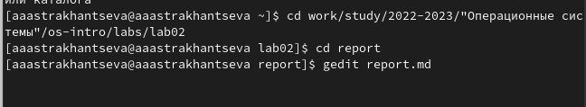
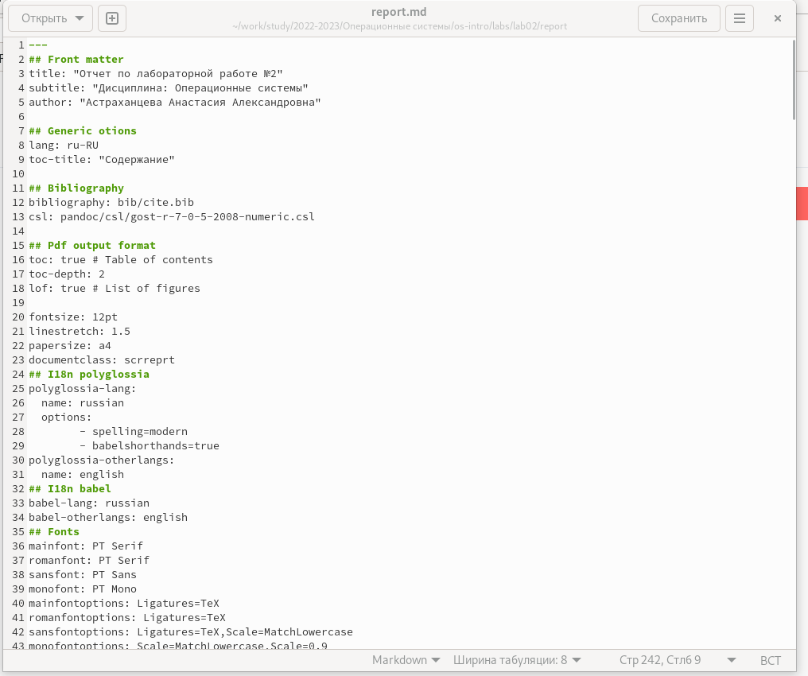
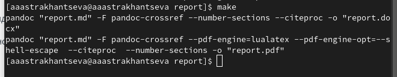
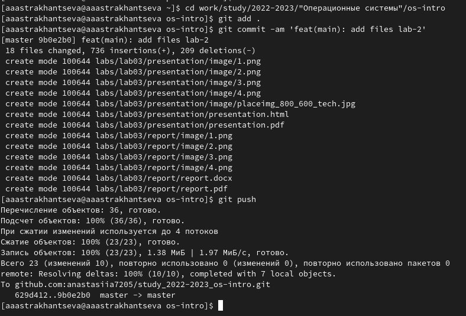

---
## Front matter
lang: ru-RU
title: "Отчет по лабораторной работе №3"
subtitle: "Дисциплина: Операционные системы" 
author:
  - Студентка группы НКАбд-01-22 Астраханцева А. А.
institute:
  - Российский университет дружбы народов, Москва, Россия
  
date: 18 ферваля 2023 

## i18n babel
babel-lang: russian
babel-otherlangs: english

## Formatting pdf
toc: false
toc-title: Содержание
slide_level: 2
aspectratio: 169
section-titles: true
theme: metropolis
header-includes:
 - \metroset{progressbar=frametitle,sectionpage=progressbar,numbering=fraction}
 - '\makeatletter'
 - '\beamer@ignorenonframefalse'
 - '\makeatother'
---

## Цели

Научиться оформлять отчёты с помощью легковесного языка разметки Markdown

## Задание 

- Выполнить отчёт по предыдущей лабораторной работе в формате Markdown.

## Выполеине лабораторной работы. Шаг 1

Для начала переходим в соответствующий каталог, содеражщий нужный нам файл "report.md".

## Выполеине лабораторной работы. Шаг 2

После этого нам нужно перейти в файловый редатор, "gedit", например:

## Выполеине лабораторной работы. Шаг 3

Далее, после того, как отчет выполнен, нам необходимо сохранить изменения в файле и закрыть окно gedit. Для конвенттрования в формат pdf и docx в терминале прописывыаем команду `make`

## Выполеине лабораторной работы. Шаг 4

После компиляции отчета в формат pdf и docx нужно отправить все изменения на сервер: 

## Выводы 

В ходе выполнения лабораторной работы №3 мною были получены навыки оформления отчёта с помощью легковесного языка разметки Markdown.

