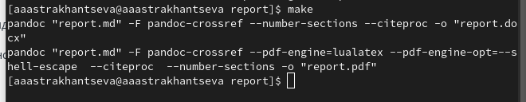

---
## Front matter
title: "Отчет по лабораторной работе №3"
subtitle: "Дисциплина: Операционные системы"
author: "Астраханцева Анастасия Александровна"

## Generic otions
lang: ru-RU
toc-title: "Содержание"

## Bibliography
bibliography: bib/cite.bib
csl: pandoc/csl/gost-r-7-0-5-2008-numeric.csl

## Pdf output format
toc: true # Table of contents
toc-depth: 2
lof: true # List of figures

fontsize: 12pt
linestretch: 1.5
papersize: a4
documentclass: scrreprt
## I18n polyglossia
polyglossia-lang:
  name: russian
  options:
	- spelling=modern
	- babelshorthands=true
polyglossia-otherlangs:
  name: english
## I18n babel
babel-lang: russian
babel-otherlangs: english
## Fonts
mainfont: PT Serif
romanfont: PT Serif
sansfont: PT Sans
monofont: PT Mono
mainfontoptions: Ligatures=TeX
romanfontoptions: Ligatures=TeX
sansfontoptions: Ligatures=TeX,Scale=MatchLowercase
monofontoptions: Scale=MatchLowercase,Scale=0.9
## Biblatex
biblatex: true
biblio-style: "gost-numeric"
biblatexoptions:
  - parentracker=true
  - backend=biber
  - hyperref=auto
  - language=auto
  - autolang=other*
  - citestyle=gost-numeric
## Pandoc-crossref LaTeX customization
figureTitle: "Рис."

listingTitle: "Листинг"
lofTitle: "Список иллюстраций"

lolTitle: "Листинги"
## Misc options
indent: true
header-includes:
  - \usepackage{indentfirst}
  - \usepackage{float} # keep figures where there are in the text
  - \floatplacement{figure}{H} # keep figures where there are in the text
---

# Цель работы

Научиться оформлять отчёты с помощью легковесного языка разметки Markdown

# Задание

- Выполнить отчёт по предыдущей лабораторной работе в формате Markdown.

# Теоретическое введение

Чтобы задать заголовок, можно использовать `"#"`

Чтобы задать полужирное **начертание**, можно использовать двойные звездочки

`**полужироне начертание**`

Чтобы задать курсивное *начертание*, можно использовать одинарные звездочки

`*курсивное начертание*`

Чтобы задать курсивное полужирное ***начертание***, можно использовать тройные звездочки

`***курсивное полужирное начертание***`

Блоу цитирования можно задать с помощью символа `>`

Список можно создать с помощью звездочек `*` или тире `-`

`
- элемент сиспка 1
- элемент сиспка 2
- элемент сиспка 3
`

Можно вкладывать список в другой список:

`
- элемент списка 1
 - элемент списка А
 - элемент списка Б
- элемент списка 2

`
**Обработка файлов в формате Markdown**

Для обработки файлов в формате Markdown будем использовать Pandoc. Конкретно, нам понадобится программа pandoc ,
pandoc-citeproc, pandoc-crossref. Мы будеи использовать Makefile, с помощью которого наш файл в формате Markdown сконвентируется в формат pdf и docx.

# Выполнение лабораторной работы

Для начала переходим в соответствующий каталог, содеражщий нужный нам файл "report.md". Для этого в теримнале прописываем команду 

`cd work/study/2022-2023/"Операционные системы"/os-intro/labs/lab02` (рис. @fig:001).

{#fig:001 width=70%}

После этого нам нужно перейти в файловый редатор, "gedit", например: (рис. @fig:002). 

{#fig:002 width=70%}

Далее, после того, как отчет выполнен, нам необходимо сохранить изменения в файле и закрыть окно gedit. После этого в том же окне терминала, с помощью которого мы переходили в gedit, нужно прописать команду `make`. (рис. @fig:003)

{#fig:003 width=70%}

После этого сконвентируется наш отчет в формате pdf и docx. 

В выполении отчета по ЛР №2 так же присутствуют ответы на контрольные вопросы. На данном скриншоте видно то, как оформляется добавление изображений. (рис. @fig:004)

{#fig:004 width=70%}

# Выводы

В ходе выполнения лабораторной работы №3 мною были получены навыки оформления отчёта с помощью легковесного языка разметки Markdown.

