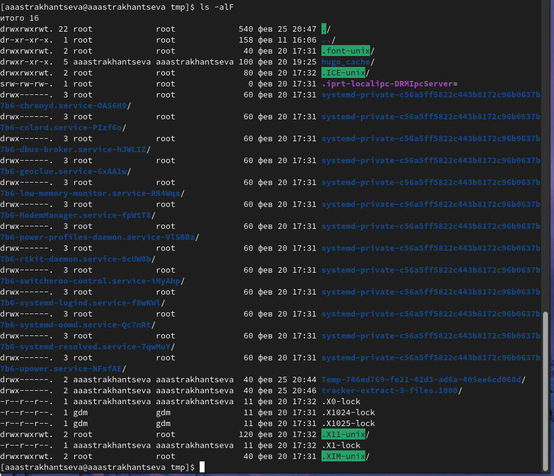
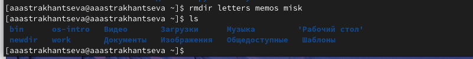

---
## Front matter
lang: ru-RU
title: "Лабораторная работа №4"
subtitle: "Дисциплина: операционные системы"
author:
  - Астраханцева А. А.
institute:
  - Российский университет дружбы народов, Москва, Россия
  
date: 01 марта 2023

## i18n babel
babel-lang: russian
babel-otherlangs: english

## Formatting pdf
toc: false
toc-title: Содержание
slide_level: 2
aspectratio: 169
section-titles: true
theme: metropolis
header-includes:
 - \metroset{progressbar=frametitle,sectionpage=progressbar,numbering=fraction}
 - '\makeatletter'
 - '\beamer@ignorenonframefalse'
 - '\makeatother'
---

## Докладчик

:::::::::::::: {.columns align=center}
::: {.column width="70%"}

  * Астраханцева А. А.
  * Студентка группы НКАбд-01-22
  * Российский университет дружбы народов
  * <https://anastasiia7205.github.io/>

:::
::: {.column width="30%"}

:::
::::::::::::::

## Цели 

Приобретение практических навыков взаимодействия пользователя с системой посредством командной строки.

## Задачи

- Выполние заданий посредством написания и запуска команд в терминале
- Ответы на контрольные вопросы

# Выполнение работы

## Задание 1

 Узнать полние имя домашнего каталога. 
Для того, чтобы определить полное имя домашеного каталога можно прописать команду `pwd`. Имя моего доманего каталога: "aaastrakhantseva" 

{#fig:001 width=70%}

## Задание 1

 Переходим в каталог tmp. С помощью разных опций команды `ls` выводим содержимое каталога tmp.

{#fig:003 width=70%}

## Вывод "ls -а"

{#fig:004 width=70%}

## Вывод "ls -l"

{#fig:004 width=70%}

## Вывод "ls -alF"

{#fig:006 width=70%}

## Проверка содержимого каталога /var/spool

Определяем, есть ли в катлоге /var/spool подкаталог с именем cron с помощью команды `ls`. Видим, что такого каталога нет  

{#fig:007 width=70%}

## Проверка содержимого домашнего каталога

Переходим в домашний каталог, выодим содержимое и определяем, кто является владельцем файлов .

{#fig:008 width=70%} 

## Создание каталога 

В домашнем каталоге создаем каталог с именем newdir 

{#fig:009 width=70%} 

В каталоге newdir создаем подкаталог morefun .

{#fig:010 width=70%} 

## Создание и удаление каталогов

В домашнем каталоге создаем одной командой три новых каталога с именами letters, memos, misk. Затем удаляем эти каталоги одной командой 
{#fig:011 width=70%} 

{#fig:012 width=70%} 

## С помощью команды man определяем набор опций команды ls

С помощью команды man определяем набор опций команды ls, позволяющий отсортировать по времени последнего изменения выводимый список содержимого каталога с развёрнутым описанием файлов 

{#fig:017 width=70%} 

{#fig:018 width=70%} 

## man cd

Начнем с cd, основные опции:

1. -L. Позволяет переходить по символическим ссылкам, после обработки всех переходов.
2. -P. Переходит по символическим ссылка перед обработкой всех переходов.
3. -e. Выдает ошибку, если каталога не удалось найти.

{#fig:019 width=70%} 

{#fig:020 width=70%} 
Начнем с cd, основные опции:

## man pwd

pwd, основные опции:
1. -L, --logical - брать директорию из переменной окружения, даже если она содержит символические ссылки;
2. -P - отбрасывать все символические ссылки;
3. --help - отобразить справку по утилите;
4. --version - отобразить версию утилиты.

{#fig:021 width=70%} 

## man mkdir

mkdir, основные опции: 
1. --mode (или -m) — установка атрибутов доступа;
2. --parents (или -p) — создание каталога вместе с родительскими по отношению к нему
каталогами

{#fig:022 width=70%}

## man rmdir 

rmdir, основные опции схожи с mkdir.

rm, основные опции:
1. -r - удаление самого католога и его содержимого 
2. -d - удаление пустых каталогов
3. -f - игнорирование несуществующих файлов и аргументов. Никогда не выдавать запросы на подтверждение удаления.
4. -i - Выводить запрос на подтверждение удаления каждого файла
5. -l - Выдать один запрос на подтверждение удаления всех файлов, если удаляется больше трех файлов или используется рекурсивное удаление. 

{#fig:023 width=70%}

## history

Используя информацию, полученную при помощи команды history, выполню мо-
дификацию и исполнение нескольких команд из буфера команд.

{#fig:025 width=70%}

{#fig:026 width=70%}

## Выводы

В ходе выполнеиня ЛР№4 я приобрела практические навыки взаимодействия пользователя с системой посредством командной строки.

## Список литературы{.unnumbered}

1. Командная строка Linux: краткий курс для начинающих [электронный ресурс] - Режим доступа: https://timeweb.cloud/tutorials/linux/linux-for-beginners
2. Командная строка в Linux [электронный ресурс] - Режим доступа: https://codechick.io/tutorials/unix-linux/unix-linux-command-line
3. Команда cd Linux [электронный ресурс] - Режим доступа: https://www.vseprolinux.ru/cd-komanda
4. Команда pwd в Linux [электронный ресурс] - Режим доступа: https://losst.pro/komanda-pwd-linux
5. Команда rm [электронный ресурс] - Режим доступа: https://pingvinus.ru/note/cmd-rm
6. Командная строка [электронный ресурс] - Режим доступа: https://linchakin.com/%D1%81%D0%BB%D0%BE%D0%B2%D0%B0%D1%80%D1%8C/%D0%BA/%D0%BA%D0%BE%D0%BC%D0%B0%D0%BD%D0%B4%D0%BD%D0%B0%D1%8F-%D1%81%D1%82%D1%80%D0%BE%D0%BA%D0%B0/
