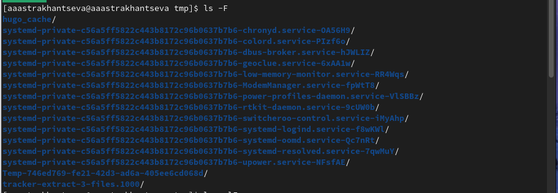

---
## Front matter
title: "Отчет по выполнению лабораторной работы №4"
subtitle: "Дисциплина: операционные системы"
author: "Астраханцева А. А., НКАбд-01-22"

## Generic otions
lang: ru-RU
toc-title: "Содержание"

## Bibliography
bibliography: bib/cite.bib
csl: pandoc/csl/gost-r-7-0-5-2008-numeric.csl

## Pdf output format
toc: true # Table of contents
toc-depth: 2
lof: true # List of figures

fontsize: 12pt
linestretch: 1.5
papersize: a4
documentclass: scrreprt
## I18n polyglossia
polyglossia-lang:
  name: russian
  options:
	- spelling=modern
	- babelshorthands=true
polyglossia-otherlangs:
  name: english
## I18n babel
babel-lang: russian
babel-otherlangs: english
## Fonts
mainfont: PT Serif
romanfont: PT Serif
sansfont: PT Sans
monofont: PT Mono
mainfontoptions: Ligatures=TeX
romanfontoptions: Ligatures=TeX
sansfontoptions: Ligatures=TeX,Scale=MatchLowercase
monofontoptions: Scale=MatchLowercase,Scale=0.9
## Biblatex
biblatex: true
biblio-style: "gost-numeric"
biblatexoptions:
  - parentracker=true
  - backend=biber
  - hyperref=auto
  - language=auto
  - autolang=other*
  - citestyle=gost-numeric
## Pandoc-crossref LaTeX customization
figureTitle: "Рис."

listingTitle: "Листинг"
lofTitle: "Список иллюстраций"

lolTitle: "Листинги"
## Misc options
indent: true
header-includes:
  - \usepackage{indentfirst}
  - \usepackage{float} # keep figures where there are in the text
  - \floatplacement{figure}{H} # keep figures where there are in the text
---

# Цель работы

Приобретение практических навыков взаимодействия пользователя с системой посредством командной строки.

# Задание

1. Определите полное имя вашего домашнего каталога. Далее относительно этого ката-
лога будут выполняться последующие упражнения.
2. Выполните следующие действия:
	2.1. Перейдите в каталог /tmp.
	2.2. Выведите на экран содержимое каталога /tmp. Для этого используйте команду ls
с различными опциями. Поясните разницу в выводимой на экран информации.
	2.3. Определите, есть ли в каталоге /var/spool подкаталог с именем cron?
	2.4. Перейдите в Ваш домашний каталог и выведите на экран его содержимое. Опре-
делите, кто является владельцем файлов и подкаталогов?
3. Выполните следующие действия:
	3.1. В домашнем каталоге создайте новый каталог с именем newdir.
	3.2. В каталоге ~/newdir создайте новый каталог с именем morefun.
	3.3. В домашнем каталоге создайте одной командой три новых каталога с именами
letters, memos, misk. Затем удалите эти каталоги одной командой.
	3.4. Попробуйте удалить ранее созданный каталог ~/newdir командой rm. Проверьте,
был ли каталог удалён.
	3.5. Удалите каталог ~/newdir/morefun из домашнего каталога. Проверьте, был ли
каталог удалён.
4. С помощью команды man определите, какую опцию команды ls нужно использо-
вать для просмотра содержимое не только указанного каталога, но и подкаталогов,
входящих в него.
5. С помощью команды man определите набор опций команды ls, позволяющий отсорти-
ровать по времени последнего изменения выводимый список содержимого каталога
с развёрнутым описанием файлов.
6. Используйте команду man для просмотра описания следующих команд: cd, pwd, mkdir,
rmdir, rm. Поясните основные опции этих команд.
7. Используя информацию, полученную при помощи команды history, выполните мо-
дификацию и исполнение нескольких команд из буфера команд.

# Теоретическое введение

В операционной системе типа Linux взаимодействие пользователя с системой обычно
осуществляется с помощью командной строки посредством построчного ввода ко-
манд. 

Работа с операционными системами GNU/Linux заключается прежде всего в работе с командной строкой. Командная оболочка позволяет пользователю взаимодействовать с операционной системой. Существует множество различных командных оболочек, в данной статье мы будем рассматривать наиболее распространенную командную оболочку bash.

Командная строка (она же консоль или терминал) – это специальная программа, с помощью которой можно управлять компьютером текстовыми командами, вводимыми с клавиатуры.

# Выполнение лабораторной работы

Для того, чтобы определить полное имя домашеного каталога можно прописать команду `pwd`. Имя моего доманего каталога: "aaastrakhantseva" (рис. @fig:001).

{#fig:001 width=70%}

Переходим в каталог `tmp` (рис. @fig:002).

{#fig:002 width=70%}

С помощью разных опций команды `ls` выводим содержимое каталога tmp. Например, опция `-F` указывает на тип файла: используетя "/", если это каталог, "*"Б если это исполняемый файл, "@", если ссылка.(рис. @fig:003)

{#fig:003 width=70%}

Опция `-a` выводит абсолютно все файлы, в том числе и скрытые (их названия начинаются с точки) (рис. @fig:004).

{#fig:004 width=70%}

Опция `-l` выводит подробную информацию:

- тип файла,
– право доступа,
– число ссылок,
– владелец,
– размер,
– дата последней ревизии,
– имя файла или каталога
(рис. @fig:005).

{#fig:005 width=70%}

Пример комбинации трех выше описанных опций (рис. @fig:006). Здесь выводится подробная информация, тип файла, а также скрытые файлы.

{#fig:006 width=70%}

Определяем, есть ли в катлоге /var/spool подкаталог с именем cron с помощью команды `ls`. Видим, что такого каталога нет (рис. @fig:007). 

{#fig:007 width=70%}

Переходим в домашний каталог, выодим содержимое и определяем, кто является владельцем файлов (рис. @fig:008).

{#fig:008 width=70%} 

В домашнем каталоге создаем каталог с именем newdir (рис. @fig:009).

{#fig:009 width=70%} 

В каталоге newdir создаем подкаталог morefun (рис. @fig:010).

{#fig:010 width=70%} 

В домашнем каталоге создаем одной командой три новых каталога с именами letters, memos, misk. Затем удаляем эти каталоги одной командой (рис. @fig:011 - @fig:012 ).

{#fig:011 width=70%} 

{#fig:012 width=70%} 

Пробуем удалить ранее созданный каталог ~/newdir командой rm. Удалить каталог с помощью команды rm можно только используя опцию `rm -r` (рис. @fig:013).

{#fig:013 width=70%} 

Удаляем каталог ~/newdir/morefun из домашнего каталога. Проверяем, что каталог удален (каталог newdir пустой) (рис. @fig:014).

Для
 
{#fig:014 width=70%} 

С помощью команды `man ls` определяем, какую опцию нужно использовать для того, чтобы просматривать содержимое не только указанного каталога, но и подкаталогов, входящих в него (рис. @fig:015 - @fig:016 ).

{#fig:015 width=70%} 

{#fig:016 width=70%} 

С помощью команды man определяем набор опций команды ls, позволяющий отсортировать по времени последнего изменения выводимый список содержимого каталога с развёрнутым описанием файлов (рис. @fig:017 - @fig:018).

{#fig:017 width=70%} 

{#fig:018 width=70%} 

Использую команду man для просмотра описания следующих команд: cd, pwd, mkdir,
rmdir, rm. Поясните основные опции этих команд.
Начнем с cd, основные опции:

1. -L. Позволяет переходить по символическим ссылкам, после обработки всех переходов.
2. -P. Переходит по символическим ссылка перед обработкой всех переходов.
3. -e. Выдает ошибку, если каталога не удалось найти.
(рис. @fig:019 - @fig:020).

{#fig:019 width=70%} 

{#fig:020 width=70%} 

pwd, основные опции:
1. -L, --logical - брать директорию из переменной окружения, даже если она содержит символические ссылки;
2. -P - отбрасывать все символические ссылки;
3. --help - отобразить справку по утилите;
4. --version - отобразить версию утилиты.
(рис. @fig:021).

{#fig:021 width=70%} 

mkdir, основные опции: 
1. --mode (или -m) — установка атрибутов доступа;
2. --parents (или -p) — создание каталога вместе с родительскими по отношению к нему
каталогами
(рис. @fig:022).

{#fig:022 width=70%}

rmdir, основные опции схожи с mkdir (рис. @fig:023).

{#fig:023 width=70%}

rm, основные опции:
1. -r - удаление самого католога и его содержимого 
2. -d - удаление пустых каталогов
3. -f - игнорирование несуществующих файлов и аргументов. Никогда не выдавать запросы на подтверждение удаления.
4. -i - Выводить запрос на подтверждение удаления каждого файла
5. -l - Выдать один запрос на подтверждение удаления всех файлов, если удаляется больше трех файлов или используется рекурсивное удаление.  (рис. @fig:024). 

{#fig:024 width=70%}

Используя информацию, полученную при помощи команды history, выполню мо-
дификацию и исполнение нескольких команд из буфера команд (рис. @fig:025 - @fig:026).

{#fig:025 width=70%}

{#fig:026 width=70%}

## Контрольные вопросы

1. Что такое командная строка?

Командная строка (англ. command line) – это пользовательский интерфейс, в котором навигация осуществляется путем ввода команд, а не с помощью мыши. Командную строку также называют интерфейсом командной строки, или консоль. Она является разновидностью текстового интерфейса (CUI) и в ней можно использовать только клавиатуру.

2. При помощи какой команды можно определить абсолютный путь текущего каталога?
Приведите пример.

С помощью команды pwd (рис. @fig:027). 

{#fig:027 width=70%}

3. При помощи какой команды и каких опций можно определить только тип файлов
и их имена в текущем каталоге? Приведите примеры.

C помощью команды `ls -F` (рис. @fig:028).

{#fig:028 width=70%}

4. Каким образом отобразить информацию о скрытых файлах? Приведите примеры.

C помощью команды `ls -a` (рис. @fig:029).

{#fig:029 width=70%}

5. При помощи каких команд можно удалить файл и каталог? Можно ли это сделать
одной и той же командой? Приведите примеры.

Удалить файл можно с помощью команды `rm`. Удалить каталог можно с помощью команды `rmdir`, или же можно использовать `rm -r`. Если каталог пуст, то можно использовать `rmdir`, а если каталог содержит файлы, то используем `rm -r`.

6. Каким образом можно вывести информацию о последних выполненных пользователем командах? работы?

С помощью команды history

7. Как воспользоваться историей команд для их модифицированного выполнения? При-
ведите примеры.

Чтобы модифицировать команду с помощью history нужно прписать такую команду: !<номер команды>:s/<что меняем>/<на что меняем> (рис. @fig:030).

{#fig:030 width=70%}

8. Приведите примеры запуска нескольких команд в одной строке.

Можно запустить несколько команд в одной строке, если записать команды через ";": `cd;ls` 

9. Дайте определение и приведите примера символов экранирования.

Если в заданном контексте встречаются специальные символы (типа «.»,
«/», «*» и т.д.), надо перед ними поставить символ экранирования \ (обратный слэш)

10. Охарактеризуйте вывод информации на экран после выполнения команды ls с опцией
l.

Опция `-l` выводит подробную информацию:

- тип файла,
– право доступа,
– число ссылок,
– владелец,
– размер,
– дата последней ревизии,
– имя файла или каталога

11. Что такое относительный путь к файлу? Приведите примеры использования относи-
тельного и абсолютного пути при выполнении какой-либо команды.

Относительный путь указывает положение файла или директории относительно ващего текущего местоположения в системе.

Абсолютный путь: находясь в каталоге, напрмер, study абсолютный путь - /home/aaastrakhantseva/work/study, а относительный путь от study до os-intro, будет таким: study/2022-2023/Операционные системы/os-intro.
Существуют полезные символы, такие как:
1. ~ - домашний каталог
2. . - текущий каталог
3. .. - родительский каталог

12. Как получить информацию об интересующей вас команде?

Чтобы получить информацию о команде можно использовать команду `man` или опцию `help`. Например: `man cd` или `help cd`

13. Какая клавиша или комбинация клавиш служит для автоматического дополнения
вводимых команд?

Можно испоьзовать клавишу "Tab" для автоматического дополнения вводимых команд.

# Выводы

В ходе выполнеиня ЛР№4 я приобрела практические навыки взаимодействия пользователя с системой посредством командной строки.

# Список литературы{.unnumbered}

1. Командная строка Linux: краткий курс для начинающих [электронный ресурс] - Режим доступа: https://timeweb.cloud/tutorials/linux/linux-for-beginners
2. Командная строка в Linux [электронный ресурс] - Режим доступа: https://codechick.io/tutorials/unix-linux/unix-linux-command-line
3. Команда cd Linux [электронный ресурс] - Режим доступа: https://www.vseprolinux.ru/cd-komanda
4. Команда pwd в Linux [электронный ресурс] - Режим доступа: https://losst.pro/komanda-pwd-linux
5. Команда rm [электронный ресурс] - Режим доступа: https://pingvinus.ru/note/cmd-rm
6. Командная строка [электронный ресурс] - Режим доступа: https://linchakin.com/%D1%81%D0%BB%D0%BE%D0%B2%D0%B0%D1%80%D1%8C/%D0%BA/%D0%BA%D0%BE%D0%BC%D0%B0%D0%BD%D0%B4%D0%BD%D0%B0%D1%8F-%D1%81%D1%82%D1%80%D0%BE%D0%BA%D0%B0/
