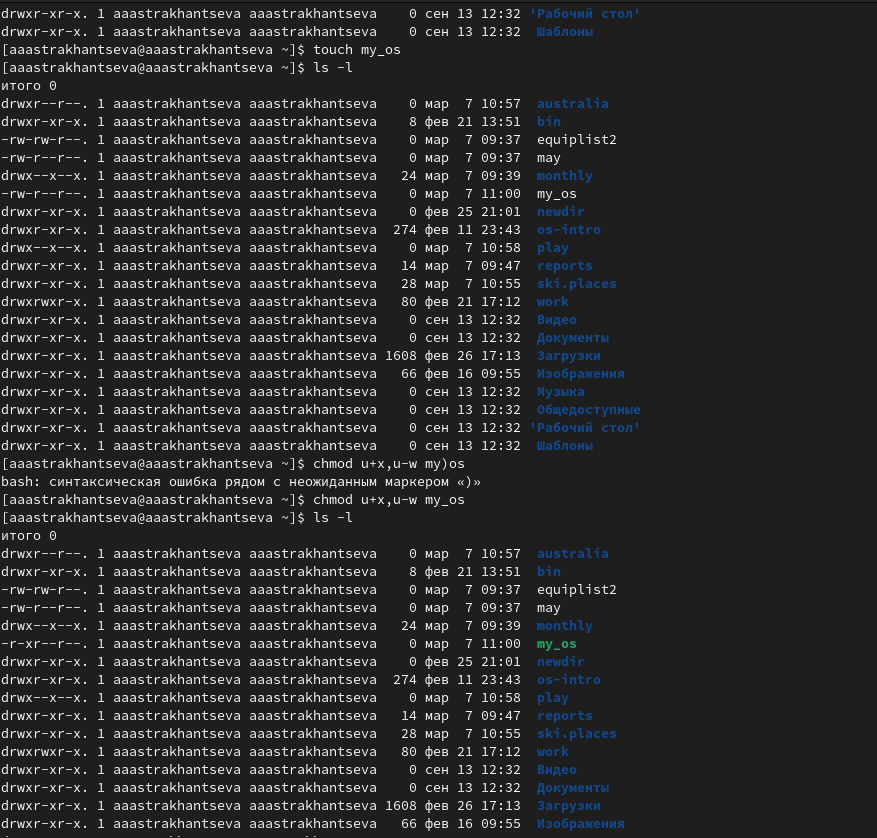

---
## Front matter
lang: ru-RU
title: "Отчет по лабораторной работе №5"
subtitle: "Дисциплина: операционные системы"
author:
  - Астрханцева А. А.
institute:
  - Российский университет дружбы народов, Москва, Россия
 
date: 11 марта 2023

## i18n babel
babel-lang: russian
babel-otherlangs: english

## Formatting pdf
toc: false
toc-title: Содержание
slide_level: 2
aspectratio: 169
section-titles: true
theme: metropolis
header-includes:
 - \metroset{progressbar=frametitle,sectionpage=progressbar,numbering=fraction}
 - '\makeatletter'
 - '\beamer@ignorenonframefalse'
 - '\makeatother'
---

# Информация

## Докладчик

:::::::::::::: {.columns align=center}
::: {.column width="70%"}

  * Астраханцева Анастасия Александровна
  * НКАбд-01-22
  * Российский университет дружбы народов
  * Студ. билет: 1132226437
  * <https://anastasiia7205.github.io/>

:::
::: {.column width="30%"}

:::
::::::::::::::

## Цель работы

Ознакомление с файловой системой Linux, её структурой, именами и содержанием каталогов. Приобретение практических навыков по применению команд для работы с файлами и каталогами, по управлению процессами (и работами), по проверке использования диска и обслуживанию файловой системы.

## Задание (Часть 1)

1. Выполните все примеры, приведённые в первой части описания лабораторной работы.
2. Выполните следующие действия, зафиксировав в отчёте по лабораторной работе
используемые при этом команды и результаты их выполнения:
2.1. Скопируйте файл /usr/include/sys/io.h в домашний каталог и назовите его
equipment. Если файла io.h нет, то используйте любой другой файл в каталоге
/usr/include/sys/ вместо него.
2.2. В домашнем каталоге создайте директорию ~/ski.plases.
2.3. Переместите файл equipment в каталог ~/ski.plases.
2.4. Переименуйте файл ~/ski.plases/equipment в ~/ski.plases/equiplist.
2.5. Создайте в домашнем каталоге файл abc1 и скопируйте его в каталог
~/ski.plases, назовите его equiplist2.
2.6. Создайте каталог с именем equipment в каталоге ~/ski.plases.
2.7. Переместите файлы ~/ski.plases/equiplist и equiplist2 в каталог
~/ski.plases/equipment.
2.8. Создайте и переместите каталог ~/newdir в каталог ~/ski.plases и назовите
его plans.
3. Определите опции команды chmod, необходимые для того, чтобы присвоить перечис-
ленным ниже файлам выделенные права доступа, считая, что в начале таких прав
нет:
3.1. drwxr--r-- ... australia
3.2. drwx--x--x ... play
3.3. -r-xr--r-- ... my_os
3.4. -rw-rw-r-- ... feathers
При необходимости создайте нужные файлы.

## Задание (Часть 2)

4. Проделайте приведённые ниже упражнения, записывая в отчёт по лабораторной
работе используемые при этом команды:
4.1. Просмотрите содержимое файла /etc/password.
4.2. Скопируйте файл ~/feathers в файл ~/file.old.
4.3. Переместите файл ~/file.old в каталог ~/play.
4.4. Скопируйте каталог ~/play в каталог ~/fun.
4.5. Переместите каталог ~/fun в каталог ~/play и назовите его games.
4.6. Лишите владельца файла ~/feathers права на чтение.
4.7. Что произойдёт, если вы попытаетесь просмотреть файл ~/feathers командой
cat?
4.8. Что произойдёт, если вы попытаетесь скопировать файл ~/feathers?
4.9. Дайте владельцу файла ~/feathers право на чтение.
4.10. Лишите владельца каталога ~/play права на выполнение.
4.11. Перейдите в каталог ~/play. Что произошло?
4.12. Дайте владельцу каталога ~/play право на выполнение.
5. Прочитайте man по командам mount, fsck, mkfs, kill и кратко их охарактеризуйте,
приведя примеры

# Выполнение лабораторной работы

## Задание 1 (Выполнение примеров)

 Выполнение всех примеров, приведённых в первой части описания лабораторной работы:

Примеры использования команд `cp`, `touch`, `mkdir`

{#fig:001 width=50%}

## Задание 1 (Выполнение примеров)

Примеры использования команды `mv` для перемещения и переименования файлов и каталогов: 

{#fig:002 width=70%}

## Задание 1 (Выполнение примеров)

Примеры использования команды ``chmod`` для изменения прав доступа 

{#fig:003 width=50%}

## Задание 2

На одном скриншоте предствленно выполнение всех действий из задания 2

{#fig:004 width=50%}

## Задание 3.1 

3.1. drwxr--r-- ... australia 

{#fig:005 width=50%}

## Задание 3.2

3.2. drwx--x--x ... play 

{#fig:006 width=50%}

## Задание 3.3

3.3. -r-xr--r-- ... my_os  

{#fig:007 width=50%}

## Задание 3.4

3.4. -rw-rw-r-- ... feathers

{#fig:008 width=50%}

## Задание 4.1

4.1. Просмотрите содержимое файла /etc/password.

Поскольку в каталоге /etc не было файла password, я проверила содержимое данного каталога: там я обнаружила файл с именем passwd-.

{#fig:009 width=70%}

## Задание 4.1

Посмотреть информацию, содержащуюся в данном файле можно с помощью команды `cat passwd-`  

{#fig:010 width=50%}

## Задание 4.2 - 4.5

На следующем скриншоте показно выполнение следующих действий: 

2. Скопируйте файл ~/feathers в файл ~/file.old. Использую команду ``cp feathers file.old``

3. Переместите файл ~/file.old в каталог ~/play. Использую команду ``mv file.old play``

4. Скопируйте каталог ~/play в каталог ~/fun. Для начала нужно было создать каталог fun с помощью команды ``mkdir fun ``. Далее использую команду ``cp -r play fun``

5. Переместите каталог ~/fun в каталог ~/play и назовите его games. Использую команду ``mv play/fun play/games``

## Задание 4.2 - 4.5

{#fig:011 width=70%}

## Задание 4.6

4.6. Лишение владельца файла ~/feathers права на чтение. ``chmod u-r feathers``. 

{#fig:012 width=50%}

## Задание 4.7 - 4.9

7. Что произойдёт, если вы попытаетесь просмотреть файл ~/feathers командой
cat? 
8. Что произойдёт, если вы попытаетесь скопировать файл ~/feathers? 

Ответ на вопросы 4.7 и 4.8: Поскольку я являюсь владельцем файла и у меня теперь нет права на чтение файла, то в терминале будет выведено предупреждение: "Отказанно в доступе" (см след. скриншот)

9. Дайте владельцу файла ~/feathers право на чтение. ``chmod u+r feathers``. 

## Задание 4.7 - 4.9

{#fig:013 width=70%}

## Задание 4.10 - 4.12

10. Лишите владельца каталога ~/play права на выполнение.
11. Перейдите в каталог ~/play. Что произошло?
12. Дайте владельцу каталога ~/play право на выполнение.

Для начала я лишила владельца права на исполнение с помощью команды ``chmod u-x play``. После попытки перемещения в данный каталог в терминале возникла ошибка: "Отказанно в доступе". После этого я вернула владельцу правло на исполнеине с помощью команды ``chmod u+x play``. 

## Задание 4.10 - 4.12

{#fig:014 width=70%}

## Задание 5. man mount

1. -a, --all - Смонтировать все файловые системы (указанных типов), упомянутые в fstab (кроме тех, чья строка содержит ключевое слово noauto). Файловые системы монтируются в соответствии с их порядком в fstab. Команда mount сравнивает источник файловой системы, цель (и корень fs для bind mount или btrfs) для обнаружения уже смонтированных файловых систем.  Параметр --all также можно использовать для операции повторного монтирования. В этом случае все фильтры (-t и -O) применяются к таблице уже смонтированных файловых систем. 
2. -B, --bind - Перемонтировать поддерево в другом месте (чтобы его содержимое было доступно в обоих местах). 
3. -c, --no-canonicalize - Не канонизировать пути. Команда mount по умолчанию канонизирует все пути (из командной строки или fstab). Этот параметр можно использовать вместе с флагом -f для уже канонизированных абсолютных путей. Опция предназначена для помощников монтирования, которые вызывают mount -i. Настоятельно рекомендуется не использовать этот параметр командной строки для обычных операций монтирования. 
4. -F, --fork -  (Используется вместе с -a.) Разветвляет новое воплощение mount для каждого устройства. Это позволит выполнять монтирование на разных устройствах или на разных серверах NFS параллельно.

## Задание 5. man mount

{#fig:015 width=50%}

## Задание 5. man fsck

Команда ``man fsck``, основные опции fsck: 

1. -l - Блокирует устройство для исключительного доступа
2. -r [<fd>] - Выводит статистику для каждого проверенного устройства
3. -t <тип> - Задаёт ФС для проверки. Можно задавать несколько ФС, перечисляя через запятую
4. -V - Выводит подробное описание выполняемых действий

## Задание 5. man fsck

{#fig:016 width=50%}

## Задание 5. man mkfs

1. -V - Подробно информирует происходящее, включая все выполняемые специфические команды файловой системы. Если указать этот параметр более одного раза, то это запретит реальное выполнение любых специфических команд файловой системы. Использовать этот параметр целесообразно во время тестирования. 
2. -t fstype - Указывает тип создаваемой файловой системы. Если этот параметр не указан, тогда, по умолчанию, принимается тип файловой системы ext2. 
3. fs-options - Передаёт модулю создания специфической файловой системы параметры в виде списка. Следует отметить, что нет гарантии в том, что следующие перечисленные параметры будут поддерживаться большинством модулей создания файловых систем. 
4. -c - Перед созданием файловой системы проверяет наличие сбойных блоков на устройстве. 
5. -l filename  - Считывает список сбойных блоков из указанного файла filename. Для составления подобного списка, можно выполнить предварительную проверку, например, с помощью программы badblocks. 
6. -v - Подробно комментирует происходящее. 

## Задание 5. man mkfs

{#fig:017 width=50%}

## Задание 5. man kill

1. -l - вывести список поддерживаемых сигналов
2. -s - сигнал — послать сигнал с указанным именем
3. -p - Вывод только ID процесса без вывода сигналов 

{#fig:018 width=50%}

## Выводы

В ходе выполнения ЛР№5 я ознакомомилась с файловой системой Linux, её структурой, именами и содержанием
каталогов. Также мною были приобретены практические навыки по применению команд для работы
с файлами и каталогами, по управлению процессами (и работами), по проверке исполь-
зования диска и обслуживанию файловой системы.

# Список литературы{.unnumbered}

1. Всё о монтировании: от системного администрирования до IT криминалистики [электронный ресурс]. Режим доступа: https://hackware.ru/?p=14459
2. Проверка и восстановление файловых систем в Linux- команда fsck [электронный ресурс]. Режим доступа: https://itproffi.ru/proverka-i-vosstanovlenie-fajlovyh-sistem-v-linux-komanda-fsck/
3. Btrfs (Русский) [электронный ресурс]. Режим доступа: https://wiki.archlinux.org/title/Btrfs_(%D0%A0%D1%83%D1%81%D1%81%D0%BA%D0%B8%D0%B9)
4. Файловая система Btrfs [электронный ресурс]. Режим доступа: https://losst.pro/fajlovaya-sistema-btrfs
5. Файловая система EXT (Ext2, Ext3, Ext 4) [электронный ресурс]. Режим доступа: https://recovery-software.ru/blog/the-ext-ext2-ext3-ext4-filesystem.html#top
6. Структура и типы файловых систем в Linux [электронный ресурс]. Режим доступа: https://selectel.ru/blog/directory-structure-linux/
