---
## Front matter
title: "Отчет по лабораторной работе №5"
subtitle: "Дисцилина: операционные системы"
author: "Астраханцева А. А."

## Generic otions
lang: ru-RU
toc-title: "Содержание"

## Bibliography
bibliography: bib/cite.bib
csl: pandoc/csl/gost-r-7-0-5-2008-numeric.csl

## Pdf output format
toc: true # Table of contents
toc-depth: 2
lof: true # List of figures
lot: false # List of tables
fontsize: 12pt
linestretch: 1.5
papersize: a4
documentclass: scrreprt
## I18n polyglossia
polyglossia-lang:
  name: russian
  options:
	- spelling=modern
	- babelshorthands=true
polyglossia-otherlangs:
  name: english
## I18n babel
babel-lang: russian
babel-otherlangs: english
## Fonts
mainfont: PT Serif
romanfont: PT Serif
sansfont: PT Sans
monofont: PT Mono
mainfontoptions: Ligatures=TeX
romanfontoptions: Ligatures=TeX
sansfontoptions: Ligatures=TeX,Scale=MatchLowercase
monofontoptions: Scale=MatchLowercase,Scale=0.9
## Biblatex
biblatex: true
biblio-style: "gost-numeric"
biblatexoptions:
  - parentracker=true
  - backend=biber
  - hyperref=auto
  - language=auto
  - autolang=other*
  - citestyle=gost-numeric
## Pandoc-crossref LaTeX customization
figureTitle: "Рис."
tableTitle: "Таблица"
listingTitle: "Листинг"
lofTitle: "Список иллюстраций"
lotTitle: "Список таблиц"
lolTitle: "Листинги"
## Misc options
indent: true
header-includes:
  - \usepackage{indentfirst}
  - \usepackage{float} # keep figures where there are in the text
  - \floatplacement{figure}{H} # keep figures where there are in the text
---

# Цель работы

Ознакомление с файловой системой Linux, её структурой, именами и содержанием
каталогов. Приобретение практических навыков по применению команд для работы
с файлами и каталогами, по управлению процессами (и работами), по проверке исполь-
зования диска и обслуживанию файловой системы.

# Задание

1. Выполните все примеры, приведённые в первой части описания лабораторной работы.
2. Выполните следующие действия, зафиксировав в отчёте по лабораторной работе
используемые при этом команды и результаты их выполнения:
2.1. Скопируйте файл /usr/include/sys/io.h в домашний каталог и назовите его
equipment. Если файла io.h нет, то используйте любой другой файл в каталоге
/usr/include/sys/ вместо него.
2.2. В домашнем каталоге создайте директорию ~/ski.plases.
2.3. Переместите файл equipment в каталог ~/ski.plases.
2.4. Переименуйте файл ~/ski.plases/equipment в ~/ski.plases/equiplist.
2.5. Создайте в домашнем каталоге файл abc1 и скопируйте его в каталог
~/ski.plases, назовите его equiplist2.
2.6. Создайте каталог с именем equipment в каталоге ~/ski.plases.
2.7. Переместите файлы ~/ski.plases/equiplist и equiplist2 в каталог
~/ski.plases/equipment.
2.8. Создайте и переместите каталог ~/newdir в каталог ~/ski.plases и назовите
его plans.
3. Определите опции команды chmod, необходимые для того, чтобы присвоить перечис-
ленным ниже файлам выделенные права доступа, считая, что в начале таких прав
нет:
3.1. drwxr--r-- ... australia
3.2. drwx--x--x ... play
3.3. -r-xr--r-- ... my_os
3.4. -rw-rw-r-- ... feathers
При необходимости создайте нужные файлы.
4. Проделайте приведённые ниже упражнения, записывая в отчёт по лабораторной
работе используемые при этом команды:
4.1. Просмотрите содержимое файла /etc/password.
4.2. Скопируйте файл ~/feathers в файл ~/file.old.
4.3. Переместите файл ~/file.old в каталог ~/play.
4.4. Скопируйте каталог ~/play в каталог ~/fun.
4.5. Переместите каталог ~/fun в каталог ~/play и назовите его games.
4.6. Лишите владельца файла ~/feathers права на чтение.
4.7. Что произойдёт, если вы попытаетесь просмотреть файл ~/feathers командой
cat?
4.8. Что произойдёт, если вы попытаетесь скопировать файл ~/feathers?
4.9. Дайте владельцу файла ~/feathers право на чтение.
4.10. Лишите владельца каталога ~/play права на выполнение.
4.11. Перейдите в каталог ~/play. Что произошло?
4.12. Дайте владельцу каталога ~/play право на выполнение.
5. Прочитайте man по командам mount, fsck, mkfs, kill и кратко их охарактеризуйте,
приведя примеры

# Теоретическое введение

**Команды для работы с файлами и каталогами** 

Для создания текстового файла можно использовать команду touch:

``touch имя файла ``

Для просмотра файлов небольшого размера можно использовать команду cat:

``cat имя файла``

Для просмотра файлов постранично удобнее использовать команду less:

`` less имя файла``

Следующие клавиши используются для управления процессом просмотра:
1. ``Space`` - переход к следующей странице,
2. ``ENTER`` - сдвиг вперёд на одну строку,
3. ``b`` - возврат на предыдущую страницу,
4. ``h`` - обращение за подсказкой,
5. ``q`` - выход из режима просмотра файла

Команда head выводит по умолчанию первые 10 строк файла (n — количество выводимых строк.).

``head [-n] имя-файла``

**Копирование файлов и каталогов**

Команда cp используется для копирования файлов и каталогов.

``cp [-опции] исходный_файл целевой_файл``

**Перемещение и переименование файлов и каталогов**

Команды mv и mvdir предназначены для перемещения и переименования файлов
и каталогов

``mv [-опции] старый_файл новый_файл``

**Права доступа**

Каждый файл или каталог имеет права доступа.

В сведениях о файле или каталоге указываются:

1. тип файла (символ (-) обозначает файл, а символ (d) — каталог);
2. права для владельца файла (r — разрешено чтение, w — разрешена запись, x — разре-
шено выполнение, - — право доступа отсутствует);
3. права для членов группы (r — разрешено чтение, w — разрешена запись, x — разрешено
выполнение, - — право доступа отсутствует);
4. права для всех остальных (r — разрешено чтение, w — разрешена запись, x — разрешено
выполнение, - — право доступа отсутствует).

**Изменение прав доступа**

Права доступа к файлу или каталогу можно изменить, воспользовавшись командой
chmod. Сделать это может владелец файла (или каталога) или пользователь с правами
администратора.

``chmod режим имя_файла``

Режим (в формате команды) имеет следующие компоненты структуры и способ записи:

1. = установить право
2. - лишить права
3. + дать право
4. r чтение
5. w запись
6. x выполнение
7. u (user) владелец файла
8. g (group) группа, к которой принадлежит владелец файла
9. o (others) все остальные

**Анализ файловой системы**

Файловая система в Linux состоит из фалов и каталогов. Каждому физическому носи-
телю соответствует своя файловая система

# Выполнение лабораторной работы

1. Выполнение всех примеров, приведённых в первой части описания лабораторной работы: (рис. @fig:001)

Примеры использования команд `cp`, `touch`, `mkdir`

{#fig:001 width=70%}

Примеры использования команды `mv` для перемещения и переименования файлов и каталогов: (рис. @fig:002)

{#fig:002 width=70%}

Примеры использования команды ``chmod`` для изменения прав доступа (рис. @fig:003)

{#fig:003 width=70%}

2. Выполнение следующих действий:

2.1. Скопируйте файл /usr/include/sys/io.h в домашний каталог и назовите его
equipment. Если файла io.h нет, то используйте любой другой файл в каталоге
/usr/include/sys/ вместо него.
2.2. В домашнем каталоге создайте директорию ~/ski.plases.
2.3. Переместите файл equipment в каталог ~/ski.plases.
2.4. Переименуйте файл ~/ski.plases/equipment в ~/ski.plases/equiplist.
2.5. Создайте в домашнем каталоге файл abc1 и скопируйте его в каталог
~/ski.plases, назовите его equiplist2.
2.6. Создайте каталог с именем equipment в каталоге ~/ski.plases.
2.7. Переместите файлы ~/ski.plases/equiplist и equiplist2 в каталог
~/ski.plases/equipment.
2.8. Создайте и переместите каталог ~/newdir в каталог ~/ski.plases и назовите
его plans. 
На одном скриншоет предствленно выполнение всех действий из задания 2(рис. @fig:004)

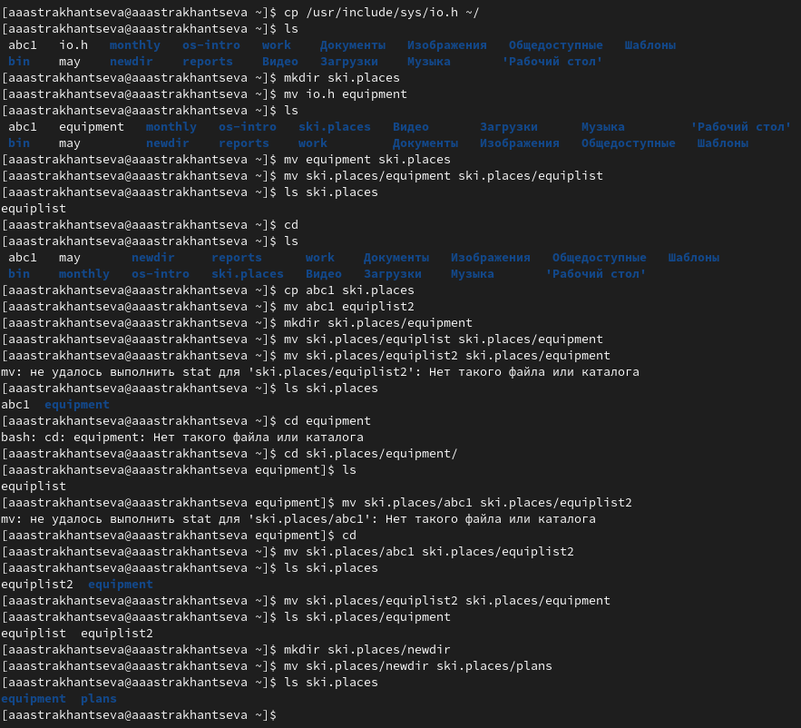{#fig:004 width=70%}

3. Определите опции команды chmod, необходимые для того, чтобы присвоить перечис-
ленным ниже файлам выделенные права доступа, считая, что в начале таких прав
нет:
3.1. drwxr--r-- ... australia (рис. @fig:005)

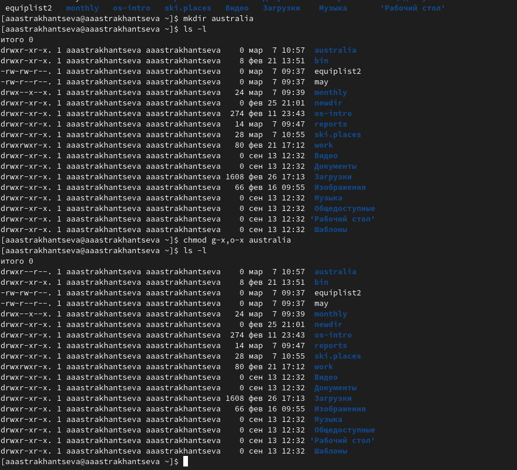{#fig:005 width=70%}

3.2. drwx--x--x ... play (рис. @fig:006)

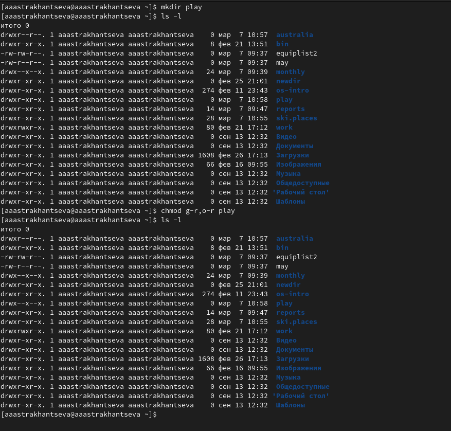{#fig:006 width=70%}

3.3. -r-xr--r-- ... my_os  (рис. @fig:007)

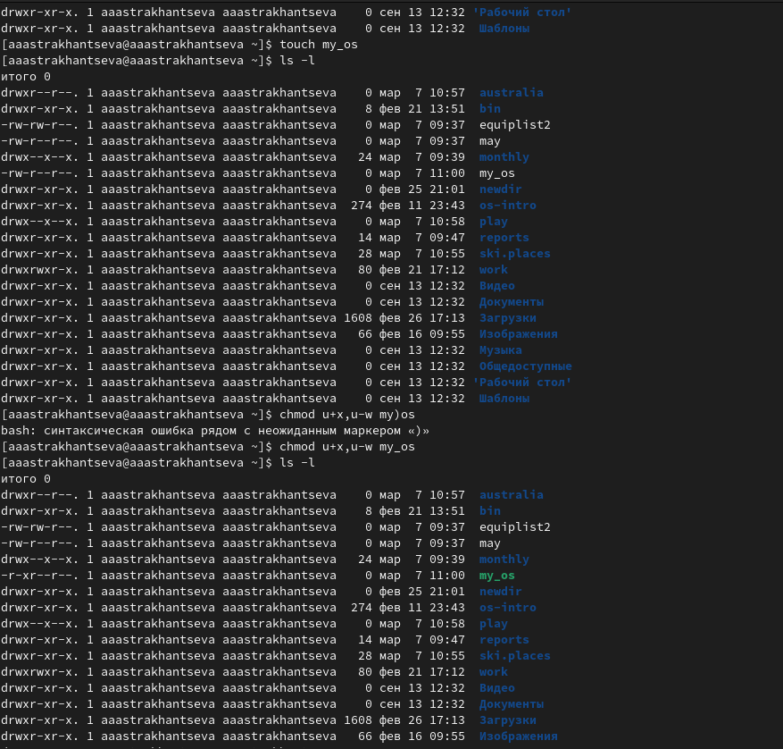{#fig:007 width=70%}

3.4. -rw-rw-r-- ... feathers (рис. @fig:008)

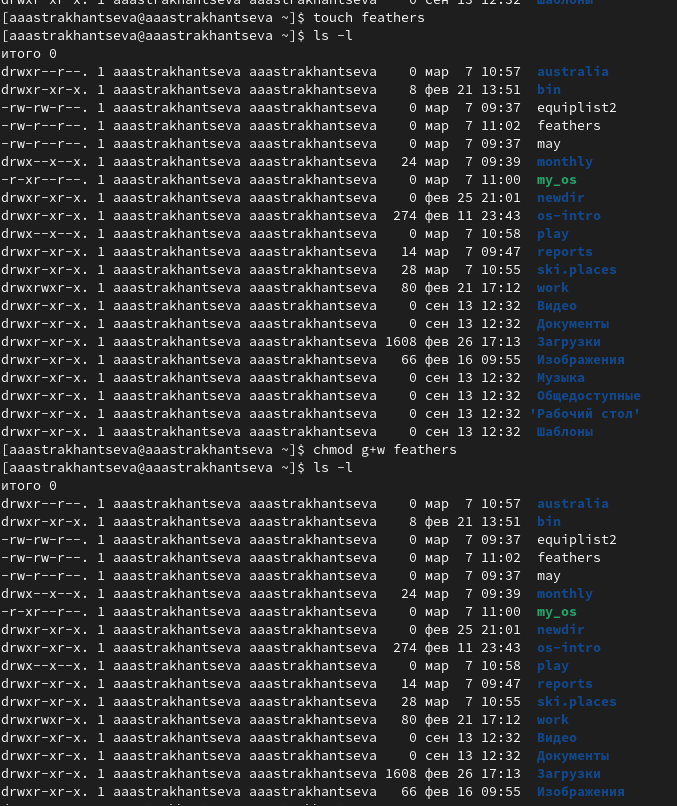{#fig:008 width=70%}

При необходимости создайте нужные файлы.
4. Проделайте приведённые ниже упражнения, записывая в отчёт по лабораторной
работе используемые при этом команды:
4.1. Просмотрите содержимое файла /etc/password.

Поскольку в каталоге /etc не было файла password, я проверила содержимое данного каталога: там я обнаружила файл с именем passwd-. (рис. @fig:009)

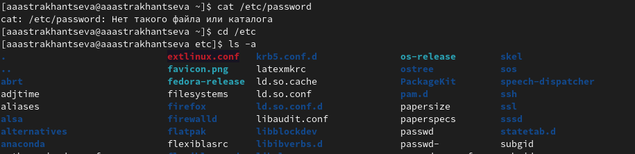{#fig:009 width=70%}

Посмотреть информацию, содержащуюся в данном файле можно с помощью команды `cat passwd-` (рис. @fig:010)

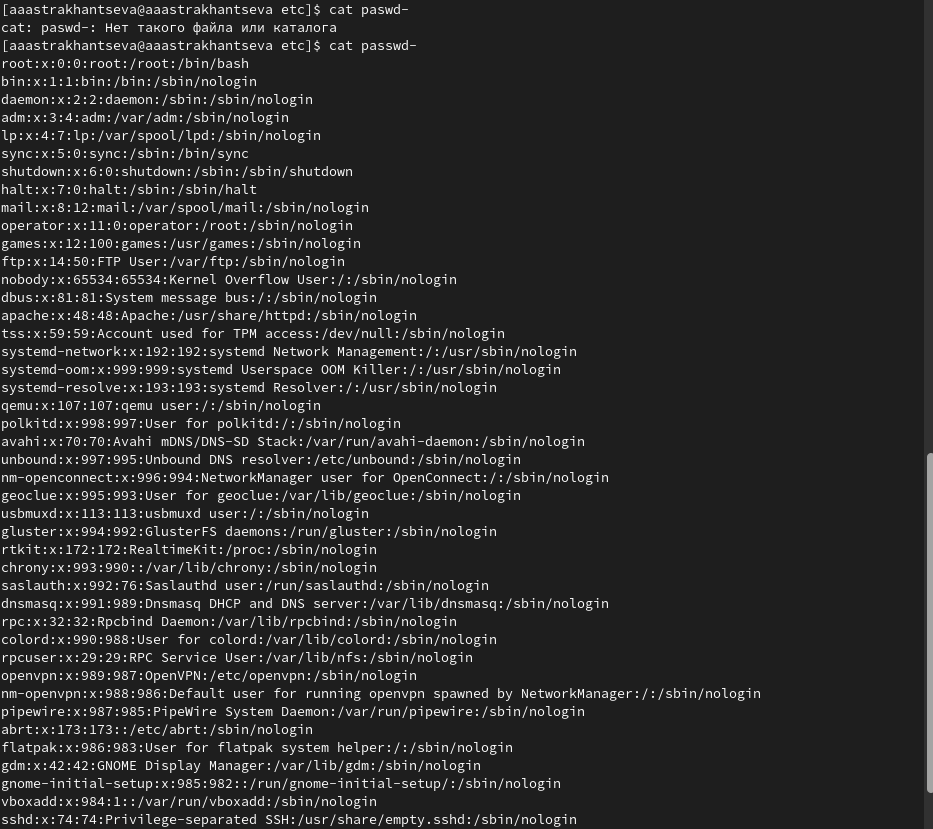{#fig:010 width=70%}

На следующем скриншоте показно выполнение следующих действий:  (рис. @fig:011)

4.2. Скопируйте файл ~/feathers в файл ~/file.old. Использую команду ``cp feathers file.old``

4.3. Переместите файл ~/file.old в каталог ~/play. Использую команду ``mv file.old play``

4.4. Скопируйте каталог ~/play в каталог ~/fun. Для начала нужно было создать каталог fun с помощью команды ``mkdir fun ``. Далее использую команду ``cp -r play fun``

4.5. Переместите каталог ~/fun в каталог ~/play и назовите его games. Использую команду ``mv play/fun play/games``

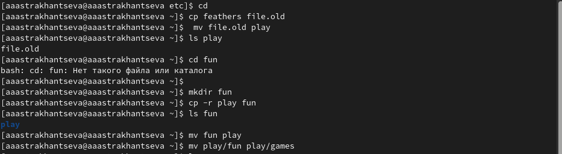{#fig:011 width=70%}

4.6. Лишение владельца файла ~/feathers права на чтение. ``chmod u-r feathers``.(рис. @fig:012)

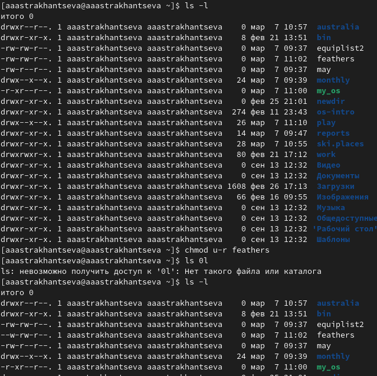{#fig:012 width=70%}

4.7. Что произойдёт, если вы попытаетесь просмотреть файл ~/feathers командой
cat? 
4.8. Что произойдёт, если вы попытаетесь скопировать файл ~/feathers? 

Ответ на вопросы 4.7 и 4.8: Поскольку я являюсь владельцем файла и у меня теперь нет права на чтение файла, то в терминале будет выведено предупреждение: "Отказанно в доступе" (см след. скриншот)

4.9. Дайте владельцу файла ~/feathers право на чтение. ``chmod u+r feathers``.(рис. @fig:013)

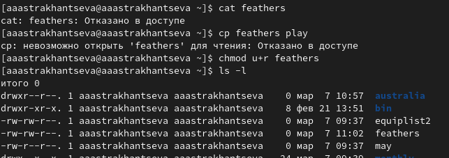{#fig:013 width=70%}

4.10. Лишите владельца каталога ~/play права на выполнение.
4.11. Перейдите в каталог ~/play. Что произошло?
4.12. Дайте владельцу каталога ~/play право на выполнение.

Для начала я лишила владельца права на исполнение с помощью команды ``chmod u-x play``. После попытки перемещения в данный каталог в терминале возникла ошибка: "Отказанно в доступе". После этого я вернула владельцу правло на исполнеине с помощью команды ``chmod u+x play``. (рис. @fig:014)

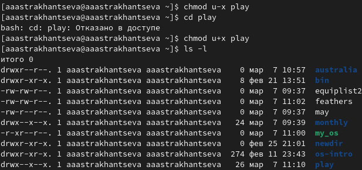{#fig:014 width=70%}

5. Прочитайте man по командам mount, fsck, mkfs, kill и кратко их охарактеризуйте,
приведя примеры

Команда ``man mount``, основные опции mount: (рис. @fig:015)

1. -a, --all - Смонтировать все файловые системы (указанных типов), упомянутые в fstab (кроме тех, чья строка содержит ключевое слово noauto). Файловые системы монтируются в соответствии с их порядком в fstab. Команда mount сравнивает источник файловой системы, цель (и корень fs для bind mount или btrfs) для обнаружения уже смонтированных файловых систем.  Параметр --all также можно использовать для операции повторного монтирования. В этом случае все фильтры (-t и -O) применяются к таблице уже смонтированных файловых систем. 
2. -B, --bind - Перемонтировать поддерево в другом месте (чтобы его содержимое было доступно в обоих местах). 
3. -c, --no-canonicalize - Не канонизировать пути. Команда mount по умолчанию канонизирует все пути (из командной строки или fstab). Этот параметр можно использовать вместе с флагом -f для уже канонизированных абсолютных путей. Опция предназначена для помощников монтирования, которые вызывают mount -i. Настоятельно рекомендуется не использовать этот параметр командной строки для обычных операций монтирования. 
4. -F, --fork -  (Используется вместе с -a.) Разветвляет новое воплощение mount для каждого устройства. Это позволит выполнять монтирование на разных устройствах или на разных серверах NFS параллельно.

Эта опция имеет преимущество в скорости; также таймауты NFS продолжаются параллельно. Недостатком является то, что порядок операций монтирования не определён. Таким образом, вы не можете использовать эту опцию, если хотите монтировать и /usr и /usr/spool. 

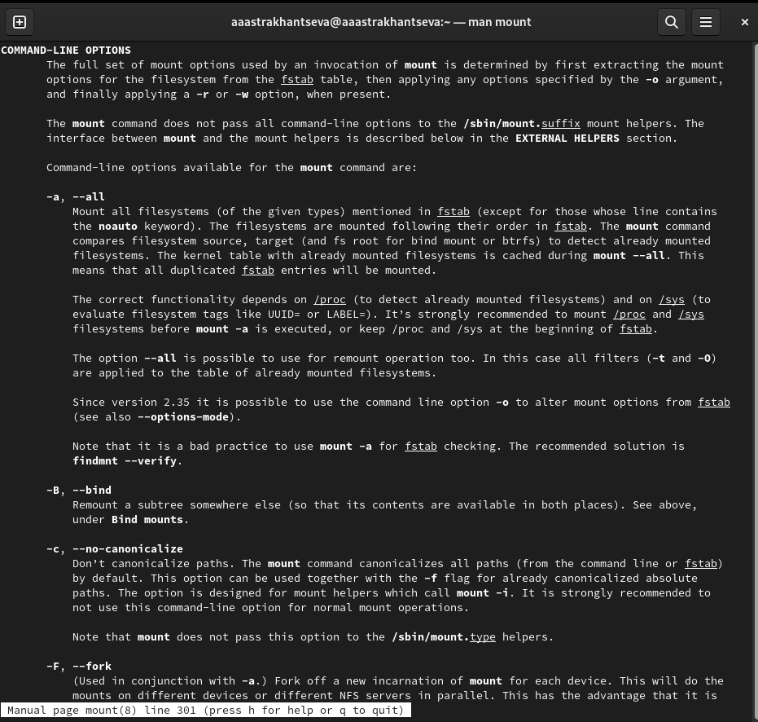{#fig:015 width=70%}

Команда ``man fsck``, основные опции fsck: (рис. @fig:016)

1. -l - Блокирует устройство для исключительного доступа
2. -r [<fd>] - Выводит статистику для каждого проверенного устройства
3. -t <тип> - Задаёт ФС для проверки. Можно задавать несколько ФС, перечисляя через запятую
4. -V - Выводит подробное описание выполняемых действий

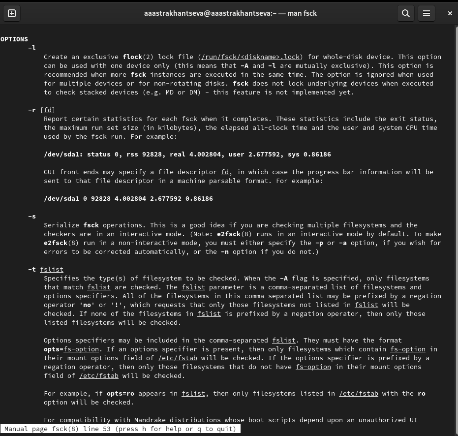{#fig:016 width=70%}

Команда ``man mkfs``, основные опции mkfs: (рис. @fig:017)

1. -V - Подробно информирует происходящее, включая все выполняемые специфические команды файловой системы. Если указать этот параметр более одного раза, то это запретит реальное выполнение любых специфических команд файловой системы. Использовать этот параметр целесообразно во время тестирования. 
2. -t fstype - Указывает тип создаваемой файловой системы. Если этот параметр не указан, тогда, по умолчанию, принимается тип файловой системы ext2. 
3. fs-options - Передаёт модулю создания специфической файловой системы параметры в виде списка. Следует отметить, что нет гарантии в том, что следующие перечисленные параметры будут поддерживаться большинством модулей создания файловых систем. 
4. -c - Перед созданием файловой системы проверяет наличие сбойных блоков на устройстве. 
5. -l filename  - Считывает список сбойных блоков из указанного файла filename. Для составления подобного списка, можно выполнить предварительную проверку, например, с помощью программы badblocks. 
6. -v - Подробно комментирует происходящее. 

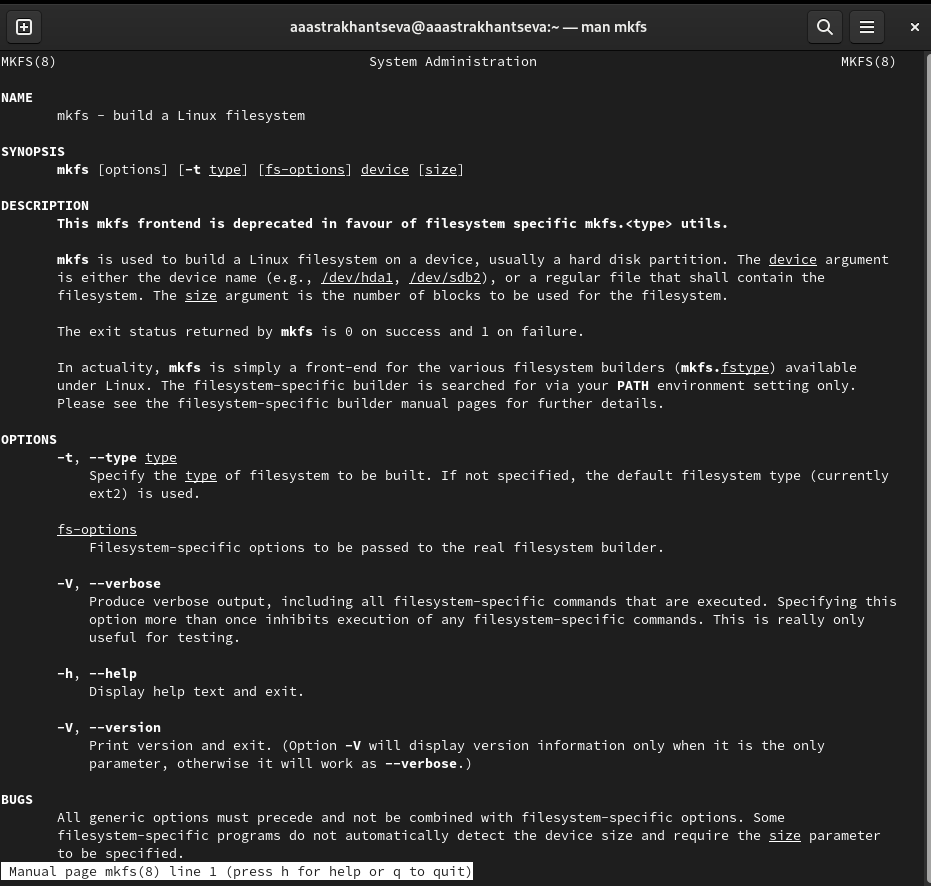{#fig:017 width=70%}

Команда ``man kill``, основные опции kill: (рис. @fig:018)

1. -l - вывести список поддерживаемых сигналов
2. -s - сигнал — послать сигнал с указанным именем
3. -p - Вывод только ID процесса без вывода сигналов 

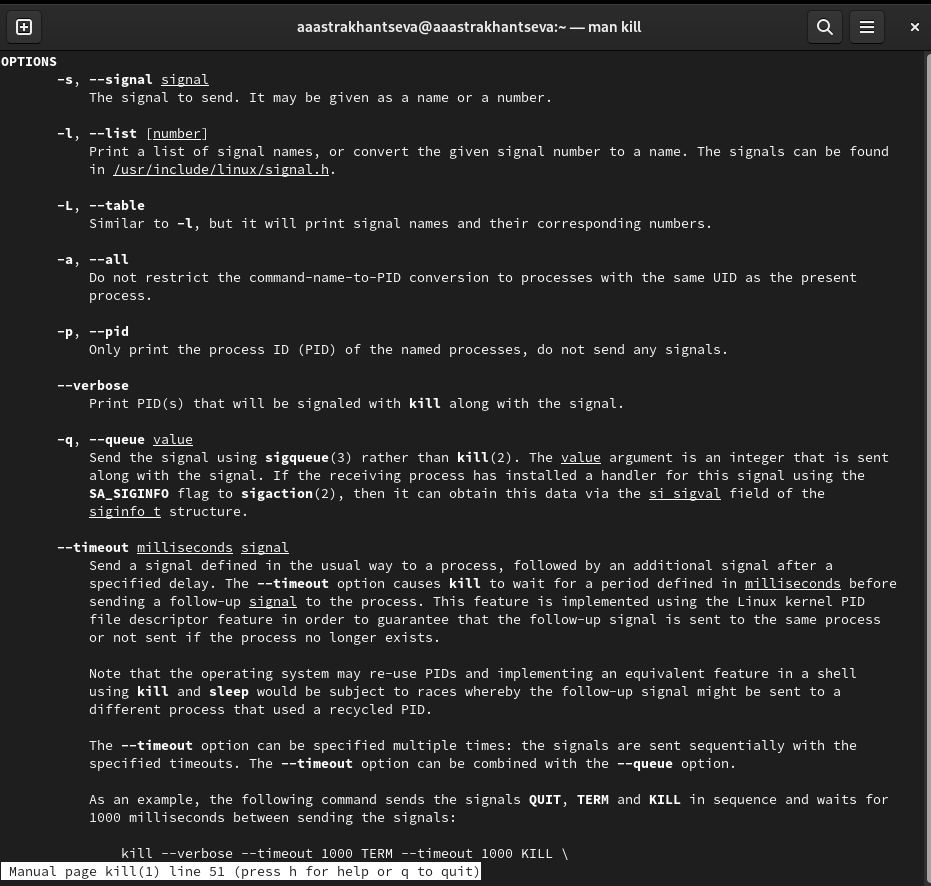{#fig:018 width=70%}

**Контрольные вопросы**

1. Дайте характеристику каждой файловой системе, существующей на жёстком диске
компьютера, на котором вы выполняли лабораторную работу.

На моем компьютере используются 2 вида файловых систем: "btrfs" и "ext4" (рис. @fig:019)

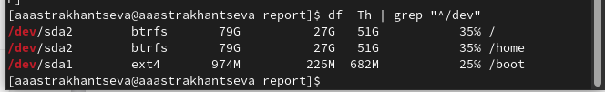{#fig:019 width=70%}

**Btrfs**

Btrfs — это современная файловая система для Linux, использующая принцип «копирование при записи» (CoW), направленная на реализацию дополнительных функций с особым упором на отказоустойчивость, восстановление и простоту администрирования.

 Btrfs была разработана компанией Oracle в 2007 году. Одной расшифровки названия нет, одни говорят, что это значит B-tree FS, другие Better Fs. 
 
 Также как и в других файловых системах, все данные хранятся на диске по определенным адресам. Эти адреса сохранены в метаданных. И тут уже начинаются различия. Все метаданные организованны в виде b-деревьев. Это дает большую производительность при работе с файловой системой, а также позволяет добавлять неограниченное количество файлов. 
 
 Из-за своей структуры Btrfs имеет огромные возможности, например, она может работать с современными очень большими носителями данных. Максимальный размер файловой системы составляет 16 Экзабайт.
 
  Это все возможно благодаря правильному использованию пространства на диске. Другие файловые системы используют жесткий диск целиком, от начала до конца для записи своей структуры. Btrfs поступает по-другому. Каждый диск, независимо от его размера делится на блоки по 1 Гб для данных и 256 Мб для метаданных. Затем эти блоки собираются в группы, каждая из которых может храниться на разных устройствах, количество таких блоков в группе может зависеть от уровня RAID для группы. 
  
  **ext4**
  
Файловая система EXT (Extended File System) была разработана специально для операционной системы Linux. Главной целью, которую преследовали создатели EXT было преодоление максимального размера записываемых файлов, который в то время составлял всего лишь 64 МБ. Благодаря созданию новой структуры метаданных – максимально возможный размер файла увеличился до 2 ГБ. В то же время максимальная длина имен файлов увеличилась о 255 байт.

Несмотря на то, что Linux поддерживает достаточно большое количество файловых систем, именно EXT является наиболее предпочтительной, поскольку она изначально построена на ядре Linux.

Ext4 – была представлена в 2008 году и на сегодняшний день является последней версией файловой системы EXT. Она использует базовые принципы Ext3, однако скорость работы была значительно увеличена (она даже выше чем в Ext2), увеличен максимальный размер файла до 16 ГБ, добавлена поддержка накопителей объемом до 1 Экзабайта и многое другое.

Несмотря на то, что файловая система Ext4 использует основные концепции Ext3 — в ней присутствует большое количество нововведений, которые сделали ее столь популярной. 

Начать стоит с пространственной записи файлов, которая используется для увеличения быстродействия файловой системы. Перед тем, как записать файл на диск – система выделяет нужную область на диске и после этого данные записываются в конец этой области.

В файловой системе Ext4 впервые была добавлена обратная совместимость с Ext2 и Ext3. К примеру, вы автоматически можете смонтировать Ext3 при помощи драйвера Ext4.

Следующим пунктом можно отметить появление экстентов. Дело в том, что в старых версиях отображение блоков данных файла реализовано старым способом – то есть, отображаются все блоки, относящиеся к конкретному файлу. Это накладывает некоторые ограничения при работе с файлами большого размера. К примеру, падает производительность.

2. Приведите общую структуру файловой системы и дайте характеристику каждой ди-
ректории первого уровня этой структуры. 

/ — root каталог. Содержит в себе всю иерархию системы;

/bin — здесь находятся двоичные исполняемые файлы. Основные общие команды, хранящиеся отдельно от других программ в системе (прим.: pwd, ls, cat, ps);

/boot — тут расположены файлы, используемые для загрузки системы (образ initrd, ядро vmlinuz);

/dev — в данной директории располагаются файлы устройств (драйверов). С помощью этих файлов можно взаимодействовать с устройствами. К примеру, если это жесткий диск, можно подключить его к файловой системе. В файл принтера же можно написать напрямую и отправить задание на печать;

/etc — в этой директории находятся файлы конфигураций программ. Эти файлы позволяют настраивать системы, сервисы, скрипты системных демонов;

/home — каталог, аналогичный каталогу Users в Windows. Содержит домашние каталоги учетных записей пользователей (кроме root). При создании нового пользователя здесь создается одноименный каталог с аналогичным именем и хранит личные файлы этого пользователя;

/lib — содержит системные библиотеки, с которыми работают программы и модули ядра;

/lost+found — содержит файлы, восстановленные после сбоя работы системы. Система проведет проверку после сбоя и найденные файлы можно будет посмотреть в данном каталоге;

/media — точка монтирования внешних носителей. Например, когда вы вставляете диск в дисковод, он будет автоматически смонтирован в директорию /media/cdrom;

/mnt — точка временного монтирования. Файловые системы подключаемых устройств обычно монтируются в этот каталог для временного использования;

/opt — тут расположены дополнительные (необязательные) приложения. Такие программы обычно не подчиняются принятой иерархии и хранят свои файлы в одном подкаталоге (бинарные, библиотеки, конфигурации);

/proc — содержит файлы, хранящие информацию о запущенных процессах и о состоянии ядра ОС;

/root — директория, которая содержит файлы и личные настройки суперпользователя;

/run — содержит файлы состояния приложений. Например, PID-файлы или UNIX-сокеты;

/sbin — аналогично /bin содержит бинарные файлы. Утилиты нужны для настройки и администрирования системы суперпользователем;

/srv — содержит файлы сервисов, предоставляемых сервером (прим. FTP или Apache HTTP);

/sys — содержит данные непосредственно о системе. Тут можно узнать информацию о ядре, драйверах и устройствах;

/tmp — содержит временные файлы. Данные файлы доступны всем пользователям на чтение и запись. Стоит отметить, что данный каталог очищается при перезагрузке;

/usr — содержит пользовательские приложения и утилиты второго уровня, используемые пользователями, а не системой. Содержимое доступно только для чтения (кроме root). Каталог имеет вторичную иерархию и похож на корневой;

/var — содержит переменные файлы. Имеет подкаталоги, отвечающие за отдельные переменные. Например, логи будут храниться в /var/log, кэш в /var/cache, очереди заданий в /var/spool/ и так далее.

3. Какая операция должна быть выполнена, чтобы содержимое некоторой файловой
системы было доступно операционной системе?

Монтирование тома.

4. Назовите основные причины нарушения целостности файловой системы. Как устра-
нить повреждения файловой системы?

Отсутствие синхронизации между образом файловой системы в памяти и ее данными на диске в случае аварийного останова может привести к появлению следующих ошибок:

1) Один блок адресуется несколькими mode (принадлежит нескольким файлам).

2) Блок помечен как свободный, но в то же время занят (на него ссылается onode).

3) Блок помечен как занятый, но в то же время свободен (ни один inode на него не ссылается).

4) Неправильное число ссылок в inode (недостаток или избыток ссылающихся записей в каталогах).

5) Несовпадение между размером файла и суммарным размером адресуемых inode блоков.

6) Недопустимые адресуемые блоки (например, расположенные за пределами файловой системы).

7) "Потерянные" файлы (правильные inode, на которые не ссылаются записи каталогов).

8) Недопустимые или неразмещенные номера inode в записях каталогов.

5. Как создаётся файловая система?

mkfs - позволяет создать файловую систему Linux.

6. Дайте характеристику командам для просмотра текстовых файлов. 

Для просмотра файлов небольшого размера можно использовать команду cat:

``cat имя файла``

Для просмотра файлов постранично удобнее использовать команду less:

`` less имя файла``

Следующие клавиши используются для управления процессом просмотра:
1) ``Space`` - переход к следующей странице,
2) ``ENTER`` - сдвиг вперёд на одну строку,
3) ``b`` - возврат на предыдущую страницу,
4) ``h`` - обращение за подсказкой,
5) ``q`` - выход из режима просмотра файла

Команда head выводит по умолчанию первые 10 строк файла (n — количество выводимых строк.).

``head [-n] имя-файла``

7. Приведите основные возможности команды cp в Linux.

Команда cp используется для копирования файлов и каталогов.

``cp [-опции] исходный_файл целевой_файл``

8. Приведите основные возможности команды mv в Linux. 

Команда mv предназначена для перемещения и переименования файлов
и каталогов

``mv [-опции] старый_файл новый_файл``

9. Что такое права доступа? Как они могут быть изменены?

Права доступа определяют, какие действия конкретный пользователь может или не может совершать с определенным файлами и каталогами.

С помощью разрешений можно создать надежную среду — такую, в которой никто не может поменять содержимое ваших документов или повредить системные файлы. 

В сведениях о файле или каталоге указываются:

1) тип файла (символ (-) обозначает файл, а символ (d) — каталог);
2) права для владельца файла (r — разрешено чтение, w — разрешена запись, x — разре-
шено выполнение, - — право доступа отсутствует);
3) права для членов группы (r — разрешено чтение, w — разрешена запись, x — разрешено
выполнение, - — право доступа отсутствует);
4) права для всех остальных (r — разрешено чтение, w — разрешена запись, x — разрешено
выполнение, - — право доступа отсутствует).

Права доступа к файлу или каталогу можно изменить, воспользовавшись командой
chmod. Сделать это может владелец файла (или каталога) или пользователь с правами
администратора.

# Выводы

В ходе выполнения ЛР№5 я ознакомомилась с файловой системой Linux, её структурой, именами и содержанием
каталогов. Также мною были приобретены практические навыки по применению команд для работы
с файлами и каталогами, по управлению процессами (и работами), по проверке исполь-
зования диска и обслуживанию файловой системы.

# Список литературы{.unnumbered}

1. Всё о монтировании: от системного администрирования до IT криминалистики [электронный ресурс]. Режим доступа: https://hackware.ru/?p=14459
2. Проверка и восстановление файловых систем в Linux- команда fsck [электронный ресурс]. Режим доступа: https://itproffi.ru/proverka-i-vosstanovlenie-fajlovyh-sistem-v-linux-komanda-fsck/
3. Btrfs (Русский) [электронный ресурс]. Режим доступа: https://wiki.archlinux.org/title/Btrfs_(%D0%A0%D1%83%D1%81%D1%81%D0%BA%D0%B8%D0%B9)
4. Файловая система Btrfs [электронный ресурс]. Режим доступа: https://losst.pro/fajlovaya-sistema-btrfs
5. Файловая система EXT (Ext2, Ext3, Ext 4) [электронный ресурс]. Режим доступа: https://recovery-software.ru/blog/the-ext-ext2-ext3-ext4-filesystem.html#top
6. Структура и типы файловых систем в Linux [электронный ресурс]. Режим доступа: https://selectel.ru/blog/directory-structure-linux/
