---
## Front matter
lang: ru-RU
title: "Отчет по лабораторной работе №6"
subtitle: "Дисциплина: Операционные системы"
author:
  - Астраханцева А. А.
institute:
  - Российский университет дружбы народов, Москва, Россия
  
date: 12 марта 2023

## i18n babel
babel-lang: russian
babel-otherlangs: english

## Formatting pdf
toc: false
toc-title: Содержание
slide_level: 2
aspectratio: 169
section-titles: true
theme: metropolis
header-includes:
 - \metroset{progressbar=frametitle,sectionpage=progressbar,numbering=fraction}
 - '\makeatletter'
 - '\beamer@ignorenonframefalse'
 - '\makeatother'
---

# Информация

## Докладчик

:::::::::::::: {.columns align=center}
::: {.column width="70%"}

  * Астраханцева Анастасия Александровна
  * Группа: НКАбд-01-22
  * Студ. билет: 1132226437
  * Российский университет дружбы народов
  * <https://anastasiia7205.github.io/>

:::
::: {.column width="50%"}

:::
::::::::::::::

# Вводная часть

## Цель работы

Ознакомление с инструментами поиска файлов и фильтрации текстовых данных. Приобретение практических навыков: по управлению процессами (и заданиями), по проверке использования диска и обслуживанию файловых систем.

## Задания

1. Осуществите вход в систему, используя соответствующее имя пользователя.
2. Запишите в файл file.txt названия файлов, содержащихся в каталоге /etc. Допи-
шите в этот же файл названия файлов, содержащихся в вашем домашнем каталоге.
3. Выведите имена всех файлов из file.txt, имеющих расширение .conf, после чего
запишите их в новый текстовой файл conf.txt.
4. Определите, какие файлы в вашем домашнем каталоге имеют имена, начинавшиеся
с символа c? Предложите несколько вариантов, как это сделать.
5. Выведите на экран (по странично) имена файлов из каталога /etc, начинающиеся
с символа h.
6. Запустите в фоновом режиме процесс, который будет записывать в файл ~/logfile
файлы, имена которых начинаются с log.

## Задания

7. Удалите файл ~/logfile.
8. Запустите из консоли в фоновом режиме редактор gedit.
9. Определите идентификатор процесса gedit, используя команду ps, конвейер и фильтр
grep. Как ещё можно определить идентификатор процесса?
10. Прочтите справку (man) команды kill, после чего используйте её для завершения
процесса gedit.
11. Выполните команды df и du, предварительно получив более подробную информацию
об этих командах, с помощью команды man.
12. Воспользовавшись справкой команды find, выведите имена всех директорий, имею-
щихся в вашем домашнем каталоге.

# Выполнение лабораторной работы

## Задание 2

2. Запись в файл file.txt названия файлов, содержащихся в каталоге /etc.

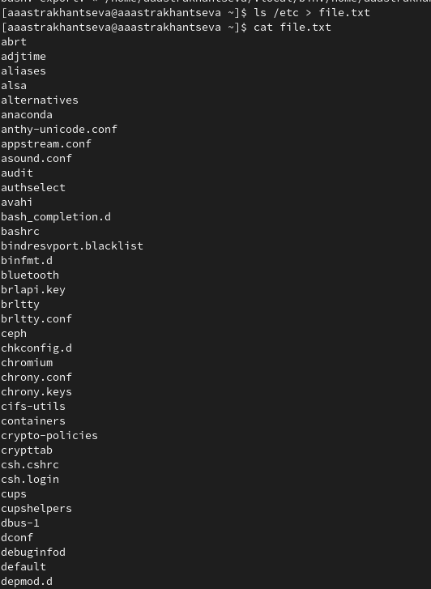{#fig:002 width=70%}

## Задание 2

После этого дописывваю в этот же файл названия файлов, содержащихся в домашнем каталоге

{#fig:003 width=50%}

## Задание 3

С помощью команды `grep` вывожу имена всех файлов из file.txt, имеющих расширение .conf 

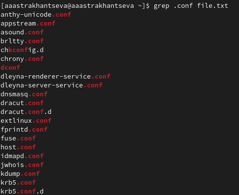{#fig:004 width=50%}

## Задание 3

После чего записываю их в новый текстовой файл conf.txt. 

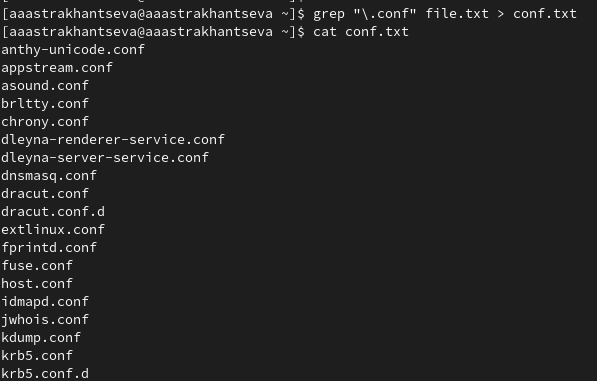{#fig:005 width=50%}

## Задание 4

Определите, какие файлы в вашем домашнем каталоге имеют имена, начинавшиеся
с символа c? Предложите несколько вариантов, как это сделать.

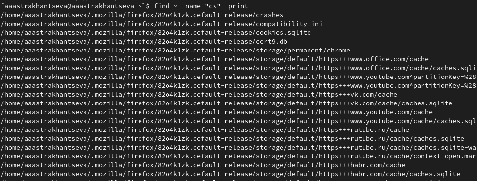{#fig:006 width=70%}

## Задание 4

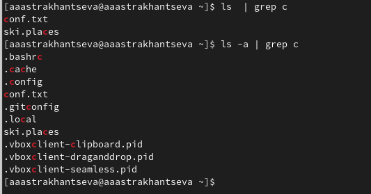{#fig:007 width=70%}

## Задание 5

 Выведите на экран (по странично) имена файлов из каталога /etc, начинающиеся
с символа h.

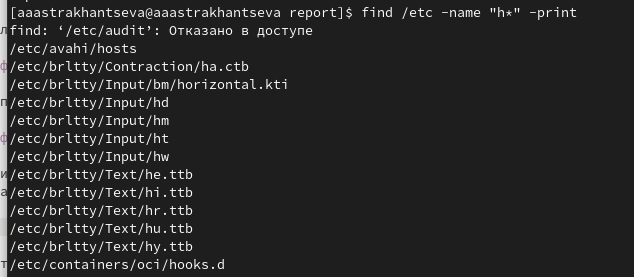{#fig:008 width=70%}

## Задание 6

Запустите в фоновом режиме процесс, который будет записывать в файл ~/logfile
файлы, имена которых начинаются с log.

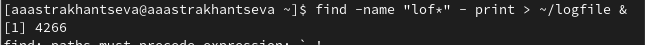{#fig:009 width=70%}

## Задание 7

Удалите файл ~/logfile.

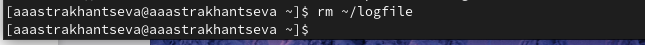{#fig:010 width=70%}

## Задание 8

Запустите из консоли в фоновом режиме редактор gedit.

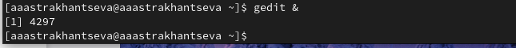{#fig:011 width=70%}

## Задание 9

Определите идентификатор процесса gedit, используя команду ps, конвейер и фильтр
grep.

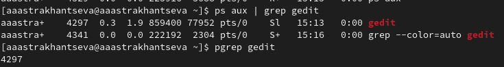{#fig:012 width=70%}

## Задание 10

Прочтите справку (man) команды kill, после чего используйте её для завершения
процесса gedit.

Завершение процесса gedit  

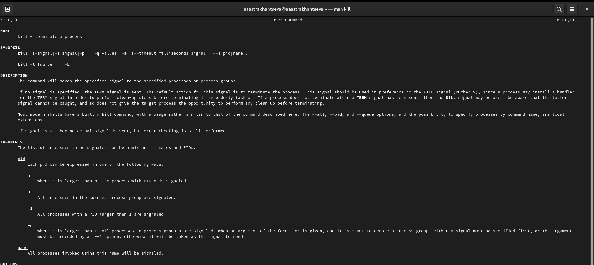{#fig:014 width=70%}

## Задание 11

 Выполните команды df и du, предварительно получив более подробную информацию
об этих командах, с помощью команды man.

Выполнение команды df  

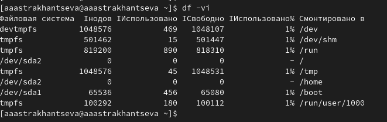{#fig:014 width=70%}

## Задание 11

Выполнение команды du. На скриншоте выше приведен вывод команды  

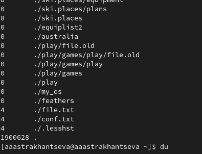{#fig:015 width=70%}

## Задание 12

Воспользовавшись справкой команды find, выведите имена всех директорий, имею-
щихся в вашем домашнем каталоге.

С помощью опции `-type d` вывожу имена всех директорий, имеющихся в домашнем каталоге

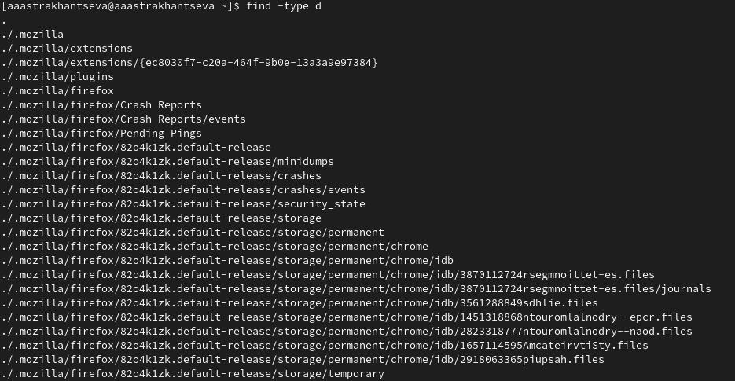{#fig:017 width=70%}

## Выводы 

В ходе выполнения лабораторной работы я ознакомилась с инструментами поиска файлов и фильтрации текстовых данных. Приобрела практические навыки: по управлению процессами (и заданиями), по проверке использования диска и обслуживанию файловых систем.

## Список литературы{.unnumbered}

1. Обслуживание файловой системы [электронный ресурс] - Режим доступа: https://it.wikireading.ru/12158
2. Управление процессами в Linux [электронный ресурс] - Режим доступа: http://www.opennet.ru/docs/RUS/lnx_process/process2.html
3. Процессы [электронный ресурс] - Режим доступа: https://linuxcookbook.ru/books/textbooks/linux_intro/ch06s01.html
4. Процесс [электронный ресурс] - Режим доступа: https://ru.wikipedia.org/wiki/%D0%9F%D1%80%D0%BE%D1%86%D0%B5%D1%81%D1%81_(%D0%B8%D0%BD%D1%84%D0%BE%D1%80%D0%BC%D0%B0%D1%82%D0%B8%D0%BA%D0%B0)
5. Pid процесса linux. Идентификатор процесса Process ID (PID) [электронный ресурс] - Режим доступа: https://leally.ru/download-soft/pid-processa-linux-identifikator-processa-process-id-pid-popytka-1/
6. top [электронный ресурс] - Режим доступа: https://wiki.dieg.info/top

