---
## Front matter
title: "Отчет по лабораторной работе №6"
subtitle: "Дисциплина: Оперционные системы"
author: "Астраханцева А. А."

## Generic otions
lang: ru-RU
toc-title: "Содержание"

## Bibliography
bibliography: bib/cite.bib
csl: pandoc/csl/gost-r-7-0-5-2008-numeric.csl

## Pdf output format
toc: true # Table of contents
toc-depth: 2
lof: true # List of figures
lot: false # List of tables
fontsize: 12pt
linestretch: 1.5
papersize: a4
documentclass: scrreprt
## I18n polyglossia
polyglossia-lang:
  name: russian
  options:
	- spelling=modern
	- babelshorthands=true
polyglossia-otherlangs:
  name: english
## I18n babel
babel-lang: russian
babel-otherlangs: english
## Fonts
mainfont: PT Serif
romanfont: PT Serif
sansfont: PT Sans
monofont: PT Mono
mainfontoptions: Ligatures=TeX
romanfontoptions: Ligatures=TeX
sansfontoptions: Ligatures=TeX,Scale=MatchLowercase
monofontoptions: Scale=MatchLowercase,Scale=0.9
## Biblatex
biblatex: true
biblio-style: "gost-numeric"
biblatexoptions:
  - parentracker=true
  - backend=biber
  - hyperref=auto
  - language=auto
  - autolang=other*
  - citestyle=gost-numeric
## Pandoc-crossref LaTeX customization
figureTitle: "Рис."
tableTitle: "Таблица"
listingTitle: "Листинг"
lofTitle: "Список иллюстраций"
lotTitle: "Список таблиц"
lolTitle: "Листинги"
## Misc options
indent: true
header-includes:
  - \usepackage{indentfirst}
  - \usepackage{float} # keep figures where there are in the text
  - \floatplacement{figure}{H} # keep figures where there are in the text
---

# Цель работы

Ознакомление с инструментами поиска файлов и фильтрации текстовых данных. Приобретение практических навыков: по управлению процессами (и заданиями), по проверке использования диска и обслуживанию файловых систем.

# Задание

1. Осуществите вход в систему, используя соответствующее имя пользователя.
2. Запишите в файл file.txt названия файлов, содержащихся в каталоге /etc. Допи-
шите в этот же файл названия файлов, содержащихся в вашем домашнем каталоге.
3. Выведите имена всех файлов из file.txt, имеющих расширение .conf, после чего
запишите их в новый текстовой файл conf.txt.
4. Определите, какие файлы в вашем домашнем каталоге имеют имена, начинавшиеся
с символа c? Предложите несколько вариантов, как это сделать.
5. Выведите на экран (по странично) имена файлов из каталога /etc, начинающиеся
с символа h.
6. Запустите в фоновом режиме процесс, который будет записывать в файл ~/logfile
файлы, имена которых начинаются с log.
7. Удалите файл ~/logfile.
8. Запустите из консоли в фоновом режиме редактор gedit.
9. Определите идентификатор процесса gedit, используя команду ps, конвейер и фильтр
grep. Как ещё можно определить идентификатор процесса?
10. Прочтите справку (man) команды kill, после чего используйте её для завершения
процесса gedit.
11. Выполните команды df и du, предварительно получив более подробную информацию
об этих командах, с помощью команды man.
12. Воспользовавшись справкой команды find, выведите имена всех директорий, имею-
щихся в вашем домашнем каталоге.

# Теоретическое введение

Процесс в Linux (как и в UNIX) - это программа, которая выполняется в отдельном виртуальном адресном пространстве. Когда пользователь регистрируется в системе, автоматически создается процесс, в котором выполняется оболочка (shell), например, /bin/bash. 

В Linux поддерживается классическая схема мультипрограммирования. Linux поддерживает параллельное (или квазипараллельного при наличии только одного процессора) выполнение процессов пользователя. Каждый процесс выполняется в собственном виртуальном адресном пространстве, т.е. процессы защищены друг от друга и крах одного процесса никак не повлияет на другие выполняющиеся процессы и на всю систему в целом. Один процесс не может прочитать что-либо из памяти (или записать в нее) другого процесса без "разрешения" на то другого процесса. Санкционированные взаимодействия между процессами допускаются системой. 

Проверка и восстановление файловой системы Linux выполняется программой fsck. Перед проверкой файловая система должна быть смонтирована в режиме «только чтение».

Программа fsck умеет проверять и другие типы файловых систем, но для исправления ошибок лучше использовать родные для этой файловой системы программы, предназначенные для проверки и исправления ошибок. Программа fsck автоматически проверяет файловые системы при загрузке Linux в соответствии с указаниями, содержащимися в файле etc/fstab. Для программы fsck можно использовать опции

**Перенаправление ввода - вывода**

 системе по умолчанию открыто три специальных потока:
 
– stdin — стандартный поток ввода (по умолчанию: клавиатура), файловый дескриптор
0;

– stdout — стандартный поток вывода (по умолчанию: консоль), файловый дескриптор
1;

– stderr — стандартный поток вывод сообщений об ошибках (по умолчанию: консоль),
файловый дескриптор 2.

Большинство используемых в консоли команд и программ записывают результаты
своей работы в стандартный поток вывода stdout. Например, команда ls выводит в стан-
дартный поток вывода (консоль) список файлов в текущей директории. Потоки вывода
и ввода можно перенаправлять на другие файлы или устройства. Проще всего это делается
с помощью символов >, >>, <, <<. 

# Выполнение лабораторной работы

2. Запись в файл file.txt названия файлов, содержащихся в каталоге /etc. (Результат команды ls /etc записывается в файл file.txt с помощью ">")(рис. @fig:001).

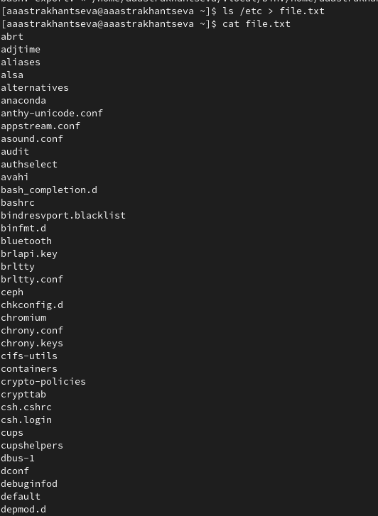{#fig:001 width=70%}

После этого дописывваю в этот же файл названия файлов, содержащихся в домашнем каталоге (рис. @fig:002 - @fig:003).

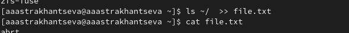{#fig:002 width=70%}

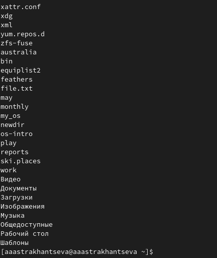{#fig:003 width=70%}

3. С помощью команды `grep` вывожу имена всех файлов из file.txt, имеющих расширение .conf (рис. @fig:004)

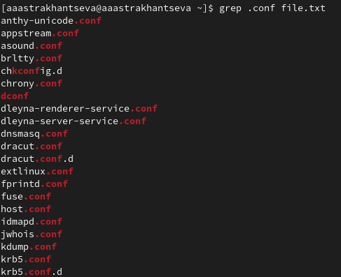{#fig:004 width=70%}

После чего записываю их в новый текстовой файл conf.txt. с помощью команды grep и символа ">" (рис. @fig:005)

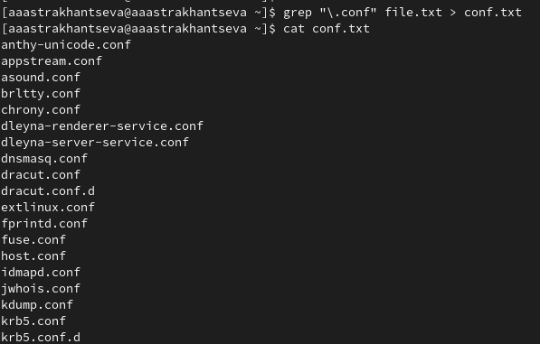{#fig:005 width=70%}

4. Определите, какие файлы в вашем домашнем каталоге имеют имена, начинавшиеся
с символа c? Предложите несколько вариантов, как это сделать.

Можно сдлать это с помощью команды find, выглядеть это будет так:  (рис. @fig:006)

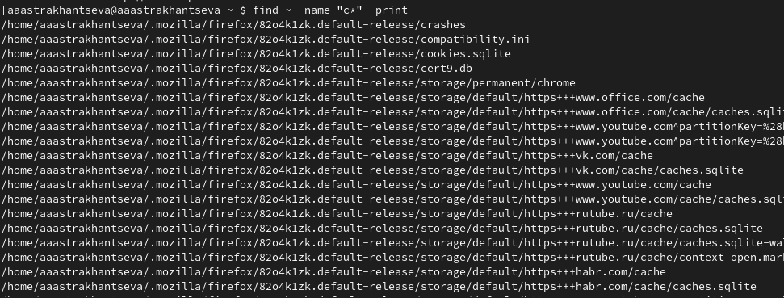{#fig:006 width=70%}

Можно использовать grep:  (рис. @fig:007) 

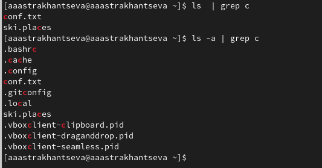{#fig:007 width=70%}

5. Выведите на экран (по странично) имена файлов из каталога /etc, начинающиеся
с символа h.

Сделать это можно с помошью команды find (рис. @fig:008) 

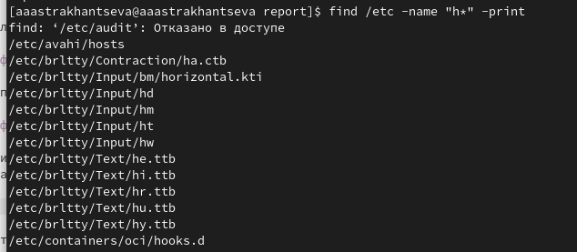{#fig:008 width=70%}

6. Запустите в фоновом режиме процесс, который будет записывать в файл ~/logfile
файлы, имена которых начинаются с log.

С помощью команды find ищем именая файлов, которые начинаются с log и записываем их в файл logfile с помощью символа ">". Чтобы процесс выполнялся в фоновом режиме нужно добавить "&" (рис. @fig:009)

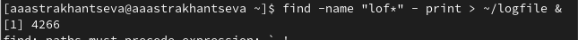{#fig:009 width=70%}

7. Удалите файл ~/logfile.(рис. @fig:009)

Делаю это с помощью команды `rm` (рис. @fig:010).

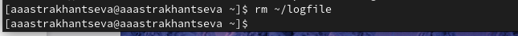{#fig:010 width=70%}

8. Запустите из консоли в фоновом режиме редактор gedit.

Нужно просто написать: gedit &. В следующей строке выведен идентификатор процесса gedit.(рис. @fig:011).

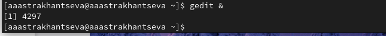{#fig:011 width=70%}

9. Определите идентификатор процесса gedit, используя команду ps, конвейер и фильтр
grep. Как ещё можно определить идентификатор процесса?

Использование команды ps, конвейера и фильтра grep. Еще есть вариант ипользовать только крманду `pgrep` (рис. @fig:012).

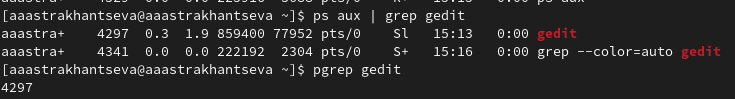{#fig:012 width=70%}

10. Прочтите справку (man) команды kill, после чего используйте её для завершения
процесса gedit.

Команда man kill (рис. @fig:013)

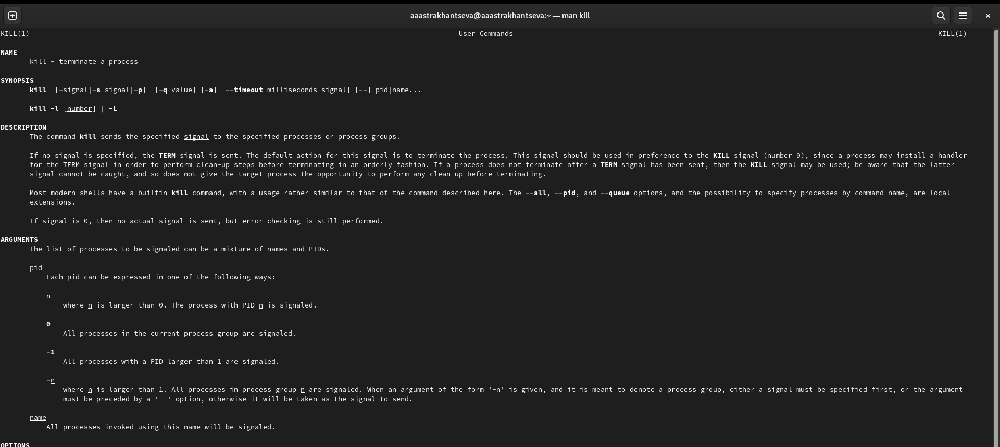{#fig:013 width=70%}

Завершение процесса gedit  (рис. @fig:014)

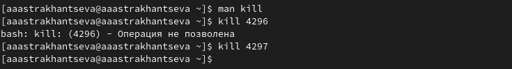{#fig:014 width=70%}

11. Выполните команды df и du, предварительно получив более подробную информацию
об этих командах, с помощью команды man.

Команда `man df`  (рис. @fig:015)

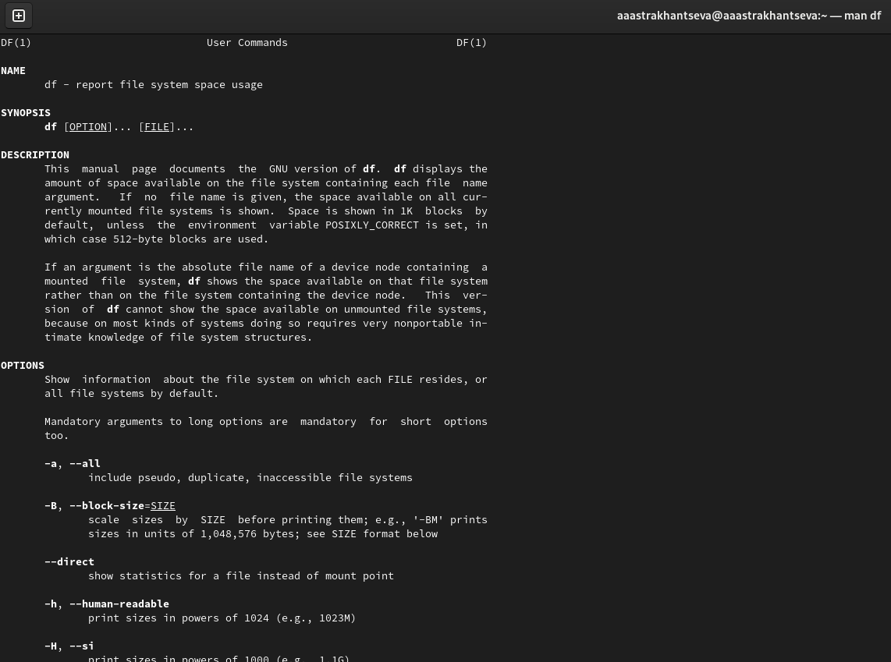{#fig:015 width=70%}

Выполнение команды df  (рис. @fig:016)

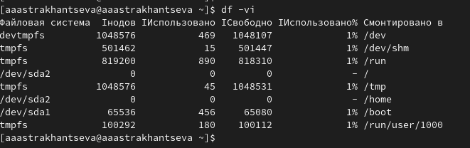{#fig:016 width=70%}

Команда `man du`  (рис. @fig:017)

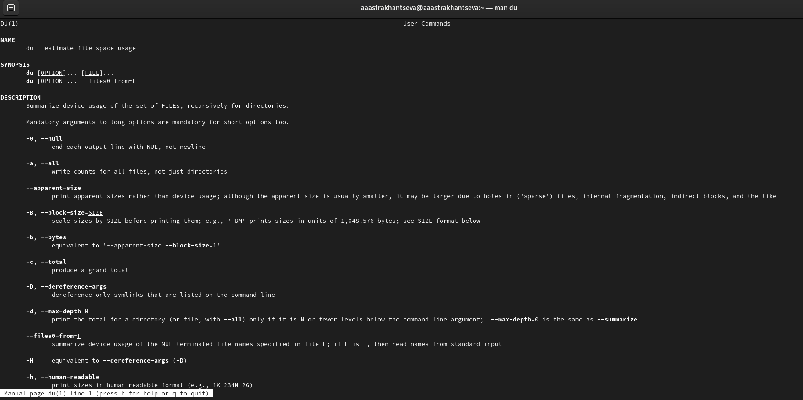{#fig:017 width=70%}

Выполнение команды du. На скриншоте выше приведен вывод команды  (рис. @fig:018)

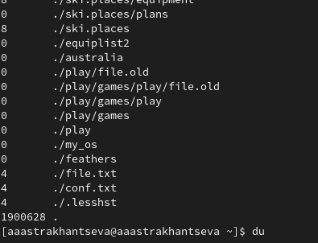{#fig:018 width=70%}

12. Воспользовавшись справкой команды find, выведите имена всех директорий, имею-
щихся в вашем домашнем каталоге.

Использую `man find`  (рис. @fig:019)

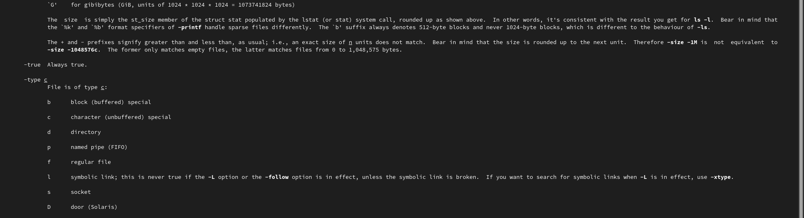{#fig:019 width=70%}

С помощью опции `-type d` вывожу имена всех директорий, имеющихся в домашнем каталоге (рис. @fig:020)

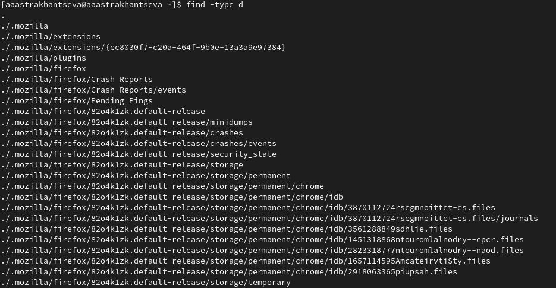{#fig:020 width=70%}

# Выводы

В ходе выполнения лабораторной работы я ознакомилась с инструментами поиска файлов и фильтрации текстовых данных. Приобрела практические навыки: по управлению процессами (и заданиями), по проверке использования диска и обслуживанию файловых систем.

#  Ответы на контрольные вопросы 

1. Какие потоки ввода вывода вы знаете?

В системе по умолчанию открыто три специальных потока:
– stdin — стандартный поток ввода (по умолчанию: клавиатура), файловый дескриптор 0;

– stdout — стандартный поток вывода (по умолчанию: консоль), файловый дескриптор 1;

– stderr — стандартный поток вывод сообщений об ошибках (по умолчанию: консоль),файловый дескриптор 2.

2. Объясните разницу между операцией > и >>.

Операция > используется для перенаправлнеи ввода/вывода, а  >> используется как перенаправлнение в режиме добавлнеия.

3. Что такое конвейер?

Конвейер (pipe) служит для объединения простых команд или утилит в цепочки, в ко-
торых результат работы предыдущей команды передаётся последующей. 

4. Что такое процесс? Чем это понятие отличается от программы?

Выполняющаяся программа называется в Linux процессом. Все процессы система регистрирует в таблице процессов, присваивая каждому уникальный номер — идентификатор процесса. 

Компьютерная программа сама по себе — лишь пассивная последовательность инструкций. В то время как процесс — непосредственное выполнение этих инструкций. Также, процессом называют выполняющуюся программу и все её элементы: адресное пространство, глобальные переменные, регистры, стек, открытые файлы и так далее.

5. Что такое PID и GID?

Каждому процессу Linux или Unix или выполняемой программе, автоматически присваивается идентификационный номер уникального процесса (PID). PID автоматически присваивает номер для каждого процесса в системе.

GID– это идентификационный номер группы данного процесса. Допустимые идентификаторы групп указываются в файле/ etc / group и в поле GID файла/е tc / passwd . Когда процесс запускается, его GID устанавливается равным GID родительского процесса.

6. Что такое задачи и какая команда позволяет ими управлять?

Запущенные фоном программы называются задачами (jobs). Ими можно управлять
с помощью команды jobs, которая выводит список запущенных в данный момент задач.

7. Найдите информацию об утилитах top и htop. Каковы их функции?

top - интерактивный просмотрщик процессов. htop аналог top.

Top показывает все запущенные процессы и выводит важную информацию о нагрузке на производительные мощности компьютера или сервера. Также эта утилита даёт возможность завершить ненужные процессы. 

Htop – просмотрщик процессов подобный top, но позволяющий прокручивать список процессов вертикально и горизонтально, чтобы видеть их полные параметры запуска. Управление процессами (остановка, изменение приоритета) может выполняться без ручного ввода их идентификаторов. 

8. Назовите и дайте характеристику команде поиска файлов. Приведите примеры ис-
пользования этой команды.

Команда find используется для поиска и отображения на экран имён файлов, соответствующих заданной строке символов. Формат команды: 

`find путь [-опции]`

Для примера: Вывести на экран имена файлов из вашего домашнего каталога и его подкаталогов,
начинающихся на f:

`find ~ -name "f*" -print`

Здесь ~ — обозначение вашего домашнего каталога, -name — после этой опции указы-
вается имя файла, который нужно найти, "f*" — строка символов, определяющая имя
файла, -print — опция, задающая вывод результатов поиска на экран.

9. Можно ли по контексту (содержанию) найти файл? Если да, то как?

Найти в текстовом файле указанную строку символов позволяет команда grep.
Формат команды: 

`grep строка имя_файла` 

Пример: 

Показать строки во всех файлах в вашем домашнем каталоге с именами, начинающи-
мися на f, в которых есть слово begin:
`grep begin f*`

10. Как определить объем свободной памяти на жёстком диске?

C помощью команды df -h

11. Как определить объем вашего домашнего каталога?

C помощью команды du -s

12. Как удалить зависший процесс?

kill% номер задачи 

# Список литературы{.unnumbered}

1. Обслуживание файловой системы [электронный ресурс] - Режим доступа: https://it.wikireading.ru/12158
2. Управление процессами в Linux [электронный ресурс] - Режим доступа: http://www.opennet.ru/docs/RUS/lnx_process/process2.html
3. Процессы [электронный ресурс] - Режим доступа: https://linuxcookbook.ru/books/textbooks/linux_intro/ch06s01.html
4. Процесс [электронный ресурс] - Режим доступа: https://ru.wikipedia.org/wiki/%D0%9F%D1%80%D0%BE%D1%86%D0%B5%D1%81%D1%81_(%D0%B8%D0%BD%D1%84%D0%BE%D1%80%D0%BC%D0%B0%D1%82%D0%B8%D0%BA%D0%B0)
5. Pid процесса linux. Идентификатор процесса Process ID (PID) [электронный ресурс] - Режим доступа: https://leally.ru/download-soft/pid-processa-linux-identifikator-processa-process-id-pid-popytka-1/
6. top [электронный ресурс] - Режим доступа: https://wiki.dieg.info/top
