---
## Front matter
lang: ru-RU
title: "Отчет о лабораторной работе №7"
subtitle: "Дисциплина: операционные системы"
author:
  - Астраханцева А. А.
institute:
  - Российский университет дружбы народов, Москва, Россия
date: 20 марта 2023

## i18n babel
babel-lang: russian
babel-otherlangs: english

## Formatting pdf
toc: false
toc-title: Содержание
slide_level: 2
aspectratio: 169
section-titles: true
theme: metropolis
header-includes:
 - \metroset{progressbar=frametitle,sectionpage=progressbar,numbering=fraction}
 - '\makeatletter'
 - '\beamer@ignorenonframefalse'
 - '\makeatother'
---

# Информация

## Докладчик

:::::::::::::: {.columns align=center}
::: {.column width="70%"}

  * Астраханцева Анастасия Александровна
  * студентка НКАбд-01-22
  * Студ. билет: 1132226437
  * Российский университет дружбы народов
  * <https://anastasiia7205.github.io/>

:::
::: {.column width="50%"}

:::
::::::::::::::

# Вводная часть

## Цель работы

Освоение основных возможностей командной оболочки Midnight Commander. Приоб-
ретение навыков практической работы по просмотру каталогов и файлов; манипуляций
с ними.

# Выполнение лабораторной работы

## Первое задание

1. Изучим информацию о mc, вызвав в командной строке man mc

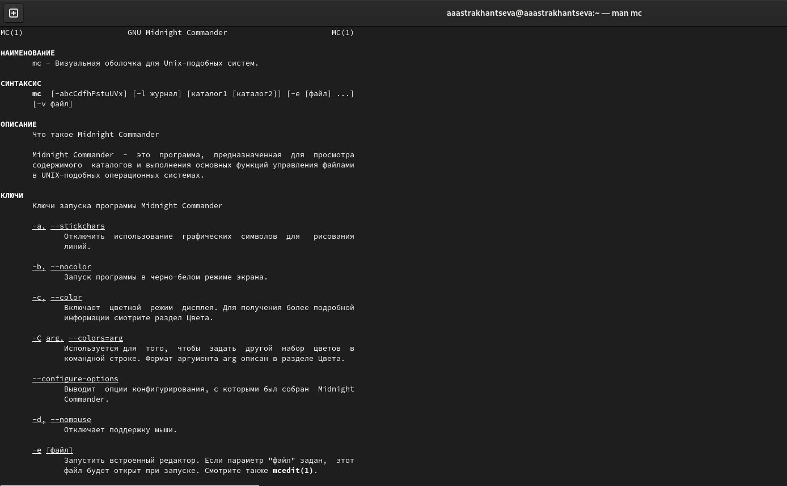{#fig:001 width=70%}

## Второе задание

2. Запуск из командной строки mc, изучение его структуры и меню 

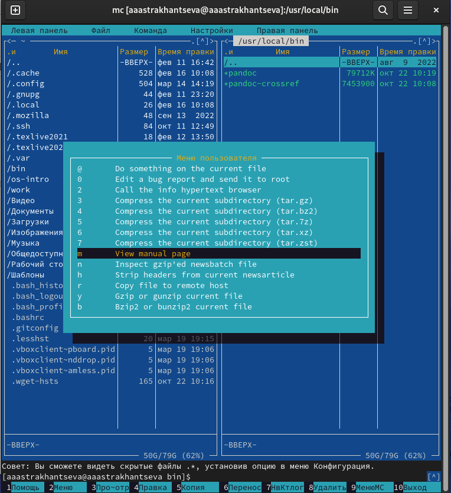{#fig:002 width=50%}

## Третье задание

3. Выполните несколько операций в mc, используя управляющие клавиши (операции
с панелями; выделение/отмена выделения файлов, копирование/перемещение фай-
лов, получение информации о размере и правах доступа на файлы и/или каталоги
и т.п.) 

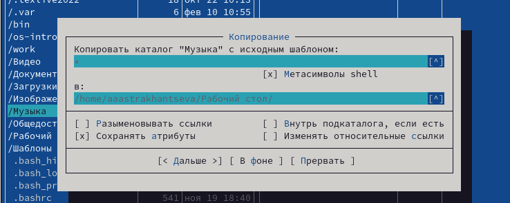{#fig:003 width=70%}

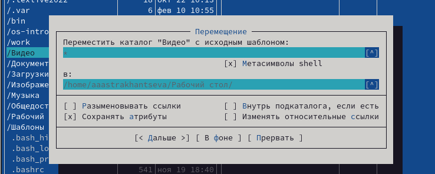{#fig:004 width=70%}

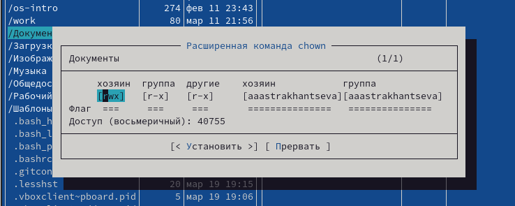{#fig:005 width=70%}

## Четвертое и пятое задания

5. Используя возможности подменю Файл , выполните:
– просмотр содержимого текстового файла;
– редактирование содержимого текстового файла (без сохранения результатов
редактирования);
– создание каталога;
– копирование в файлов в созданный каталог.

Более подробно в скринкасте. Редактировние и просмотр 

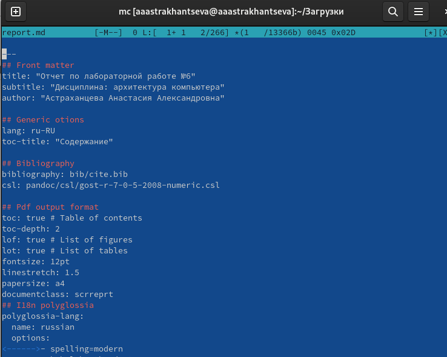{#fig:006 width=60%}

## Шестое задание

6. С помощью соответствующих средств подменю Команда осуществите:
– поиск в файловой системе файла с заданными условиями (например, файла
с расширением .c или .cpp, содержащего строку main);
– выбор и повторение одной из предыдущих команд;
– переход в домашний каталог;
– анализ файла меню и файла расширений. 

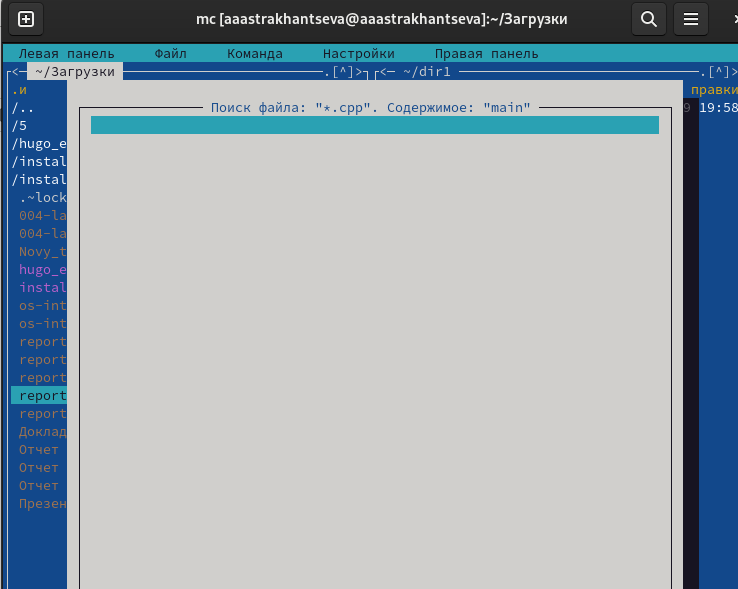{#fig:007 width=60%}

## Шестое задание

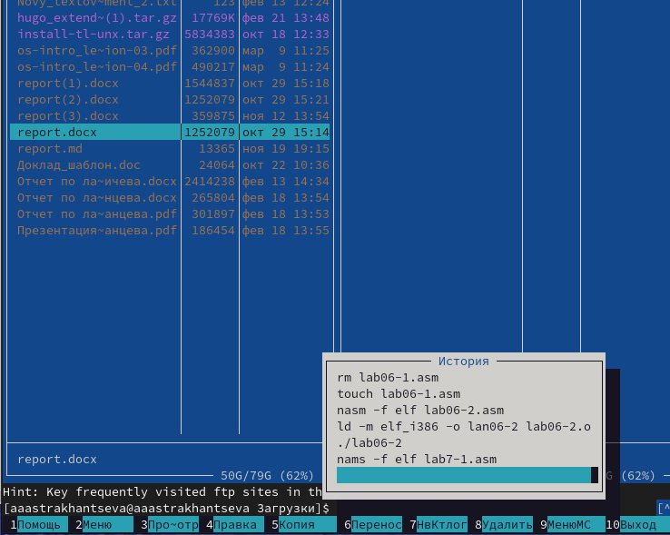{#fig:008 width=60%}

## Шестое задание

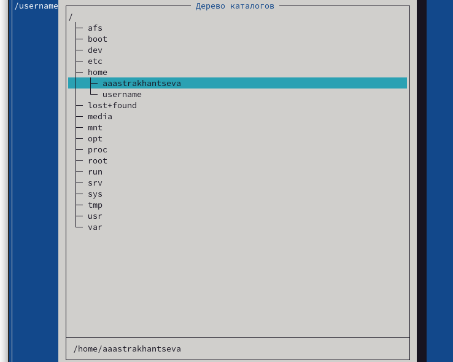{#fig:008 width=60%}

## Шестое задание

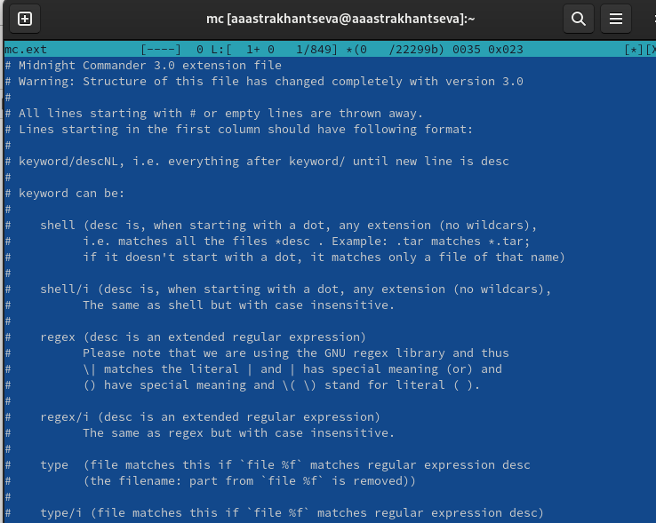{#fig:009 width=60%}

## Шестое задание

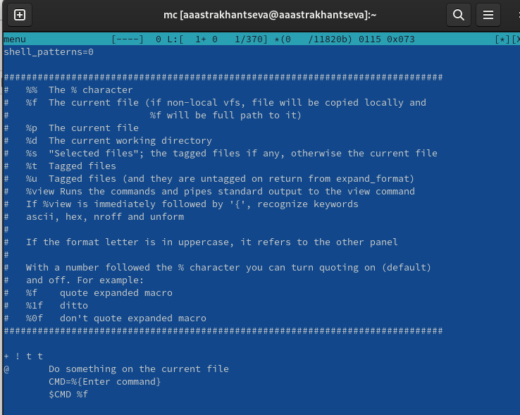{#fig:010 width=60%}

## Седьмое задание

7. Вызовите подменю Настройки . Освойте операции, определяющие структуру экрана mc
(Full screen, Double Width, Show Hidden Files и т.д.) 

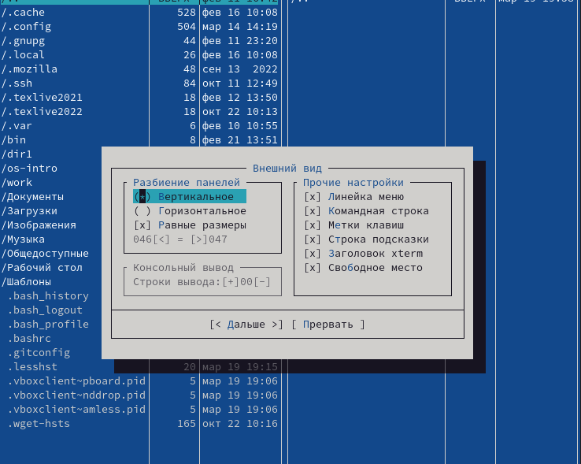{#fig:011 width=60%}

# Задания по встроенному редактору mc

## Первое задание

1. Создайте текстовой файл text.txt. 

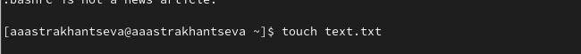{#fig:013 width=70%}

## Второе и третье задания

2. Откройте этот файл с помощью встроенного в mc редактора.

3. Вставьте в открытый файл небольшой фрагмент текста, скопированный из любого
другого файла или Интернета.

Вставляю текст с помощью сочетания клавиш Shift+Ctrl+V

## Четвертое задание

4. Проделайте с текстом следующие манипуляции, используя горячие клавиши:
4.1. Удалите строку текста 

4.2. Выделите фрагмент текста и скопируйте его на новую строку.

Выделить строку можно с помощью клавиши F3, скопировать с помощью F5  

## Четвертое задание

4.3. Выделите фрагмент текста и перенесите его на новую строку.

Выделить строку можно с помощью клавиши F3, перенести с помощью F6 

4.4. Сохраните файл.

Сохранить файл можно с помощью клавиши F2 

## Четвертое задание

4.5. Отмените последнее действие.

Отменить последнее действие можно с помощью сочетания клавиш Ctrl + u

4.6. Перейдите в конец файла (нажав комбинацию клавиш) и напишите некоторый
текст.

4.7. Перейдите в начало файла (нажав комбинацию клавиш) и напишите некоторый
текст.

Для того, чтобы перейти в начало строки используем Сtrl + Home, а в конец -  Сtrl + End  
 
4.8. Сохраните и закройте файл. С помощью сочетания клавиш F2 и F10.

## Пятое задание

5. Откройте файл с исходным текстом на некотором языке программирования (напри-
мер C или Java)
 
Открою файл с текстом на Java  

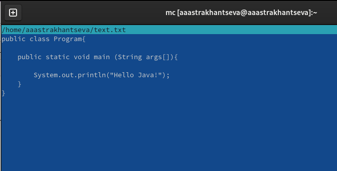{#fig:019 width=70%}

##Шестое задание

6. Используя меню редактора, включите подсветку синтаксиса, если она не включена,
или выключите, если она включена

С помошью Сtrl + S можно включить подсветку синтаксиса

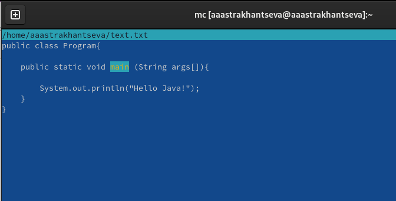{#fig:020 width=60%}

