---
## Front matter
title: "Отчет по лаборатроной работе №7"
subtitle: "Дисциплина: операционные системы"
author: "Астраханцева Анастасия"

## Generic otions
lang: ru-RU
toc-title: "Содержание"

## Bibliography
bibliography: bib/cite.bib
csl: pandoc/csl/gost-r-7-0-5-2008-numeric.csl

## Pdf output format
toc: true # Table of contents
toc-depth: 2
lof: true # List of figures
lot: false # List of tables
fontsize: 12pt
linestretch: 1.5
papersize: a4
documentclass: scrreprt
## I18n polyglossia
polyglossia-lang:
  name: russian
  options:
	- spelling=modern
	- babelshorthands=true
polyglossia-otherlangs:
  name: english
## I18n babel
babel-lang: russian
babel-otherlangs: english
## Fonts
mainfont: PT Serif
romanfont: PT Serif
sansfont: PT Sans
monofont: PT Mono
mainfontoptions: Ligatures=TeX
romanfontoptions: Ligatures=TeX
sansfontoptions: Ligatures=TeX,Scale=MatchLowercase
monofontoptions: Scale=MatchLowercase,Scale=0.9
## Biblatex
biblatex: true
biblio-style: "gost-numeric"
biblatexoptions:
  - parentracker=true
  - backend=biber
  - hyperref=auto
  - language=auto
  - autolang=other*
  - citestyle=gost-numeric
## Pandoc-crossref LaTeX customization
figureTitle: "Рис."
tableTitle: "Таблица"
listingTitle: "Листинг"
lofTitle: "Список иллюстраций"
lotTitle: "Список таблиц"
lolTitle: "Листинги"
## Misc options
indent: true
header-includes:
  - \usepackage{indentfirst}
  - \usepackage{float} # keep figures where there are in the text
  - \floatplacement{figure}{H} # keep figures where there are in the text
---

# Цель работы

Освоение основных возможностей командной оболочки Midnight Commander. Приоб-
ретение навыков практической работы по просмотру каталогов и файлов; манипуляций
с ними.

# Задание

1. Изучите информацию о mc, вызвав в командной строке man mc.
2. Запустите из командной строки mc, изучите его структуру и меню.
3. Выполните несколько операций в mc, используя управляющие клавиши (операции
с панелями; выделение/отмена выделения файлов, копирование/перемещение фай-
лов, получение информации о размере и правах доступа на файлы и/или каталоги
и т.п.)
4. Выполните основные команды меню левой (или правой) панели. Оцените степень
подробности вывода информации о файлах.
5. Используя возможности подменю Файл , выполните:
– просмотр содержимого текстового файла;
– редактирование содержимого текстового файла (без сохранения результатов
редактирования);
– создание каталога;
– копирование в файлов в созданный каталог.
6. С помощью соответствующих средств подменю Команда осуществите:
– поиск в файловой системе файла с заданными условиями (например, файла
с расширением .c или .cpp, содержащего строку main);
– выбор и повторение одной из предыдущих команд;
– переход в домашний каталог;
– анализ файла меню и файла расширений.
7. Вызовите подменю Настройки . Освойте операции, определяющие структуру экрана mc
(Full screen, Double Width, Show Hidden Files и т.д.)

**Задание по встроенному редактору mc**

1. Создайте текстовой файл text.txt.
2. Откройте этот файл с помощью встроенного в mc редактора.
3. Вставьте в открытый файл небольшой фрагмент текста, скопированный из любого
другого файла или Интернета.
4. Проделайте с текстом следующие манипуляции, используя горячие клавиши:
4.1. Удалите строку текста.
4.2. Выделите фрагмент текста и скопируйте его на новую строку.
4.3. Выделите фрагмент текста и перенесите его на новую строку.
4.4. Сохраните файл.
4.5. Отмените последнее действие.
4.6. Перейдите в конец файла (нажав комбинацию клавиш) и напишите некоторый
текст.
4.7. Перейдите в начало файла (нажав комбинацию клавиш) и напишите некоторый
текст.
4.8. Сохраните и закройте файл.
5. Откройте файл с исходным текстом на некотором языке программирования (напри-
мер C или Java)
6. Используя меню редактора, включите подсветку синтаксиса, если она не включена,
или выключите, если она включена

# Теоретическое введение

Командная оболочка — интерфейс взаимодействия пользователя с операционной систе-
мой и программным обеспечением посредством команд.
Midnight Commander (или mc) — псевдографическая командная оболочка для UNIX/Linux
систем. 

Панель в mc отображает список файлов текущего каталога. Абсолютный путь к этому
каталогу отображается в заголовке панели. У активной панели заголовок и одна из её
строк подсвечиваются. Управление панелями осуществляется с помощью определённых
комбинаций клавиш или пунктов меню mc.

# Выполнение лабораторной работы
1. Изучим информацию о mc, вызвав в командной строке man mc (рис. @fig:001).

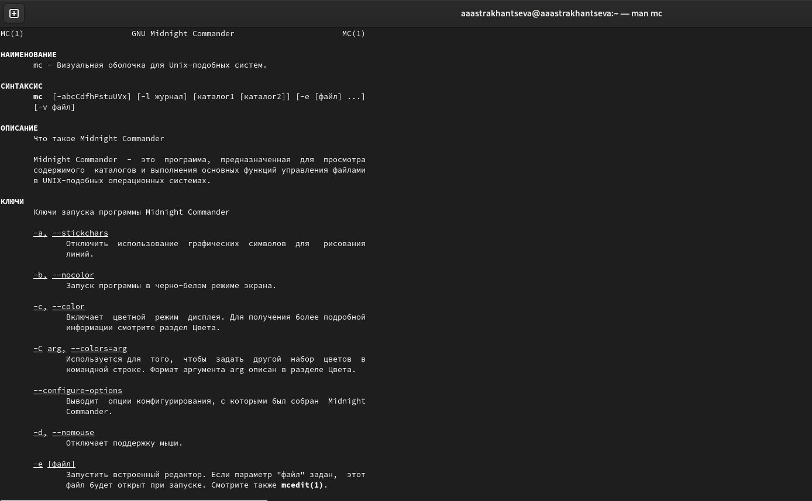{#fig:001 width=70%}

2. Запуск из командной строки mc, изучение его структуры и меню (рис. @fig:002).

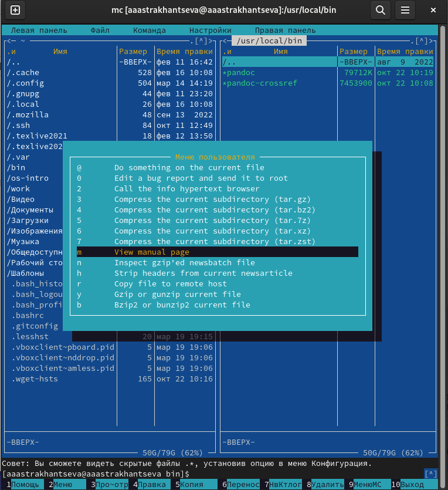{#fig:002 width=70%}

3. Выполните несколько операций в mc, используя управляющие клавиши (операции
с панелями; выделение/отмена выделения файлов, копирование/перемещение фай-
лов, получение информации о размере и правах доступа на файлы и/или каталоги
и т.п.) (рис. @fig:003 - @fig:005).

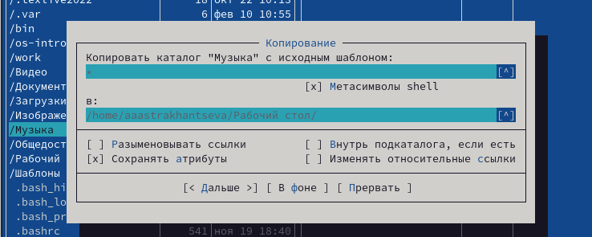{#fig:003 width=70%}

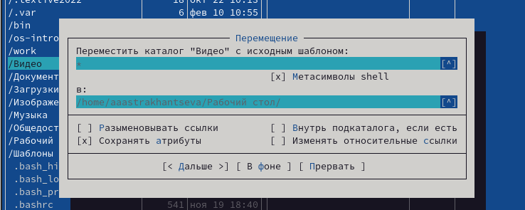{#fig:004 width=70%}

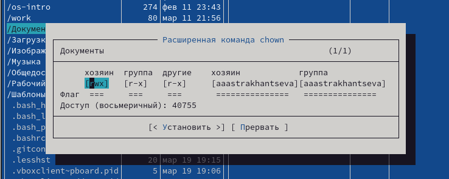{#fig:005 width=70%}

4. Выполните основные команды меню левой (или правой) панели. Оцените степень
подробности вывода информации о файлах.

Более подробно в скринкасте.

5. Используя возможности подменю Файл , выполните:
– просмотр содержимого текстового файла;
– редактирование содержимого текстового файла (без сохранения результатов
редактирования);
– создание каталога;
– копирование в файлов в созданный каталог.

Более подробно в скринкасте. Редактировние и просмотр (рис. @fig:006).

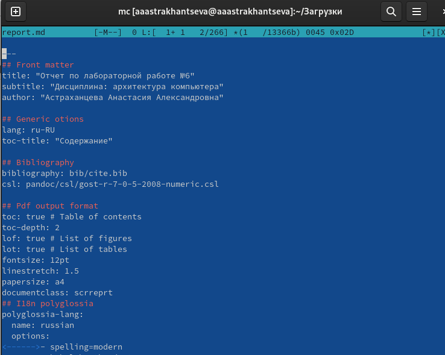{#fig:006 width=70%}

6. С помощью соответствующих средств подменю Команда осуществите:
– поиск в файловой системе файла с заданными условиями (например, файла
с расширением .c или .cpp, содержащего строку main);
– выбор и повторение одной из предыдущих команд;
– переход в домашний каталог;
– анализ файла меню и файла расширений. (рис. @fig:007 - @fig:010).

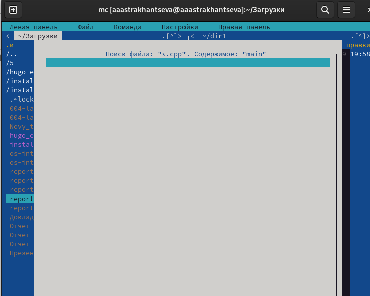{#fig:007 width=70%}

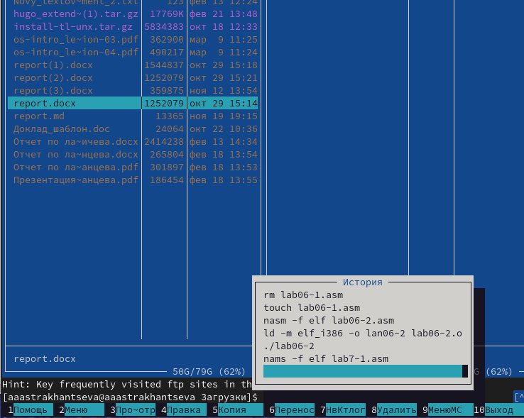{#fig:008 width=70%}

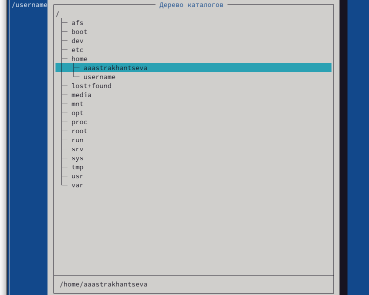{#fig:008 width=70%}

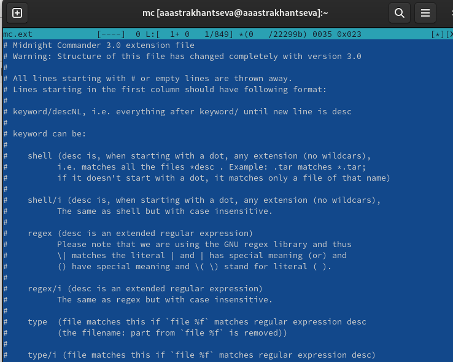{#fig:009 width=70%}

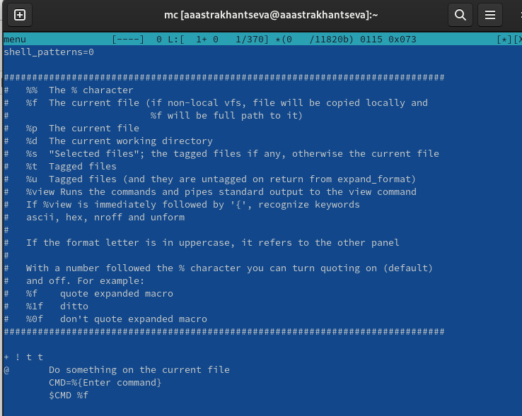{#fig:010 width=70%}

7. Вызовите подменю Настройки . Освойте операции, определяющие структуру экрана mc
(Full screen, Double Width, Show Hidden Files и т.д.) (рис. @fig:011 - @fig:012).

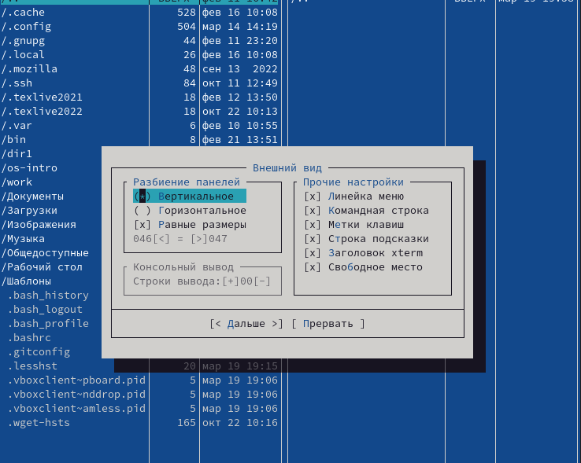{#fig:011 width=70%}

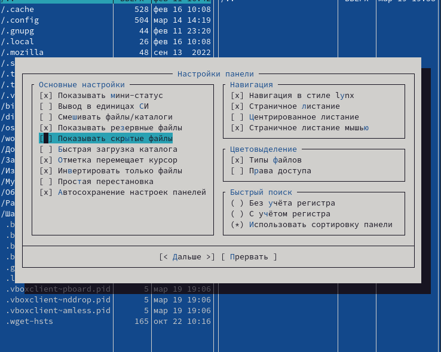{#fig:012 width=70%}

 **Задание по встроенному редактору mc**

1. Создайте текстовой файл text.txt. (рис. @fig:013).

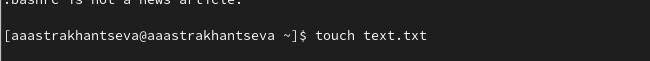{#fig:013 width=70%}

2. Откройте этот файл с помощью встроенного в mc редактора.

3. Вставьте в открытый файл небольшой фрагмент текста, скопированный из любого
другого файла или Интернета.

Вставляю текст с помощью сочетания клавиш Shift+Ctrl+V

4. Проделайте с текстом следующие манипуляции, используя горячие клавиши:
4.1. Удалите строку текста (рис. @fig:014).

{#fig:014 width=70%}

4.2. Выделите фрагмент текста и скопируйте его на новую строку.

Выделить строку можно с помощью клавиши F3, скопировать с помощью F5  (рис. @fig:015).

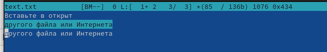{#fig:015 width=70%}

4.3. Выделите фрагмент текста и перенесите его на новую строку.

Выделить строку можно с помощью клавиши F3, перенести с помощью F6 (рис. @fig:016).

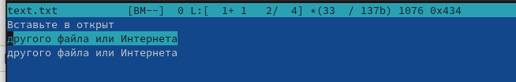{#fig:016 width=70%}

4.4. Сохраните файл.

Сохранить файл можно с помощью клавиши F2 (рис. @fig:017).

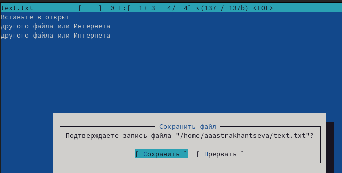{#fig:017 width=70%}

4.5. Отмените последнее действие.

Отменить последнее действие можно с помощью сочетания клавиш Ctrl + u

4.6. Перейдите в конец файла (нажав комбинацию клавиш) и напишите некоторый
текст.
 

4.7. Перейдите в начало файла (нажав комбинацию клавиш) и напишите некоторый
текст.

Для того, чтобы перейти в начало строки используем Сtrl + Home, а в конец -  Сtrl + End  (рис. @fig:018).

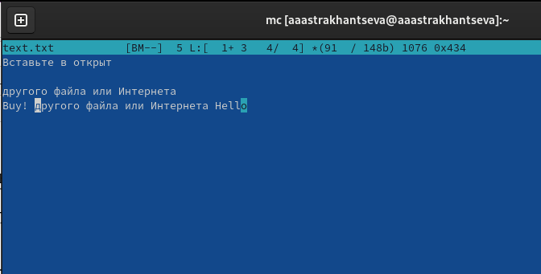{#fig:018 width=70%}

4.8. Сохраните и закройте файл.

С помощью сочетания клавиш F2 и F10.

5. Откройте файл с исходным текстом на некотором языке программирования (напри-
мер C или Java)
 
Открою файл с текстом на Java  (рис. @fig:019).

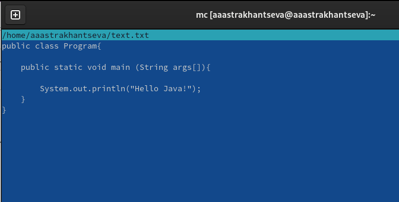{#fig:019 width=70%}

6. Используя меню редактора, включите подсветку синтаксиса, если она не включена,
или выключите, если она включена

С помошью Сtrl + S можно включить подсветку синтаксиса (рис. @fig:020).

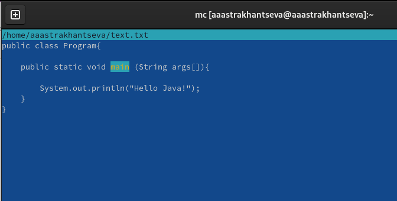{#fig:020 width=70%}

**Ответы на контрольные вопросы**

1. Какие режимы работы есть в mc. Охарактеризуйте их.

Режим "Информация". В этом режиме на панель выводится информация о подсвеченном в другой панели файле и о текущей файловой системе (тип, свободное пространство и число свободных индексных дескрипторов — inode).

Режим "Дерево". В режиме отображения дерева каталогов в одной из панелей выводится графическое изображение структуры дерева каталогов. Этот режим подобен тому, который вы увидите, выбрав команду Дерево каталогов из меню Команды, только в последнем случае изображение структуры каталогов выводится в отдельное окно.
    
Режим "Быстрый просмотр" ("Quick View"). В этом режиме панель переключается на отображение содержимого файла, подсвеченного в другой панели.

Режимы "Сетевое соединение" и "FTP-соединение". Эти два режима используются для отображения списка каталогов, располагающихся на удаленных компьютерах. В остальном формат вывода информации аналогичен форматам, используемым для отображения локальных каталогов. Если вас интересует, как пользоваться этими режимами, воспользуйтесь подсказкой программы.

2. Какие операции с файлами можно выполнить как с помощью команд shell, так и с по-
мощью меню (комбинаций клавиш) mc? Приведите несколько примеров.

shell и mc имеют сходую струтуру, поэтому некоторые команды можно выполнить в обоих случаях. Например: системная информация, поиск, копирование. 

3. Опишите структура меню левой (или правой) панели mc, дайте характеристику ко-
мандам.

Вид  панелей,  в  которых отображаются списки файлов и каталогов, может быть изменен через
       пункты меню Левая (или Верхняя ) и Правая (или Нижняя ).

    Формат списка...
       Этот пункт меню предназначен для определения формата вывода списка  файлов  в  панели.  Вы
       можете  выбрать один из 4 вариантов представления списка файлов: Стандартный, Укороченный,
       Расширенный и Определяемый пользователем.

       В стандартном формате отображаются имя файла, его размер и время последней модификации.

       В укороченном (brief) формате отображаются только 
       имена файлов, расположенные в  несколько
       колонок (от 1 до 9), за счет чего на панели видно в несколько раз больше имен.

       В  расширенном  (long)  формате  содержимое  каталога  представляется 
       так, как это делает
       команда ls -l.  В этом формате панель занимает весь экран.

       Если вы выберете формат "Определяемый пользователем" ("User"), 
       вы  должны  будете  задать
       структуру отображаемой информации.

       При  задании  структуры  вначале  указывается  размер панели: 
       "half" (половина экрана) или
       "full" (весь экран).

       После размера панели можно указать, что на панели должно быть две  колонки. 
       Это  делается  добавлением цифры 2 в строку задания формата.

4. Опишите структура меню Файл mc, дайте характеристику командам.

 В MC используются клавиши от F1 до F10 для быстрого выполнения команд из этого меню. Escape последовательностями для функциональных клавиш являются последовательности terminfo от kf1 до kf10. Если терминал не поддерживает функциональные клавиши, то этого же результата можно добиться путём нажатия Escape, а затем цифровой клавиши от 1 до 9 и 0 (равносильно нажатию клавиш от F1 до F9 и F10 соответственно).

Меню File содержит следующие команды (в скобках даны соответствующие им функциональные клавиши):

Справка (F1)

    Вызывает встроенный гипертекстовый вьюер помощи. Нажатие клавиши Tab 
    приводит к выбору следующей ссылки, а Enter - к переходу по этой ссылке.
     Клавиши Space и Backspace позволяют перемещаться вперёд и назад. 
     Для получения справки по используемым клавишам, нажмите F1 ещё раз. 
Меню (F2)

    Вызывает меню пользователя. Оно позволяет создавать и добавлять дополнительные функции.

Просмотр (F3, Shift-F3)

    Показывает текущий файл. По умолчанию эта команда вызывает 
    внутренний вьюер файлов. Если опция "Use internal view" не
     установлена, то вызывается внешний вьюер, указанный в 
     переменной PAGER. Если эта переменная не определена, то 
     вызывается команда "view". При нажатии Shift-F3, вьюер 
     будет вызван без форматирования и предварительной обработки файла.

Перенаправленный просмотр (A-!)

    Эта функция запрашивает команду с параметрами
     (аргумент к текущему выбранному файлу) и результат 
     перенаправляется во встроенный вюьер файлов.

Редактирование (F4)

    Обычно эта команда вызывает редактор "vi" или любой другой, указанный в переменной оболочки EDITOR.

Копирование (F5)

    Выдаёт диалоговое окно с каталогом назначения, которым
     по умолчанию принимается каталог неактивной панели, и 
     копирует выделенный файл или группу помеченных файлов 
     в каталог, указанный в этом окне. Копирование можно 
     прервать в любой момент, нажав C-c или Escape. Для 
     подробной информации по установке маски копируемых 
     файлов (обычно * или ^\(.*\)$, в зависимости от 
     установки опции использования шаблонов оболочки) 
     и возможных шаблонов каталога назначения см. команду
      копирование/переименование по маске.

Link (C-x l) 

5. Опишите структура меню Команда mc, дайте характеристику командам.

 Команда Directory tree показывает структуру каталогов системы.

Команда Find file позволяет находить указанные файлы.

Команда "Swap panels" меняет местами содержимое панелей.

Команда "Panels on/off" позволяет просмотреть результат последней выполнявшейся программы. Эта функция работает только на xterm и на Linux консоли.

Команда Compare directories (C-x d) сравнивает содержимое панелей. После выполнения этой команды можно воспользоваться копированием для восполнения недостающих файлов в одной из панелей. Существует два метода сравнения. Быстрый метод сравнивает только имена файлов, размер и дату создания. Другой метод производит полное сравнение файлов, байт за байтом. Этот метод не будет работать, если компьютер не поддерживает системый вызов mmap(2).

Команда Command history показывает список набираемых команд. Выбранная команда копируется в командную строку. Эта функция также доступна при использовании комбинаций A-p или A-n.

Горячий список каталогов (C-\) выполняет быструю смену текущего каталога на один из списка.

Команда External panelize позволяет выполнять внешнюю программу, результат выполнения которой отображается в текущей панели.

Команда Extension file edit позволяет указывать программы, которые выполняются при попытке запуска, просмотра, редактирования и выполнения других действий над файлами с определёнными расширениями.

Команда Menu file edit используется для редактирования пользовательского меню (которое вызывается нажатием клавиши F2).

Directory Tree Эта команда показывает структуру каталогов. При выборе каталога из дерева, MC автоматически переходит в этот каталог.

Существует два способа вызова дерева. Один из них - из меню Commands. Другой способ заключается в выборе функции tree view из меню Left или Right.

Для ускорения работы, MC создаёт дерево путём сканирования небольшого количества каталогов. Если каталога, который требуется просмотреть - нет, следует перейти в предыдущий каталог и нажать C-r ( или F2).

Вы можете использовать следующие клавиши:

Здесь применяются основные клавиши перемещения, а также:

    Enter в режиме дерева каталогов - выходит из режима и меняет
    текущий каталог активной панели на выбранный. В tree view, 
    переходит в выбранный каталог на неактивной панели без выхода из режима.

    C-r, F2 (обновление) прочитать каталог ещё раз. 
    Пользуйтесь этой функцией при старении дерева каталогов 
    (потеря подкаталогов или отображение уже не существующих каталогов).

    F3 (Удалить) удаляет каталог из дерева. Этой функцией 
    пользуются во избежание путаницы. Для восстановления 
    каталога нажмите F2 в предыдущем каталоге.

    F4 (статический/динамический режимы) переключение между 
    динамическим (по умолчанию) и статическим режимами работы.

    В статическом режиме стрелками выбирают каталог,
     причём видны все известные каталоги.

    В динамическом режиме стрелками выбирают соседний каталог,
     стрелка влево - переход в предыдущий каталог, 
     стрелка вправо - переход в подкаталог. В текущий момент времени 
     видны только текущий каталог, предыдущий каталог и подкаталоги.
      Остальные каталоги не видны, то есть структура дерева меняется динамически .

    F5 (Копирование) копирует каталог.

    F6 (Переименование/Перемещение) перемещает каталог.

    F7 (Создать каталог) создаёт новый каталог.

    F8 (Удаление) удаление каталога из файловой системы.

    C-s, A-s начинает поиск следующего каталога по шаблону. 
    Если такого каталога нет, то эти клавиши служат для перемещения на одну строку вниз.

    C-h, Backspace удаляет последний символ в шаблоне поиска.

    Нажатие любой другой клавиши приводит к добавлению этого 
    символа к шаблону поиска и перемещению к следующему каталогу,
     который подходит к этому шаблону. В режиме tree view поиск 
     каталога аналогичен поиску файла в текущем каталоге.
      Шаблон поиска отображается в строке мини-статуса.

Следующие команды используются только в режиме directory tree. Они не поддерживаются в tree view.

    F1 (Справка)

    Вызывает вьюер помощи и показывает этот раздел.

    Escape, F10

    Производит выход из directory tree без смены каталога.

6. Опишите структура меню Настройки mc, дайте характеристику командам.

Программа Midnight Commander имеет ряд установок (опций), каждая  из  которых  может  быть
      включена  или  выключена,  для чего служат несколько диалоговых окон, доступных через меню
       "Настройки". Опция включена, если поставлена  звёздочка  или  знак  "x"  в  скобках  перед
       названием опции.

       Пункт  Конфигурация  вызывает  диалоговое  окно,  в котором вы можете поменять 
       большинство установок программы Midnight Commander.

       Пункт Внешний вид служит для задания настроек, определяющих положение 
       и вид окна программы mc на экране.

       Пункт Настройки панелей служит для задания настроек панелей файлового менеджера.

       Пункт Подтверждение вызывает диалоговое окно, в котором вы указываете,
       на выполнение каких действий программа будет требовать подтверждения.

       Пункт Оформление вызывает диалоговое окно, в котором вы можете выбрать скин.

       Пункт Биты символов вызывает диалоговое окно, в котором вы указываете,
       в каком формате ваш терминал  будет  обрабатывать (вводить и отображать на дисплее) информацию,
       представленную байтами (например, записанную в файле).

       Пункт Распознавание клавиш вызывает диалоговое окно, в котором  вы  
       можете  протестировать работу  некоторых  клавиш,  которые  работают 
       не  на  всех типах терминалов, и связать ту
       реакцию системы, которая должна была последовать  за  нажатием  
       отсутствующей  клавиши,  с нажатием другой клавиши или комбинации клавиш.

       Пункт  Виртуальные  ФС  вызывает  диалоговое  окно,  в  котором 
       вы можете задать значения некоторых параметров, связанных с использованием 
       виртуальных файловых систем.

       По команде Сохранить настройки  введённые  значения  параметров 
       сохраняются  в  ini-файле программы.

7. Назовите и дайте характеристику встроенным командам mc.

Встроенная команда cd
       Команда cd не передаётся на  исполнение  оболочке,  а  интерпретируется  самой  программой
       Midnight  Commander.  Поэтому  при  её  запуске  возможны не все удобные макрорасширения и
       подстановки, доступные в оболочке, а только часть из них:

Быстрый поиск - Ctrl/Alt + s

Ctrl/Alt + Enter - копирует подсвеченное имя файла в командную строку

Alt + Tab - пытается выполнить операцию Завершение ввода

Ctrl + x t, Ctrl + x Ctrl + t - копирует в командную строку имена помеченных файлов из активной/пассивной панели

Ctrl + x p, Ctrl + x Ctrl + p  - копирует в командную строку имя текущего каталога из активной/пассивной панели

Ctrl + q - вставить символы, которые интерпретируются mc (пример: +)

Alt + p, Alt + n - перемещение по истории команд

Alt + h	- выводит историю текущей строки ввода (историю команд)

8. Назовите и дайте характеристику командам встроенного редактора mc.

Встроенный в mc редактор вызывается с помощью функциональной клавиши F4 . В нём
удобно использовать различные комбинации клавиш при редактировании содержимого
(как правило текстового) файла 

Клавиши для редактирования файла

1. Ctrl-y удалить строку
2. Ctrl-u отмена последней операции
3. Ins вставка/замена
4. F7 поиск (можно использовать регулярные выражения)
5. -F7 повтор последней операции поиска
6. F4 замена
7. F3 первое нажатие — начало выделения, второе — окончание
выделения
8. F5 копировать выделенный фрагмент
9. F6 переместить выделенный фрагмент
10. F8 удалить выделенный фрагмент
11. F2 записать изменения в файл
12. F10 выйти из редактора

9. Дайте характеристику средствам mc, которые позволяют создавать меню, определяе-
мые пользователем.

Один из четырех форматов списка в Midnight Commander –пользовательский, определённый самим пользователем позволяет ему редактировать меню любого из двух списков. А меню пользователя – это меню, состоящее из команд, определенных пользователем. При вызове меню используется файл ~/.mc.menu. Если такого файла нет, то по умолчанию используется системный файл меню /usr/lib/mc/mc.menu. Все строки в этих файлах , начинающиеся с пробела или табуляции, являются командами, которые выполняются при выборе записи.

10. Дайте характеристику средствам mc, которые позволяют выполнять действия, опреде-
ляемые пользователем, над текущим файлом.

Когда мы выделяем файл не являющегося исполняемым, Midnight Commander сравнивает расширение выбранного файла с расширениями, прописанными в «файле расширений» ~/ mc.ext. Если в файле расширений найдется подраздел, задающий процедуры обработки файлов с данным расширением, то обработка файла производится в соответствии с заданными в этом подразделе командами и файлами: · файл помощи для MC. /usr/lib/mc.hlp · файл расширений, используемый по умолчанию. /usr/lib/mc/mc.ext · файл расширений, конфигурации редактора. $HOME/.mc.ext · системный инициализационный файл. /usr/lib/mc/mc.ini · фаил который содержит основные установки. /usr/lib/mc/mc.lib · инициализационный файл пользователя. Если он существует, то системный файл mc.ini игнорируется. $HOME/.mc.ini · этот файл содержит подсказки, отображаемые в нижней части экрана. /usr/lib/mc/mc.hint · системный файл меню MC, используемый по умолчанию. /usr/lib/mc/mc.menu · файл меню пользователя. Если он существует, то системный файл меню игнорируется. $HOME/.mc.menu · инициализационный файл пользователя. Если он существует, то системный файл mc.ini игнорируется. $HOME/.mc.tree

# Выводы

В ходе выполнения лабораторной работы мною были освоены основные возможности командной оболочки Midnight Commander, приобретены навыки практической работы по просмотру каталогов и файлов; манипуляций
с ними.

# Список литературы{.unnumbered}

1. Linux для пользователя [электронный ресурс] - Режим доступа: http://citforum.ru/operating_systems/linux/user/gl-06/gl_06_05.shtml
2. mc - Визуальная оболочка для Unix-подобных систем [электронный ресурс] - Режим доступа: https://manpages.ubuntu.com/manpages/impish/ru/man1/mc.1.html
3.mc  [электронный ресурс] - Режим доступа: https://www.opennet.ru/docs/RUS/mc/mc-3.html
