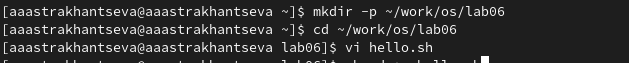
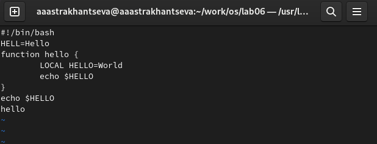
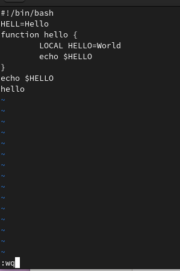
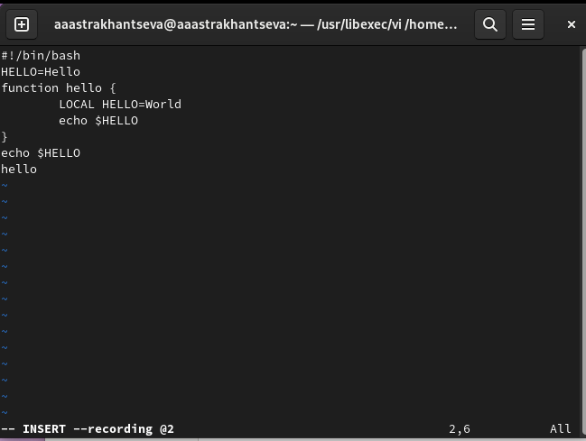
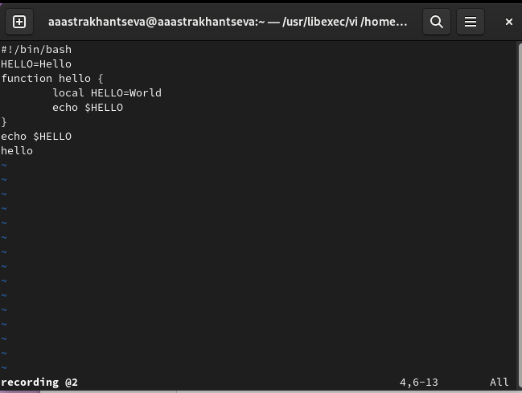
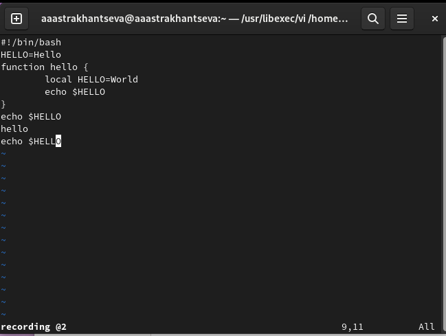
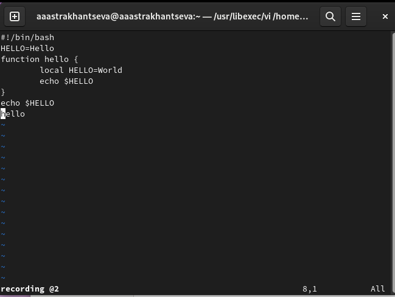
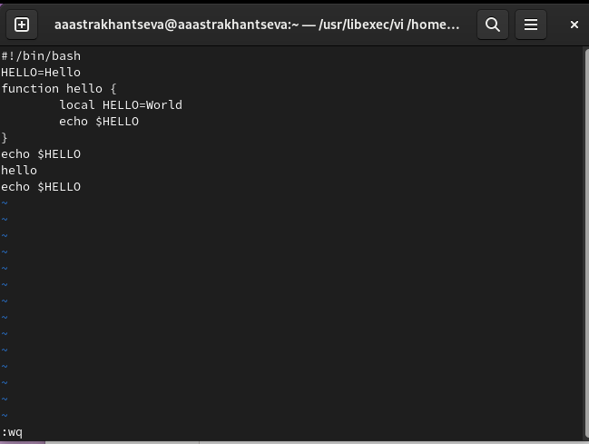

---
## Front matter
lang: ru-RU
title: "Отчет по выполнению лабораторной работы №8"
subtitle: "Дисциплина: операционные системы"
author:
  - Астраханцева А. А.
institute:
  - Российский университет дружбы народов, Москва, Россия
date: 26 марта 2023

## i18n babel
babel-lang: russian
babel-otherlangs: english

## Formatting pdf
toc: false
toc-title: Содержание
slide_level: 2
aspectratio: 169
section-titles: true
theme: metropolis
header-includes:
 - \metroset{progressbar=frametitle,sectionpage=progressbar,numbering=fraction}
 - '\makeatletter'
 - '\beamer@ignorenonframefalse'
 - '\makeatother'
---

# Информация

## Докладчик

:::::::::::::: {.columns align=center}
::: {.column width="70%"}

  * Астраханцева Анастасия Александровна
  * студентка НКАбд-01-22
  * Студ. билет: 1132226437
  * Российский университет дружбы народов
  * <https://anastasiia7205.github.io/>

:::
::: {.column width="50%"}

:::
::::::::::::::

## Цель работы

Познакомиться с операционной системой Linux. Получить практические навыки работы с редактором vi, установленным по умолчанию практически во всех дистрибутивах.

## Задание

1. Ознакомиться с теоретическим материалом.
2. Ознакомиться с редактором vi.
3. Выполнить упражнения, используя команды vi.

# Выполнение лабораторной работы

## Создание нового файла с использованием vi

Первым делом мы создали каталог `~/work/os/lab06.`, перешли в него и запустили редактор vi для работы с файлом hello.sh 

{#fig:001 width=70%}

## Редактирование созданного файла

После этого нужно нажать клавишу `i` и ввести текст. Далее нажимаем клавишу `esc` для возвращения в командный режим 

{#fig:002 width=70%}

## Переход в режим последней строки

Нажимаем клавишу `:` для перехода в режим последней строки, нажимаем `w` (записать) и `q` (выйти), а затем нажмаем клавишу `Enter` для сохранения текста и завершения работы 

{#fig:003 width=70%}

## Изменение прав доступа

Делаем файл исполняемым

{#fig:004 width=70%}

## Редактирование существующего файла

Вызываем vi на редактирование файла hello.sh с помощью команды: `vi ~/work/os/lab06/hello.sh`

Устанавливаем курсор в конец слова HELL второй строки. Далее переходим в режим вставки (клавиша `i`) и заменяем на HELLO. Нажмиаем Esc для возврата в команд-
ный режим 

{#fig:005 width=70%}

## Редактирование файла

Устанавливаем курсор на четвертую строку и стираем слово LOCAL. Переходим в режим вставки (клавиша `i`) и набираем следующий текст: local, нажмаем `Esc` для возврата в командный режим 

{#fig:006 width=70%}

## Вставка строки

Устанавливаем курсор на последней строке файла, вставляем после неё строку, содержащую
следующий текст: echo $HELLO 

{#fig:007 width=70%}

## Удаление строки

Переходим в командный режим с помощью клавиши `Esc` Удаляем последнюю строку с помощью двойного нажатия на клавишу `d` 

{#fig:008 width=70%}

## Отмена изменений

Отменяем последние изменения с помощью клавиши `u`. Вводим символ `:` для перехода в режим последней строки. Записываем произведённые изменения и выйдим из vi с помощью ввода `wq`

{#fig:009 width=50%}

## Выводы

В ходе выполнения лабораторной работы №8 я познакомилась с операционной системой Linux и получила практические навыки работы с редактором vi, установленным по умолчанию практически во всех дистрибутивах.

