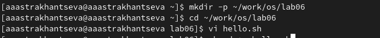
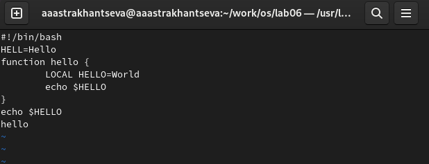
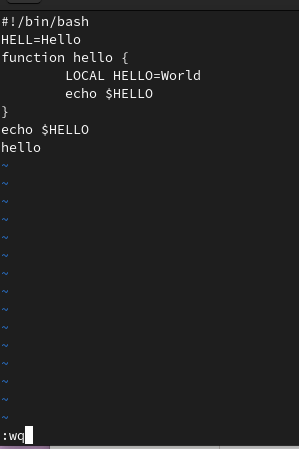
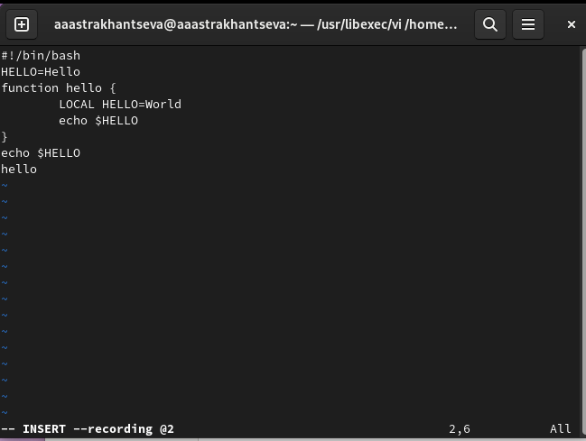
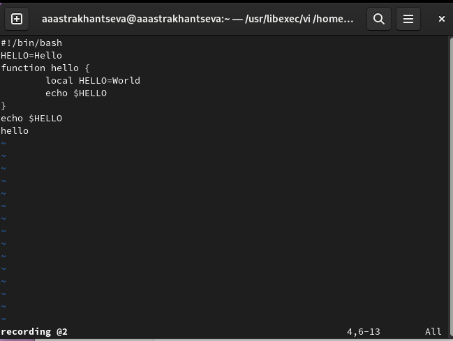
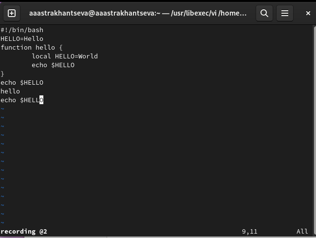
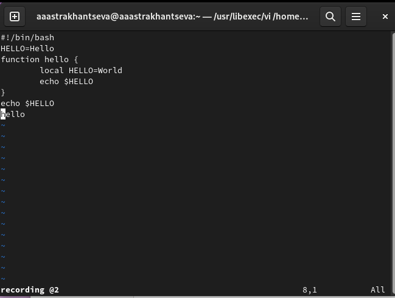
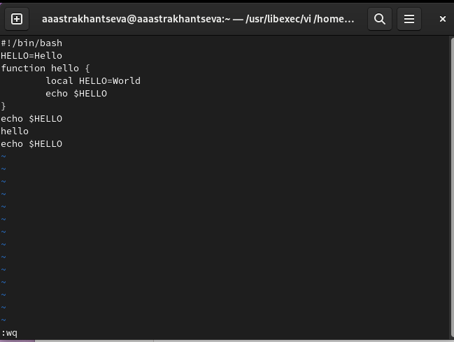

---
## Front matter
title: "Отчет по выполнению лабораторной работы №8"
subtitle: "Дисциплина: операционные системы"
author: "Астраханцева Анастасия"

## Generic otions
lang: ru-RU
toc-title: "Содержание"

## Bibliography
bibliography: bib/cite.bib
csl: pandoc/csl/gost-r-7-0-5-2008-numeric.csl

## Pdf output format
toc: true # Table of contents
toc-depth: 2
lof: true # List of figures
lot: false # List of tables
fontsize: 12pt
linestretch: 1.5
papersize: a4
documentclass: scrreprt
## I18n polyglossia
polyglossia-lang:
  name: russian
  options:
	- spelling=modern
	- babelshorthands=true
polyglossia-otherlangs:
  name: english
## I18n babel
babel-lang: russian
babel-otherlangs: english
## Fonts
mainfont: PT Serif
romanfont: PT Serif
sansfont: PT Sans
monofont: PT Mono
mainfontoptions: Ligatures=TeX
romanfontoptions: Ligatures=TeX
sansfontoptions: Ligatures=TeX,Scale=MatchLowercase
monofontoptions: Scale=MatchLowercase,Scale=0.9
## Biblatex
biblatex: true
biblio-style: "gost-numeric"
biblatexoptions:
  - parentracker=true
  - backend=biber
  - hyperref=auto
  - language=auto
  - autolang=other*
  - citestyle=gost-numeric
## Pandoc-crossref LaTeX customization
figureTitle: "Рис."
tableTitle: "Таблица"
listingTitle: "Листинг"
lofTitle: "Список иллюстраций"
lotTitle: "Список таблиц"
lolTitle: "Листинги"
## Misc options
indent: true
header-includes:
  - \usepackage{indentfirst}
  - \usepackage{float} # keep figures where there are in the text
  - \floatplacement{figure}{H} # keep figures where there are in the text
---

# Цель работы

Познакомиться с операционной системой Linux. Получить практические навыки рабо-
ты с редактором vi, установленным по умолчанию практически во всех дистрибутивах.

# Задание

1. Ознакомиться с теоретическим материалом.
2. Ознакомиться с редактором vi.
3. Выполнить упражнения, используя команды vi.

# Теоретическое введение

Текстовым редактором (text editor) называют программу, которая предназначена для редактирования (составления и изменения) файлов, содержащих только текст, например: письмо, программа на языке C, системный конфигурационный файл. При том, что имеется много различных редакторов для системы Linux, единственный, чьё присутствие будет гарантировано в любой системе UNIX или Linux — это vi (visual editor). 

В любой момент при работе в редакторе vi вы находитесь в одном из трёх режимов редактора: командный режим (command mode), режим ввода (insert mode) и режим последней строки (last line mode).

При запуске редактора vi вы оказываетесь в командном режиме. В этом режиме можно давать команды для редактирования файлов или перейти в другой режим. Например, вводя x в командном режиме мы удаляем символ, на который указывает курсор. Клавиши-стрелки перемещают курсор по редактируемому файлу. Как правило, команды, используемые в командном режиме, состоят из одного или двух символов.

Основной ввод и редактирование текста осуществляется в режиме ввода. При использовании редактора vi основное время, скорее всего, будет проводиться именно в этом режиме. Переход в режим ввода из командного режима осуществляется командой i (от слова insert). Находясь в режиме ввода, можно вводить текст в то место, куда указывает курсор. Выход из режима ввода в командный режим осуществляется клавишей Esc.

Режим последней строки — это специальный режим, в котором редактору даются сложные команды. При вводе этих команд они отображаются в последней строке экрана (отсюда пошло название режима). Например, если ввести в командном режиме команду :, то осуществится переход в режим последней строки, и можно будет вводить такие команды, как wq (записать файл и покинуть редактор vi) или q! (выйти из редактора vi без сохранения изменений). В режиме последней строки обычно вводятся команды, название которых состоит из нескольких символов. В этом режиме в последнюю строку вводится команда, после чего нажимается клавиша Enter, и команда исполняется.

# Выполнение лабораторной работы

**Создание нового файла с использованием vi**

Первым делом мы создали каталог `~/work/os/lab06.`, перешли в него и запустили редактор vi для работы с файлом hello.sh (рис. @fig:001).

{#fig:001 width=70%}

После этого нужно нажать клавишу `i` и ввести текст. Далее нажимаем клавишу `esc` для возвращения в командный режим (рис. @fig:002).

{#fig:002 width=70%}

Нажимаем клавишу `:` для перехода в режим последней строки, нажимаем `w` (записать) и `q` (выйти), а затем нажмаем клавишу `Enter` для сохранения текста и завершения работы (рис. @fig:003).

{#fig:003 width=70%}

Делаем файл исполняемым (рис. @fig:004).

{#fig:004 width=70%}

**Редактирование существующего файла**

Вызываем vi на редактирование файла hello.sh с помощью команды: `vi ~/work/os/lab06/hello.sh`

Устанавливаем курсор в конец слова HELL второй строки. Это можно сделать разными способами: с помощью команд управления курсором,  с помощью команд перемещения по словам (W или w — перейти на слово вперёд). Далее переходим в режим вставки (клавиша `i`) и заменяем на HELLO. Нажмиаем Esc для возврата в команд-
ный режим (рис. @fig:005).

{#fig:005 width=70%}

Устанавливаем курсор на четвертую строку и стираем слово LOCAL. Переходим в режим вставки (клавиша `i`) и набираем следующий текст: local, нажмаем `Esc` для возврата в командный режим (рис. @fig:006).

{#fig:006 width=70%}

Устанавливаем курсор на последней строке файла, вставляем после неё строку, содержащую
следующий текст: echo $HELLO (рис. @fig:007).

{#fig:007 width=70%}

Переходим в командный режим с помощью клавиши `Esc` Удаляем последнюю строку с помощью двойного нажатия на клавишу `d` (рис. @fig:008).

{#fig:008 width=70%}

Отменяем последние изменения с помощью клавиши `u`. Вводим символ `:` для перехода в режим последней строки. Записываем произведённые изменения и выйдим из иvi с помощью ввода `wq` (рис. @fig:009).

{#fig:009 width=70%}

**Контрольные вопросы**

1. Дайте краткую характеристику режимам работы редактора vi.

Редактор vi имеет три режима работы:

– командный режим — предназначен для ввода команд редактирования и навигации по
редактируемому файлу;

– режим вставки — предназначен для ввода содержания редактируемого файла;

– режим последней (или командной) строки — используется для записи изменений в файл
и выхода из редактора.

2. Как выйти из редактора, не сохраняя произведённые изменения?

Переходим в режим последней строки и помощью клавиши `:` и вводим  q (или q!), если требуется выйти из редактора без сохранения.

3. Назовите и дайте краткую характеристику командам позиционирования.

– `0` (ноль) — переход в начало строки;

– `$` — переход в конец строки;

– `G` — переход в конец файла;

– `nG` — переход на строку с номером n

4. Что для редактора vi является словом?

Любой набор символов, который может включать в себя буквы, цифрыи символы подчеркивания.

5. Каким образом из любого места редактируемого файла перейти в начало (конец)
файла?

С помощбю клавиши `G` — переход в конец файла

6. Назовите и дайте краткую характеристику основным группам команд редактирова-
ния.

**Вставка текста**

– а — вставить текст после курсора;

– А — вставить текст в конец строки;

– i — вставить текст перед курсором;

– n i — вставить текст n раз;

– I — вставить текст в начало строки.

**Вставка строки**

– о — вставить строку под курсором;

– О — вставить строку над курсором.

**Удаление текста**

– x — удалить один символ в буфер;

– d w — удалить одно слово в буфер;

– d $ — удалить в буфер текст от курсора до конца строки;

– d 0 — удалить в буфер текст от начала строки до позиции курсора;

– d d — удалить в буфер одну строку;

– n d d — удалить в буфер n строк.

**Отмена и повтор произведённых изменений**

– u — отменить последнее изменение;

– . — повторить последнее изменение.

**Копирование текста в буфер**

– Y — скопировать строку в буфер;

– n Y — скопировать n строк в буфер;

– y w — скопировать слово в буфер.

**Вставка текста из буфера**

– p — вставить текст из буфера после курсора;

– P — вставить текст из буфера перед курсором.

**Замена текста**

– c w — заменить слово;

– n c w — заменить n слов;

– c $ — заменить текст от курсора до конца строки;

– r — заменить слово;

– R — заменить текст.

**Поиск текста**

– / текст — произвести поиск вперёд по тексту указанной строки символов текст;

– ? текст — произвести поиск назад по тексту указанной строки символов текст.

7. Необходимо заполнить строку символами $. Каковы ваши действия?

Переходим в режим вставки с помощью клавиши `i` и вводим символ `$` необходимое количество раз. Для перехода в командный режим нажимаем клавишу `Esc`

8. Как отменить некорректное действие, связанное с процессом редактирования?

Отменить изменения можно в командном режиме с помощью клавиши `u`

9. Назовите и дайте характеристику основным группам команд режима последней стро-
ки.

:q! - выйти без сохранения;

:wq - записать файл и выйти;

ZZ - записать файл и выйти (Если файл не изменяли, то записываться он не будет)

10. Как определить, не перемещая курсора, позицию, в которой заканчивается строка?

С помощью `$` — переход в конец строки;

11. Выполните анализ опций редактора vi (сколько их, как узнать их назначение и т.д.).

Опции редактора vi позволяют настроить рабочую среду. Для задания опций использу-
ется команда set (в режиме последней строки):

– : set all — вывести полный список опций;

– : set nu — вывести номера строк;

– : set list — вывести невидимые символы;

– : set ic — не учитывать при поиске, является ли символ прописным или строчным.

Если вы хотите отказаться от использования опции, то в команде set перед именем
опции надо поставить no.

12. Как определить режим работы редактора vi?

При запуске редактора vi вы оказываетесь в командном режиме. В этом режиме можно давать команды для редактирования файлов или перейти в другой режим. Например, вводя x в командном режиме мы удаляем символ, на который указывает курсор. Клавиши-стрелки перемещают курсор по редактируемому файлу. Как правило, команды, используемые в командном режиме, состоят из одного или двух символов.

Основной ввод и редактирование текста осуществляется в режиме ввода. При использовании редактора vi основное время, скорее всего, будет проводиться именно в этом режиме. Переход в режим ввода из командного режима осуществляется командой i (от слова insert). Находясь в режиме ввода, можно вводить текст в то место, куда указывает курсор. Выход из режима ввода в командный режим осуществляется клавишей Esc.

# Выводы

В ходе выполнения лабораторной работы №8 я познакомилась с операционной системой Linux и получила практические навыки работы с редактором vi, установленным по умолчанию практически во всех дистрибутивах.

# Список литературы{.unnumbered}

1. Работа с редактором vi [электронный ресурс] - Режим доступа: https://docs.altlinux.org/ru-RU/archive/2.3/html-single/junior/alt-docs-extras-linuxnovice/ch02s10.html
