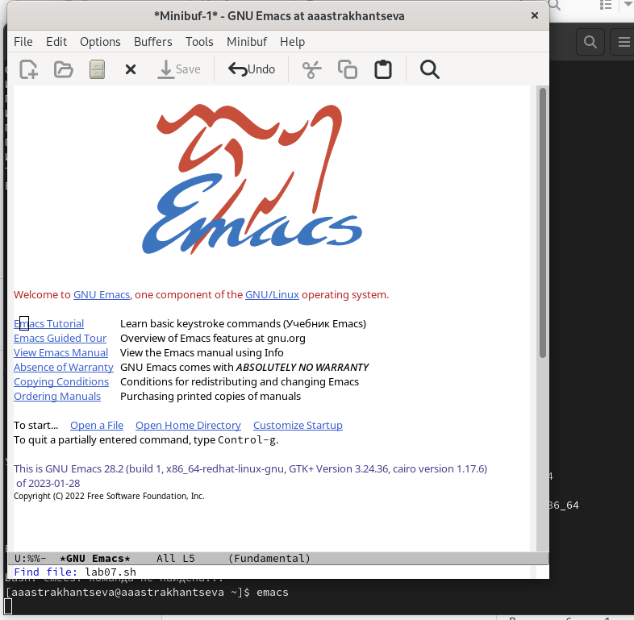
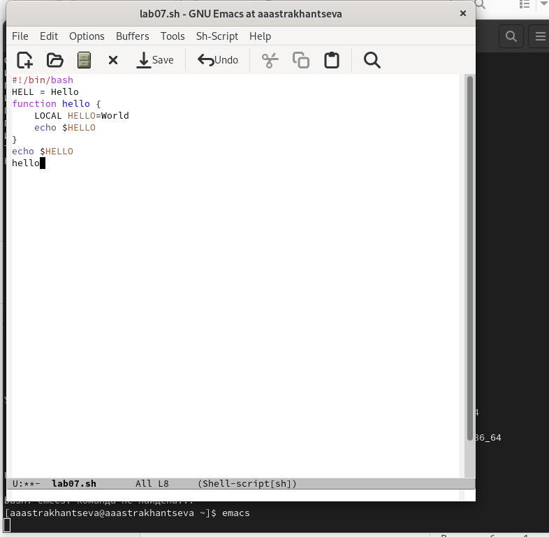
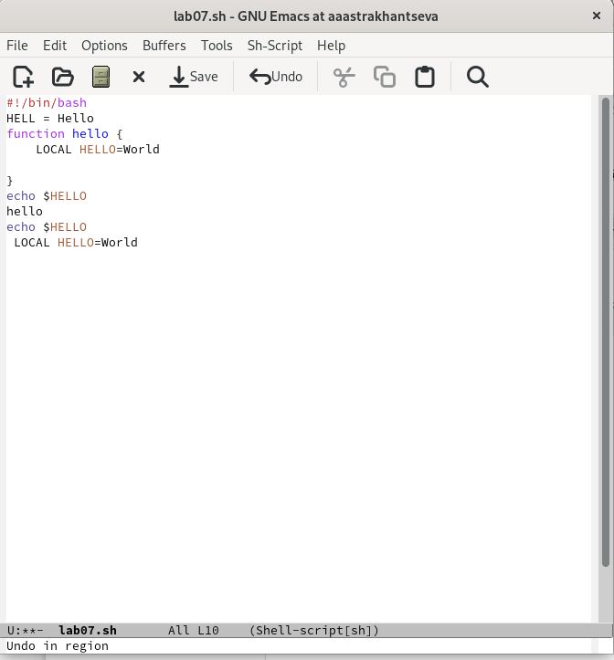
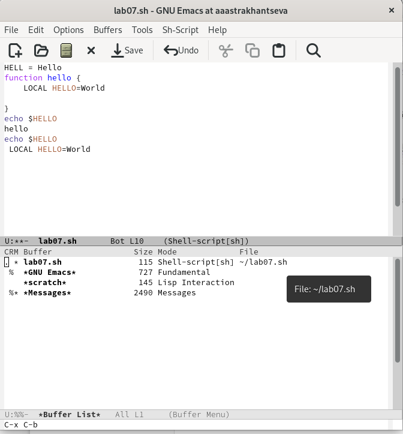
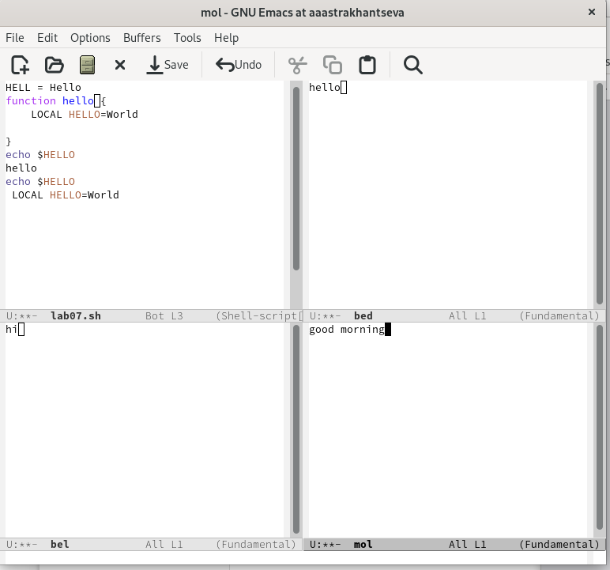
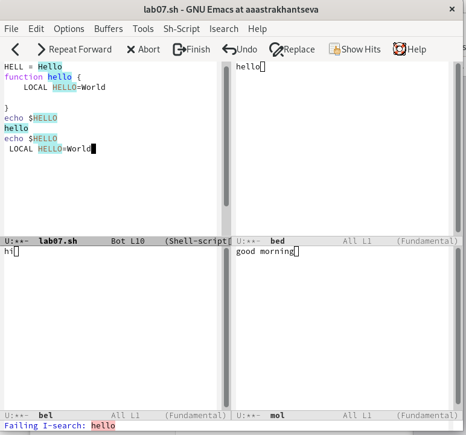

---
## Front matter
lang: ru-RU
title: "Отчет по выполнению лабораторной работы №9"
subtitle: "Дисциплина: операционные системы"
author:
  - Астраханцева А. А.
institute:
  - Российский университет дружбы народов, Москва, Россия
date: 06 апреля 2023

## i18n babel
babel-lang: russian
babel-otherlangs: english

## Formatting pdf
toc: false
toc-title: Содержание
slide_level: 2
aspectratio: 169
section-titles: true
theme: metropolis
header-includes:
 - \metroset{progressbar=frametitle,sectionpage=progressbar,numbering=fraction}
 - '\makeatletter'
 - '\beamer@ignorenonframefalse'
 - '\makeatother'
---

# Информация

## Докладчик

:::::::::::::: {.columns align=center}
::: {.column width="70%"}

  * Астраханцева Анастасия Александровна
  * студентка НКАбд-01-22
  * Студ. билет: 1132226437
  * Российский университет дружбы народов
  * <https://anastasiia7205.github.io/>

:::
::: {.column width="50%"}

:::
::::::::::::::

## Цель работы

Познакомиться с операционной системой Linux. Получить практические навыки рабо-
ты с редактором Emacs.

## Задание

1. Ознакомиться с теоретическим материалом.
2. Ознакомиться с редактором emacs.
3. Выполнить упражнения.
4. Ответить на контрольные вопросы.

# Выполнение лабораторной работы

## Запуск emacs

Откроем emacs и создадим файл lab07.sh с помощью комбинации Ctrl-x Ctrl-f (C-x C-f).

{#fig:001 width=50%}

## Набор текста и сохранение

Набираем текст и сорханяем файл с помощью комбинации Ctrl-x Ctrl-s (C-x C-s).

{#fig:002 width=50%}

## Стандартные процедуры редактирования текста

Проделываем с текстом стандартные процедуры редактирования с помощью комбинаций клавиш:

1. Вырезать одной командой целую строку (С-k) и вставить эту строку в конец файла (C-y).
2. Выделить область текста, скопировать область в буфер обмена (M-w) и вставить область в конец файла.
3. Вновь выделить эту область и на этот раз вырезать её (C-w).
4. Отменить последнее действие (C-/).

## Стандартные процедуры редактирования текста

{#fig:006 width=70%}

## Команды по перемещению курсора

Научитесь использовать команды по перемещению курсора.
6.1. Переместите курсор в начало строки (C-a).
6.2. Переместите курсор в конец строки (C-e).
6.3. Переместите курсор в начало буфера (M-<).
6.4. Переместите курсор в конец буфера (M->).

## Управление буферами.

7.1. Вывести список активных буферов на экран (C-x C-b).
7.2. Переместитесь во вновь открытое окно (C-x) o со списком открытых буферов
и переключитесь на другой буфер.
7.3. Закройте это окно (C-x 0).
7.4. Теперь вновь переключайтесь между буферами, но уже без вывода их списка на
экран (C-x b).

{#fig:007 width=50%}

## Управление окнами.
 
8.1. Поделите фрейм на 4 части: разделите фрейм на два окна по вертикали (C-x 3),
а затем каждое из этих окон на две части по горизонтали (C-x 2)
8.2. В каждом из четырёх созданных окон откройте новый буфер (файл) и введите
несколько строк текста.

{#fig:009 width=50%}

## Режим поиска

9.1. Переключитесь в режим поиска (C-s) и найдите несколько слов, присутствующих
в тексте.
9.2. Переключайтесь между результатами поиска, нажимая C-s.
9.3. Выйдите из режима поиска, нажав C-g.

{#fig:010 width=50%}

## Выводы

В зоде выполнения лабораторной работы №9 я познакомилась с операционной системой Linux и получила практические навыки работы с редактором Emacs.

