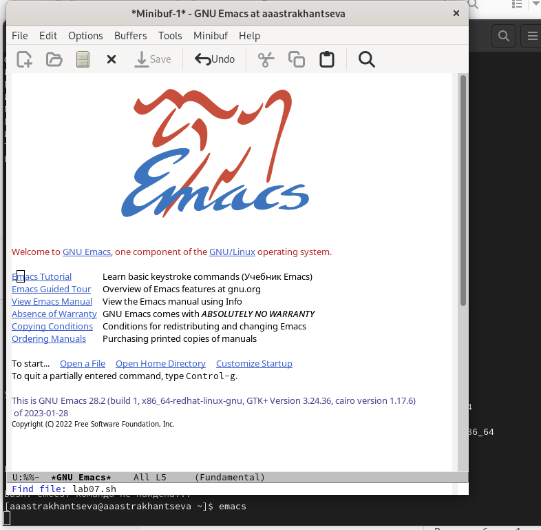
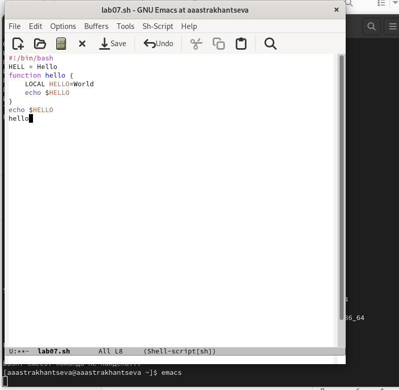
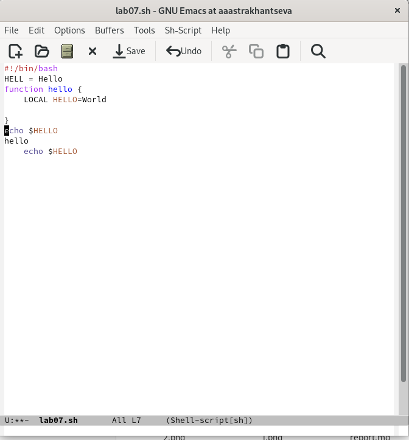
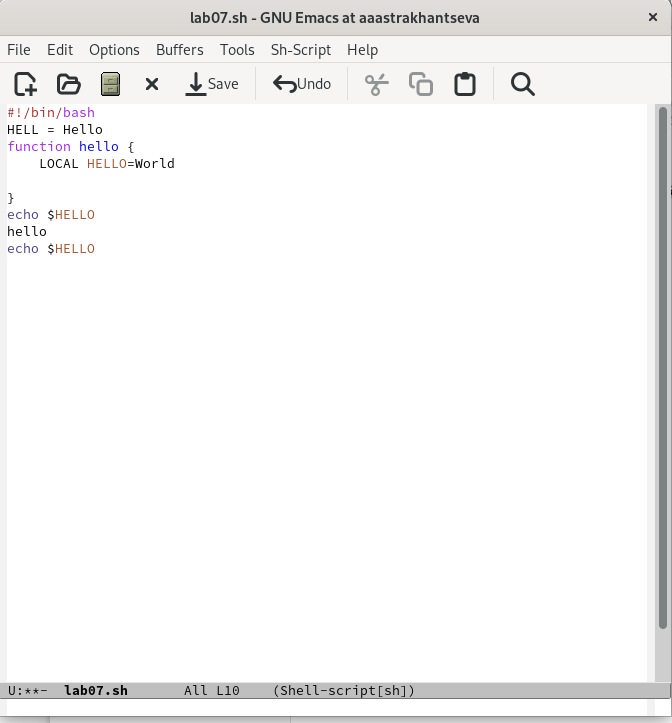
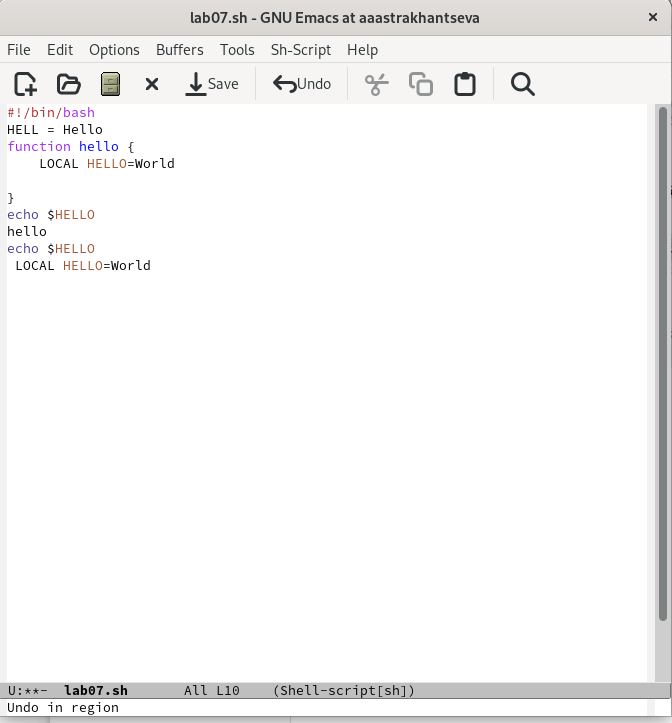
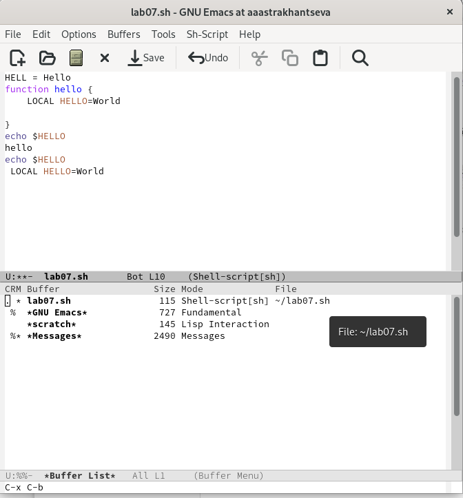
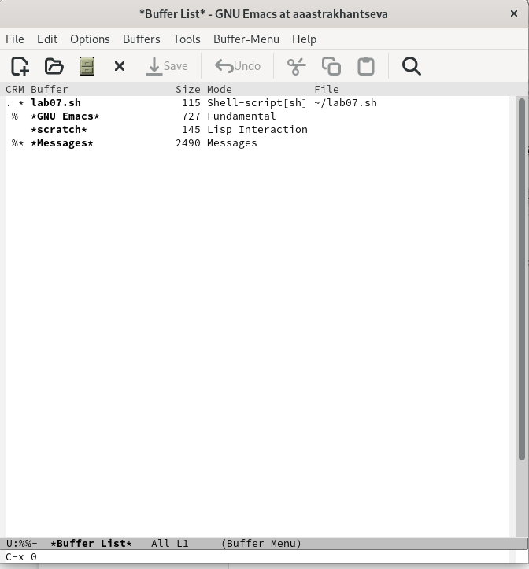
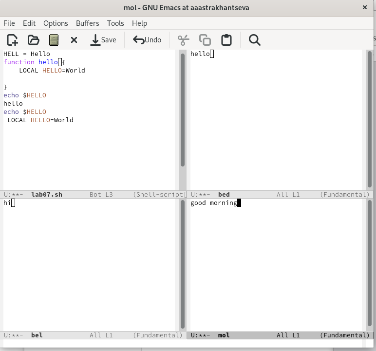
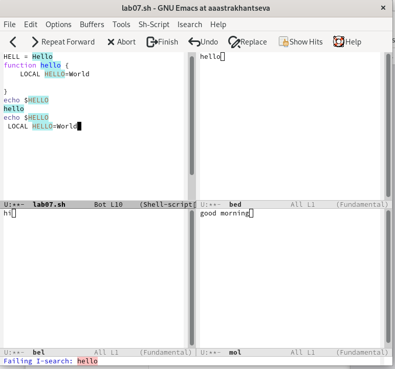

и---
## Front matter
title: "Отчет о лабораторной работе №9"
subtitle: "Дисциплина: операционные системы"
author: "Астраханцева А. А."

## Generic otions
lang: ru-RU
toc-title: "Содержание"

## Bibliography
bibliography: bib/cite.bib
csl: pandoc/csl/gost-r-7-0-5-2008-numeric.csl

## Pdf output format
toc: true # Table of contents
toc-depth: 2
lof: true # List of figures
lot: false # List of tables
fontsize: 12pt
linestretch: 1.5
papersize: a4
documentclass: scrreprt
## I18n polyglossia
polyglossia-lang:
  name: russian
  options:
	- spelling=modern
	- babelshorthands=true
polyglossia-otherlangs:
  name: english
## I18n babel
babel-lang: russian
babel-otherlangs: english
## Fonts
mainfont: PT Serif
romanfont: PT Serif
sansfont: PT Sans
monofont: PT Mono
mainfontoptions: Ligatures=TeX
romanfontoptions: Ligatures=TeX
sansfontoptions: Ligatures=TeX,Scale=MatchLowercase
monofontoptions: Scale=MatchLowercase,Scale=0.9
## Biblatex
biblatex: true
biblio-style: "gost-numeric"
biblatexoptions:
  - parentracker=true
  - backend=biber
  - hyperref=auto
  - language=auto
  - autolang=other*
  - citestyle=gost-numeric
## Pandoc-crossref LaTeX customization
figureTitle: "Рис."
tableTitle: "Таблица"
listingTitle: "Листинг"
lofTitle: "Список иллюстраций"
lotTitle: "Список таблиц"
lolTitle: "Листинги"
## Misc options
indent: true
header-includes:
  - \usepackage{indentfirst}
  - \usepackage{float} # keep figures where there are in the text
  - \floatplacement{figure}{H} # keep figures where there are in the text
---

# Цель работы

Познакомиться с операционной системой Linux. Получить практические навыки рабо-
ты с редактором Emacs.

# Задание

1. Ознакомиться с теоретическим материалом.
2. Ознакомиться с редактором emacs.
3. Выполнить упражнения.
4. Ответить на контрольные вопросы.

# Теоретическое введение

Emacs — бесплатное семейство текстовых редакторов. Основу идеологии Emacs составляют принципы «всё в одном», расширяемости, настраиваемости под пользователя и документированности.

Функциональность Emacs можно разделить на три уровня: базовая, основной режим и дополнительные режимы. Сочетание этих трёх уровней позволяет выполнять огромное количество задач (в том числе и не связанных напрямую с редактированием текста) не выходя из редактора. 

Базовая функциональность включает в себя основные операции работы с текстом, как присутствующие в любом редакторе, так и уникальные для Emacs. Сюда входят вставка и удаление текста, перемещение по тексту, открытие и сохранение файлов и т. п. Уникальным для Emacs является множество этих операций и доступность практически всех из них с клавиатуры. Так, например, по тексту можно перемещаться посимвольно, по словам, строкам, страницам, предложениям, абзацам, сбалансированным спискам (то есть по выражениям, заключённым в скобки), функциям… 

Основной режим Emacs определяется типом редактируемого файла. Существуют режимы для различных языков программирования, языков разметки текста (HTML, TeX и т. п.), для просмотра директорий, для чтения и отправления электронной почты и многие другие. Основной режим определяет способ подсветки синтаксиса, способ выравнивания кода для языков программирования, специальные команды для выполнения часто используемых операций и др. 

Основной режим может также переопределять базовые элементы текста. Так, при редактировании программ на C и подобных языках, предложением считается одна команда программы. При этом в комментариях предложение имеет обычный текстовый смысл. Дополнительные режимы обычно обеспечивают функциональность, независящую или слабо зависящую от формата редактируемого файла. В отличие от основного режима, который для любого буфера один, количество активных дополнительных режимов неограниченно. Например, существуют режимы для подсветки текущей строки, постоянного вывода имени текущей функции для текстов программ, подсветки соответствующих друг другу скобок и многие другие.

# Выполнение лабораторной работы

Откроем emacs и создадим файл lab07.sh с помощью комбинации Ctrl-x Ctrl-f (C-x C-f) (рис. @fig:001).

{#fig:001 width=70%}

Набираем текст и сорханяем файл с помощью комбинации Ctrl-x Ctrl-s (C-x C-s) (рис. @fig:002).

{#fig:002 width=70%}

Проделываем с текстом стандартные процедуры редактирования с помощбю комбинаций клавиш:

1. Вырезать одной командой целую строку (С-k) и вставить эту строку в конец файла (C-y)(рис. @fig:003).

{#fig:003 width=70%}

2. Выделить область текста (C-space), скопировать область в буфер обмена (M-w) и вставить область в конец файла (рис. @fig:004).

{#fig:004 width=70%}

3. Вновь выделить эту область и на этот раз вырезать её (C-w) (рис. @fig:005).

{#fig:005 width=70%}

4. Отменить последнее действие (C-/) (рис. @fig:006).

{#fig:006 width=70%}

Научитесь использовать команды по перемещению курсора.
6.1. Переместите курсор в начало строки (C-a).
6.2. Переместите курсор в конец строки (C-e).
6.3. Переместите курсор в начало буфера (M-<).
6.4. Переместите курсор в конец буфера (M->).

(см. скринкаст)

Управление буферами.

7.1. Вывести список активных буферов на экран (C-x C-b).
7.2. Переместитесь во вновь открытое окно (C-x) o со списком открытых буферов
и переключитесь на другой буфер.
7.3. Закройте это окно (C-x 0).
7.4. Теперь вновь переключайтесь между буферами, но уже без вывода их списка на
экран (C-x b) (рис. @fig:007 - @fig:008).

{#fig:007 width=70%}

{#fig:008 width=70%}

 Управление окнами.
 
8.1. Поделите фрейм на 4 части: разделите фрейм на два окна по вертикали (C-x 3),
а затем каждое из этих окон на две части по горизонтали (C-x 2)
8.2. В каждом из четырёх созданных окон откройте новый буфер (файл) и введите
несколько строк текста (рис. @fig:009).

{#fig:009 width=70%}

Режим поиска

9.1. Переключитесь в режим поиска (C-s) и найдите несколько слов, присутствующих
в тексте.
9.2. Переключайтесь между результатами поиска, нажимая C-s.
9.3. Выйдите из режима поиска, нажав C-g (рис. @fig:010).

{#fig:010 width=70%}

**Контрольные вопросы**

1. Кратко охарактеризуйте редактор emacs.

Основу идеологии Emacs составляют принципы «всё в одном», расширяемости, настраиваемости под пользователя и документированности.

Функциональность Emacs можно разделить на три уровня: базовая, основной режим и дополнительные режимы. Сочетание этих трёх уровней позволяет выполнять огромное количество задач (в том числе и не связанных напрямую с редактированием текста) не выходя из редактора. 

Базовая функциональность включает в себя основные операции работы с текстом, как присутствующие в любом редакторе, так и уникальные для Emacs. Сюда входят вставка и удаление текста, перемещение по тексту, открытие и сохранение файлов и т. п. Уникальным для Emacs является множество этих операций и доступность практически всех из них с клавиатуры. Так, например, по тексту можно перемещаться посимвольно, по словам, строкам, страницам, предложениям, абзацам, сбалансированным спискам (то есть по выражениям, заключённым в скобки), функциям… 

2. Какие особенности данного редактора могут сделать его сложным для освоения новичком?

Множество различных сложных комбинаций и сочетаний клавиш могут покааться сложными для новичков

3. Своими словами опишите, что такое буфер и окно в терминологии emacs’а.

Буфер - какой-либо текст. Та часть программы, на который мы можме видеть один из буферов.

4. Можно ли открыть больше 10 буферов в одном окне?

Да, можно.

5. Какие буферы создаются по умолчанию при запуске emacs?

Только что запущенный Emacs несет один буфер с именем `*scratch*', который может быть использован для вычисления выражений Лиспа в Emacs. В именах буферов имеет значение различие между верхним и нижним регистрами. 

6. Какие клавиши вы нажмёте, чтобы ввести следующую комбинацию C-c | и C-c C-|?

Ctrl + c, |

Ctrl + c, Ctrl + |

7. Как поделить текущее окно на две части?

Ctrl + x, 2

8. В каком файле хранятся настройки редактора emacs?

Настройки редактора emacs хранятся в файле .emacs, который хранится в домашней дирректории

9. Какую функцию выполняет клавиша `<-` и можно ли её переназначить?

Выполняет функцию "стереть", ее можно переназначить

10. Какой редактор вам показался удобнее в работе vi или emacs? Поясните почему.

Редектор vi показался мне более простым в использовании и понятным. Мне понравилось, что он является встроенным, поэтом уже не требует дополнительной установки. В данном редакторе понятные и простые команды и режимы.

# Выводы

В зоде выполнения лабораторной работы №9 я познакомилась с операционной системой Linux и получила практические навыки работы с редактором Emacs.

# Список литературы{.unnumbered}

1. Текстовый редактор - Emacs [электронный источник] - Режим доступа: https://pro-spo.ru/text/87--emacs 

