---
## Front matter
lang: ru-RU
title: "Отчет по выполнению лабораторной работы №10"
subtitle: "Дисциплина: операционные системы"
author:
  - Астраханцева А. А.
institute:
  - Российский университет дружбы народов, Москва, Россия
date: 13 апреля 2023

## i18n babel
babel-lang: russian
babel-otherlangs: english

## Formatting pdf
toc: false
toc-title: Содержание
slide_level: 2
aspectratio: 169
section-titles: true
theme: metropolis
header-includes:
 - \metroset{progressbar=frametitle,sectionpage=progressbar,numbering=fraction}
 - '\makeatletter'
 - '\beamer@ignorenonframefalse'
 - '\makeatother'
---

# Информация

## Докладчик

:::::::::::::: {.columns align=center}
::: {.column width="70%"}

  * Астраханцева Анастасия Александровна
  * студентка НКАбд-01-22
  * Студ. билет: 1132226437
  * Российский университет дружбы народов
  * <https://anastasiia7205.github.io/>

:::
::: {.column width="50%"}

:::
::::::::::::::

## Цель работы

Изучить основы программирования в оболочке ОС UNIX/Linux. Научиться писать небольшие командные файлы.

## Задания

1. Написать скрипт, который при запуске будет делать резервную копию самого себя (то
есть файла, в котором содержится его исходный код) в другую директорию backup
в вашем домашнем каталоге. При этом файл должен архивироваться одним из ар-
хиваторов на выбор zip, bzip2 или tar. Способ использования команд архивации
необходимо узнать, изучив справку.
2. Написать пример командного файла, обрабатывающего любое произвольное число
аргументов командной строки, в том числе превышающее десять. Например, скрипт
может последовательно распечатывать значения всех переданных аргументов.

## Задания

3. Написать командный файл — аналог команды ls (без использования самой этой ко-
манды и команды dir). Требуется, чтобы он выдавал информацию о нужном каталоге
и выводил информацию о возможностях доступа к файлам этого каталога.
4. Написать командный файл, который получает в качестве аргумента командной строки
формат файла (.txt, .doc, .jpg, .pdf и т.д.) и вычисляет количество таких файлов
в указанной директории. Путь к директории также передаётся в виде аргумента ко-
мандной строки

# Выполнение лабораторной работы

## Создание директории и командного файла №1

Для начала создаем файл для нашего командного файла с названием `progr1.sh`. И создадим каталог с названием backup в домашней директории.

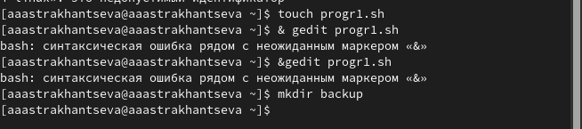{#fig:001 width=70%}

## Текст программы №1

Далее в созданном файле пишем текст программы. С помощью команды tar мы создаем сжатую копию файла progr1.sh в директории backup.

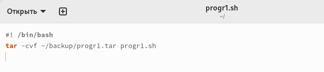{#fig:002 width=70%}

## Запуск и проверка программы №1

Запускаем файл progr1.sh `bash progr1.sh` и проверяем, что все работает корректно. То есть в директории backup создается файл progr1.tar.

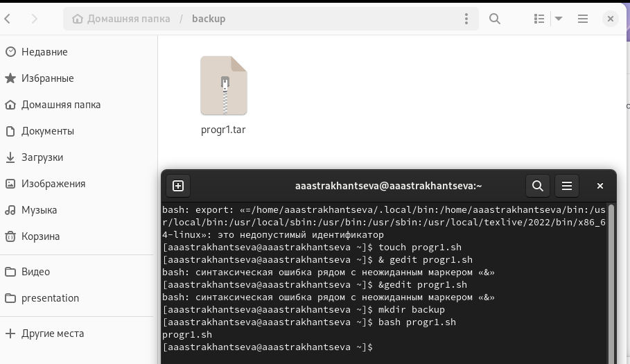{#fig:003 width=65%}

## Создание командного файла №2

Создаем файл для нашего командного файла с названием `progr2.sh`.

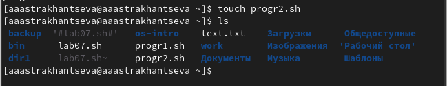{#fig:004 width=70%}

## Текст программы №2

Далее в созданном файле пишем текст программы. Используем цикл for для перебора всех чисел, введеных в терминал. С помощью команды echo мы выводим на экран значение переменнойБ чтобы обозначить, что это не просто буква А, а именно переменная, используем `$`.

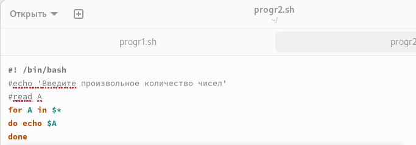{#fig:005 width=70%}

## Запуск и проверка программы №2

Запускаем файл progr2.sh `bash progr2.sh` и проверяем, что все работает корректно. То есть в термниал выводятся те числа, которые мы ввели после вызова команды.

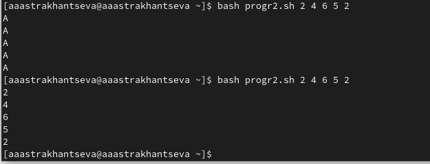{#fig:006 width=70%}

## Создание командного файла №3

Создаем файл для нашего командного файла с названием `progr3.sh`.

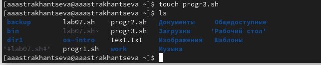{#fig:007 width=70%}

## Текст программы №3

Далее в созданном файле пишем текст программы. Используем `test` и конструкцию `if - fi` для проверки того, какие файлы содержатся в данной директории.

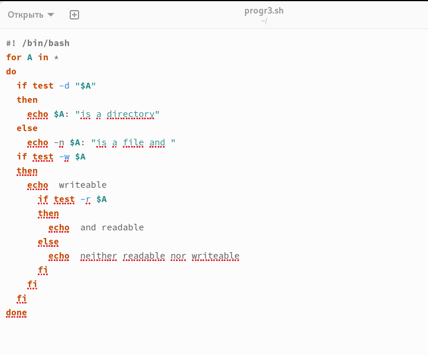{#fig:008 width=50%}

## Запуск и проверка программы №3

Запускаем файл progr3.sh `bash progr3.sh` и проверяем, что все работает корректно. То есть в термниал выводятся файлы и каталоги, после которых подписано, чем именно они являются.

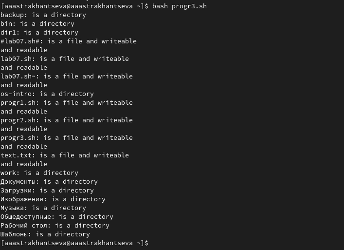{#fig:009 width=50%}

## Создание командного файла №4

Создаем файл для нашего командного файла с названием `progr4.sh`.

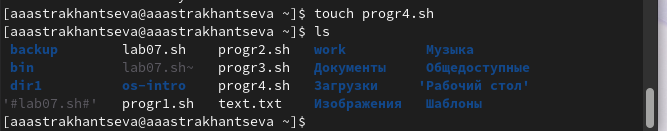{#fig:010 width=70%}

## Текст программы №4

Далее в созданном файле пишем текст программы. Принимаем от пользователя назнавие директории и формат файла, после этого с помощью `find` ищем все файлы с заданным расширением в заданной директории и считаем их количество.

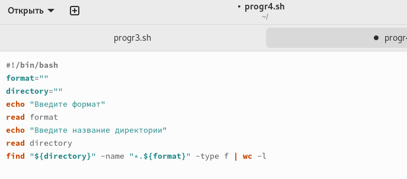{#fig:011 width=70%}

## Запуск и проверка программы №3

Запускаем файл progr4.sh `bash progr4.sh` и проверяем, что все работает корректно. То есть в термниал выводятся число с заданным расширением в заданной директории.

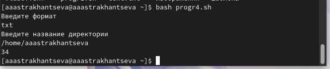{#fig:012 width=70%}

## Выводы 

В ходе выполнения лабораторной работы №10 я изучила основы программирования в оболочке ОС UNIX/Linux и научилась писать небольшие командные файлы.

