---
## Front matter
lang: ru-RU
title: "Отчет по выполнению лабораторной работы №11"
subtitle: "Дисциплина: операционные системы"
author:
  - Астраханцева А. А.
institute:
  - Российский университет дружбы народов, Москва, Россия
date: 19 апреля 2023

## i18n babel
babel-lang: russian
babel-otherlangs: english

## Formatting pdf
toc: false
toc-title: Содержание
slide_level: 2
aspectratio: 169
section-titles: true
theme: metropolis
header-includes:
 - \metroset{progressbar=frametitle,sectionpage=progressbar,numbering=fraction}
 - '\makeatletter'
 - '\beamer@ignorenonframefalse'
 - '\makeatother'
---

# Информация

## Докладчик

:::::::::::::: {.columns align=center}
::: {.column width="70%"}

  * Астраханцева Анастасия Александровна
  * студентка НКАбд-01-22
  * Студ. билет: 1132226437
  * Российский университет дружбы народов
  * <https://anastasiia7205.github.io/>

:::
::: {.column width="50%"}

:::
::::::::::::::

## Цель работы

Изучить основы программирования в оболочке ОС UNIX. Научится писать более
сложные командные файлы с использованием логических управляющих конструкций
и циклов.

## Задание

1. Используя команды getopts grep, написать командный файл, который анализирует
командную строку с ключами:
– -iinputfile — прочитать данные из указанного файла;
– -ooutputfile — вывести данные в указанный файл;
– -pшаблон — указать шаблон для поиска;
– -C — различать большие и малые буквы;
– -n — выдавать номера строк.
а затем ищет в указанном файле нужные строки, определяемые ключом -p.
2. Написать на языке Си программу, которая вводит число и определяет, является ли оно
больше нуля, меньше нуля или равно нулю. Затем программа завершается с помощью
функции exit(n), передавая информацию в о коде завершения в оболочку. Команд-
ный файл должен вызывать эту программу и, проанализировав с помощью команды
$?, выдать сообщение о том, какое число было введено.

## Задание

3. Написать командный файл, создающий указанное число файлов, пронумерованных
последовательно от 1 до 𝑁 (например 1.tmp, 2.tmp, 3.tmp,4.tmp и т.д.). Число файлов,
которые необходимо создать, передаётся в аргументы командной строки. Этот же ко-
мандный файл должен уметь удалять все созданные им файлы (если они существуют).
4. Написать командный файл, который с помощью команды tar запаковывает в архив
все файлы в указанной директории. Модифицировать его так, чтобы запаковывались
только те файлы, которые были изменены менее недели тому назад (использовать
команду find).

# Выполнение лабораторной работы

## Создание командного файла №1

Для начала создадим командный файл №1

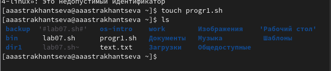{#fig:001 width=70%}

## Текст программы №1

В созданный файл записывам текст нашей програмы. Используем опреатор case для выбора опций

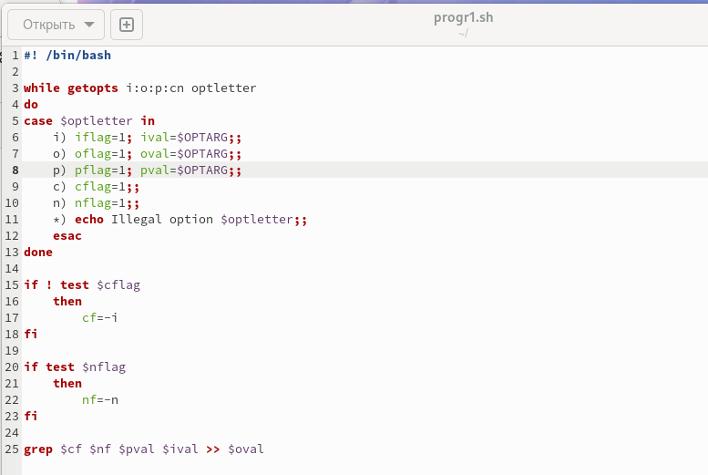{#fig:002 width=70%}

## Запуск и проверка программы №1

Проверяем, что работает корректно.

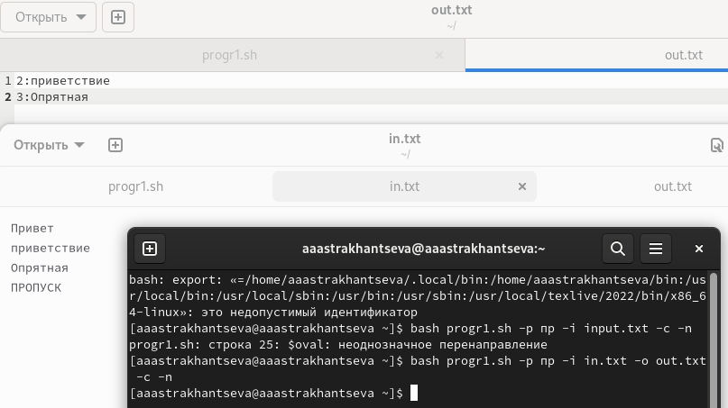{#fig:003 width=70%}

## Создание файлов

Создаем командный файл №2 и файл для программы на Си

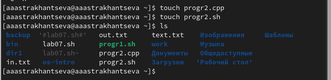{#fig:004 width=70%}

## Текст програмы на Си

В созданный файл записывам текст нашей програмы на языке Си

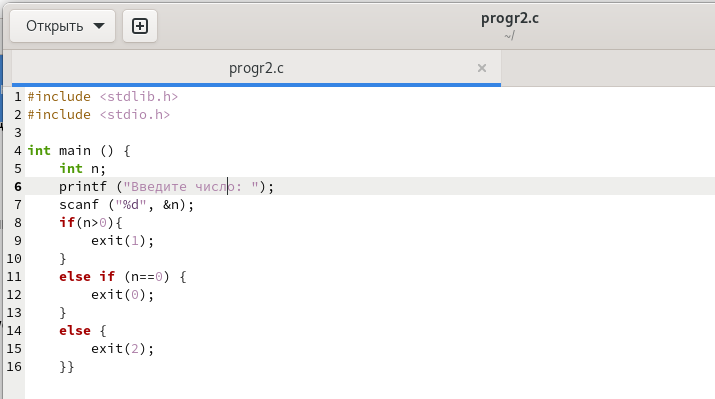{#fig:005 width=70%}

## Текст програмы №2

В командный файл записываем текст программы. Используем опреатор case 

{#fig:006 width=70%}

## Запуск и проверка программы №2

Проверяем, что работает корректно 

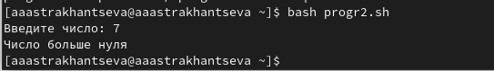{#fig:007 width=70%}

## Создание командного файла №3

Создаем командный файл №3 

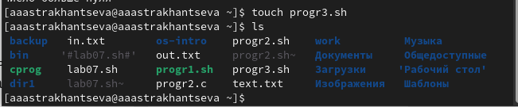{#fig:008 width=70%}

## Текст програмы №3

В командный файл записываем текст программы. Используем цикл for.

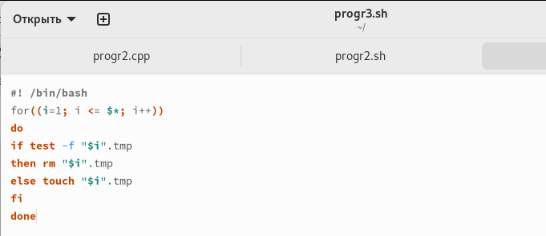{#fig:009 width=70%}

## Запуск и проверка программы №3

Проверяем, что работает корректно .

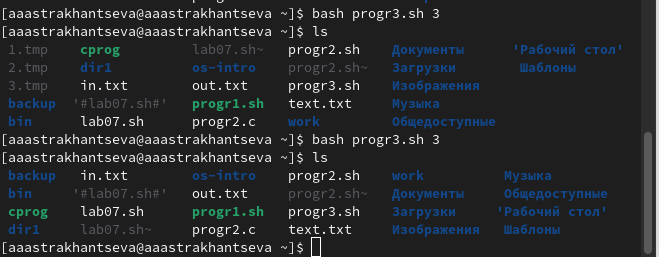{#fig:010 width=70%}

## Создание командного файла №4

Создаем командный файл №4

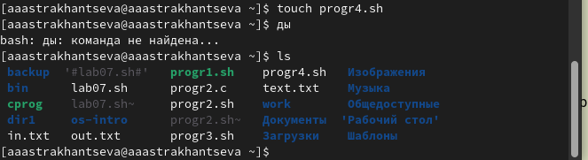{#fig:011 width=70%}

## Текст програмы №4

В командный файл записываем текст программы. Используем команды find и tar

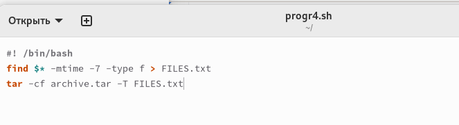{#fig:012 width=70%}

## Запуск и проверка программы №4

Проверяем, что работает корректно

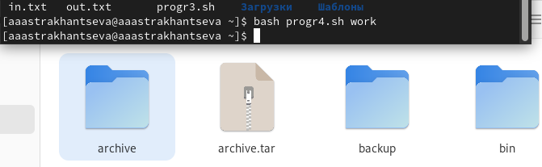{#fig:013 width=70%}

## Выводы

Я изучила основы программирования в оболочке ОС UNIX, научилась писать более сложные командные файлы с использованием логических управляющих конструкций и циклов.

