---
## Front matter
title: "Отчет по лабораторной работе №11"
subtitle: "Дисциплина: операционные системы"
author: "Астраханцева А. А."

## Generic otions
lang: ru-RU
toc-title: "Содержание"

## Bibliography
bibliography: bib/cite.bib
csl: pandoc/csl/gost-r-7-0-5-2008-numeric.csl

## Pdf output format
toc: true # Table of contents
toc-depth: 2
lof: true # List of figures
lot: false # List of tables
fontsize: 12pt
linestretch: 1.5
papersize: a4
documentclass: scrreprt
## I18n polyglossia
polyglossia-lang:
  name: russian
  options:
	- spelling=modern
	- babelshorthands=true
polyglossia-otherlangs:
  name: english
## I18n babel
babel-lang: russian
babel-otherlangs: english
## Fonts
mainfont: PT Serif
romanfont: PT Serif
sansfont: PT Sans
monofont: PT Mono
mainfontoptions: Ligatures=TeX
romanfontoptions: Ligatures=TeX
sansfontoptions: Ligatures=TeX,Scale=MatchLowercase
monofontoptions: Scale=MatchLowercase,Scale=0.9
## Biblatex
biblatex: true
biblio-style: "gost-numeric"
biblatexoptions:
  - parentracker=true
  - backend=biber
  - hyperref=auto
  - language=auto
  - autolang=other*
  - citestyle=gost-numeric
## Pandoc-crossref LaTeX customization
figureTitle: "Рис."
tableTitle: "Таблица"
listingTitle: "Листинг"
lofTitle: "Список иллюстраций"
lotTitle: "Список таблиц"
lolTitle: "Листинги"
## Misc options
indent: true
header-includes:
  - \usepackage{indentfirst}
  - \usepackage{float} # keep figures where there are in the text
  - \floatplacement{figure}{H} # keep figures where there are in the text
---

# Цель работы

Изучить основы программирования в оболочке ОС UNIX. Научится писать более
сложные командные файлы с использованием логических управляющих конструкций
и циклов.

# Задание

1. Используя команды getopts grep, написать командный файл, который анализирует
командную строку с ключами:
– -iinputfile — прочитать данные из указанного файла;
– -ooutputfile — вывести данные в указанный файл;
– -pшаблон — указать шаблон для поиска;
– -C — различать большие и малые буквы;
– -n — выдавать номера строк.
а затем ищет в указанном файле нужные строки, определяемые ключом -p.
2. Написать на языке Си программу, которая вводит число и определяет, является ли оно
больше нуля, меньше нуля или равно нулю. Затем программа завершается с помощью
функции exit(n), передавая информацию в о коде завершения в оболочку. Команд-
ный файл должен вызывать эту программу и, проанализировав с помощью команды
$?, выдать сообщение о том, какое число было введено.
3. Написать командный файл, создающий указанное число файлов, пронумерованных
последовательно от 1 до 𝑁 (например 1.tmp, 2.tmp, 3.tmp,4.tmp и т.д.). Число файлов,
которые необходимо создать, передаётся в аргументы командной строки. Этот же ко-
мандный файл должен уметь удалять все созданные им файлы (если они существуют).
4. Написать командный файл, который с помощью команды tar запаковывает в архив
все файлы в указанной директории. Модифицировать его так, чтобы запаковывались
только те файлы, которые были изменены менее недели тому назад (использовать
команду find).

# Теоретическое введение

Командный процессор (командная оболочка, интерпретатор команд shell) — это программа, позволяющая пользователю взаимодействовать с операционной системой компьютера. В операционных системах типа UNIX/Linux наиболее часто используются следующие реализации командных оболочек:

    оболочка Борна (Bourne shell или sh) — стандартная командная оболочка UNIX/Linux, содержащая базовый, но при этом полный набор функций;

    С-оболочка (или csh) — надстройка на оболочкой Борна, использующая С-подобный синтаксис команд с возможностью сохранения истории выполнения команд;

    оболочка Корна (или ksh) — напоминает оболочку С, но операторы управления программой совместимы с операторами оболочки Борна;

    BASH — сокращение от Bourne Again Shell (опять оболочка Борна), в основе своей совмещает свойства оболочек С и Корна (разработка компании Free Software Foundation).

POSIX (Portable Operating System Interface for Computer Environments) — набор стандартов описания интерфейсов взаимодействия операционной системы и прикладных программ. Стандарты POSIX разработаны комитетом IEEE (Institute of Electrical and Electronics Engineers) для обеспечения совместимости различных UNIX/Linux-подобных операционных систем и переносимости прикладных программ на уровне исходного кода. POSIX-совместимые оболочки разработаны на базе оболочки Корна. Рассмотрим основные элементы программирования в оболочке bash. В других оболочках большинство команд будет совпадать с описанными ниже. 

# Выполнение лабораторной работы

Для начала создадим командный файл №1(рис. @fig:001).

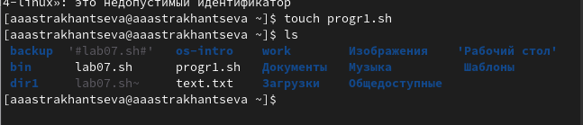{#fig:001 width=70%}

В созданный файл записывам текст нашей програмы. Используем опреатор case для выбора опций (рис. @fig:002).

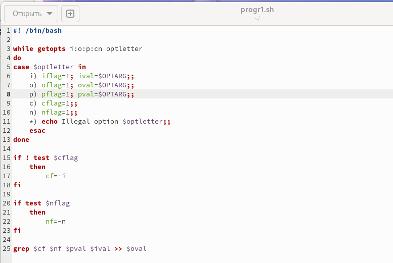{#fig:002 width=70%}

Проверяем, что работает корректно (рис. @fig:003).

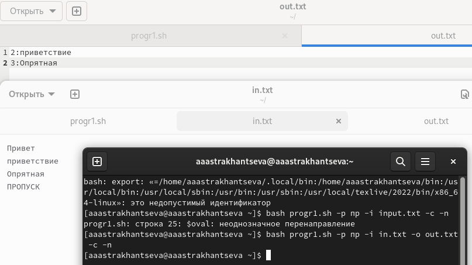{#fig:003 width=70%}

Создаем командный файл №2 и файл для программы на Си (рис. @fig:004).

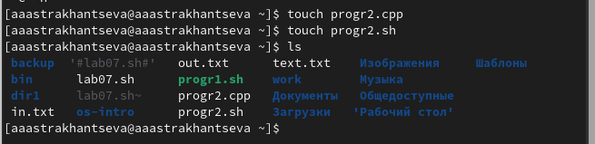{#fig:004 width=70%}

В созданный файл записывам текст нашей програмы на языке Си(рис. @fig:005).

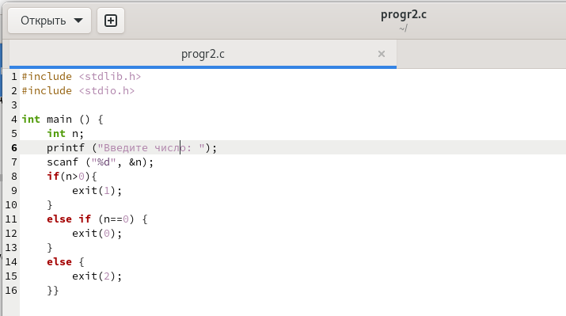{#fig:005 width=70%}

В командный файл записываем текст программы. Используем опреатор case (рис. @fig:006).

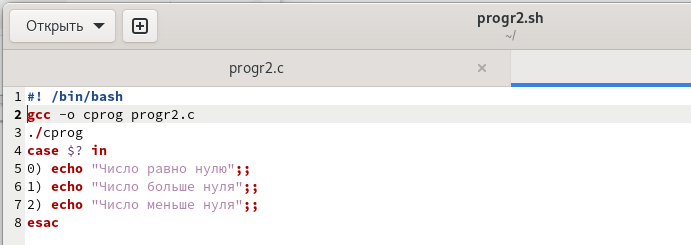{#fig:006 width=70%}

Проверяем, что работает корректно (рис. @fig:007).

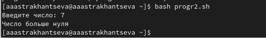{#fig:007 width=70%}

Создаем командный файл №3 (рис. @fig:008).

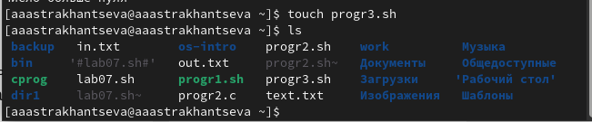{#fig:008 width=70%}

В командный файл записываем текст программы. Используем цикл for(рис. @fig:009).

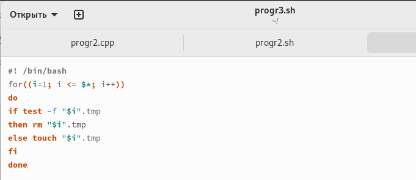{#fig:009 width=70%}

Проверяем, что работает корректно (рис. @fig:010).

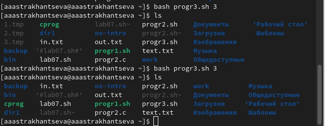{#fig:010 width=70%}

Создаем командный файл №4 (рис. @fig:011).

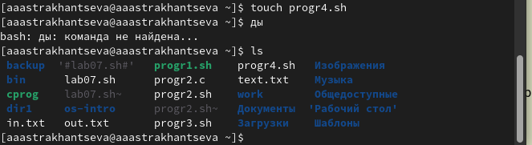{#fig:011 width=70%}

В командный файл записываем текст программы. Используем команды find и tar(рис. @fig:012).

{#fig:012 width=70%}

Проверяем, что работает корректно (рис. @fig:013).

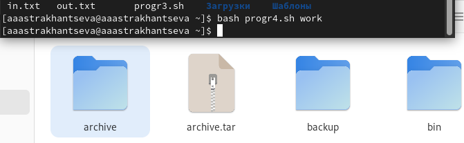{#fig:013 width=70%}

**Контрольные вопросы**

1. Каково предназначение команды getopts?

Команда getopts используется shell-процедурами для разбора позиционных параметров и проверки опций на допустимость. Команда getopts поддерживает все применимые правила стандартного синтаксиса команд 

	Цепочка_опций должна содержать флаги, которые будут распознаваться shell-процедурой, использующей getopts. Если за флагом следует двоеточие, то предполагается, что опция имеет аргумент или группу аргументов, которые должны отделяться от флага пробелами или табуляциями.

После каждого вызова getopts помещает следующую опцию в переменную имя, а номер аргумента, который должен быть обработан следующим, - в переменную OPTIND. Всегда, когда запускается shell или shell-процедура, OPTIND получает значение 1.

Если опции требуется аргумент, то getopts помещает его в переменную OPTARG.

Если встретилась некорректная опция, то в переменную имя помещается ?.

Если опции кончились, getopts возвращает ненулевой код завершения. Можно использовать специальную опцию --, чтобы отметить конец опций.

По умолчанию команда getopts разбирает позиционные параметры вызвавшей ее shell-процедуры, но если указать дополнительные аргументы, то getopts будет разбирать их. 

2. Какое отношение метасимволы имеют к генерации имён файлов?

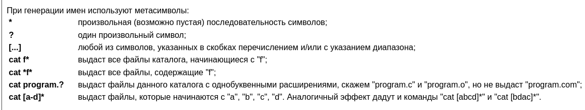{#fig:014 width=70%}

3. Какие операторы управления действиями вы знаете?

 Для решения подобных задач язык программирования bash предоставляет возможность использовать такие управляющие конструкции, как for, case, if и while. С точки зрения командного процессора эти управляющие конструкции являются обычными командами и могут использоваться как при создании командных файлов, так и при работе в интерактивном режиме. Команды, реализующие подобные конструкции, по сути, являются операторами языка программирования bash. Поэтому при описании языка программирования bash термин оператор будет использоваться наравне с термином команда. Команды ОС UNIX возвращают код завершения, значение которого может быть использовано для принятия решения о дальнейших действиях. Команда test, например, создана специально для использования в командных файлах. Единственная функция этой команды заключается в выработке кода завершения.

4. Какие операторы используются для прерывания цикла?

Команда break завершает выполнение цикла, а команда continue завершает данную итерацию блока операторов. Команда break полезна для завершения цикла while в ситуациях, когда условие перестаёт быть правильным. Команда continue используется в ситуациях, когда больше нет необходимости выполнять блок операторов, но вы можете захотеть продолжить проверять данный блок на других условных выражениях.

5. Для чего нужны команды false и true?

Следующие две команды ОС UNIX используются только совместно с управляющими конструкциями языка программирования bash: это команда true, которая всегда возвращает код завершения, равный нулю (т.е. истина), и команда false, которая всегда возвращает код завершения, не равный нулю (т. е. ложь).

    Что означает строка if test -f man$s/$i.$s, встреченная в командном файле?

Строка if test -f man$s/$i.$s проверяет, существует ли файл man$s/$i.$s и является ли этот файл обычным файлом. Если данный файл является каталогом, то команда вернет нулевое значение (ложь).

    Объясните различия между конструкциями while и until.

Выполнение оператора цикла while сводится к тому, что сначала выполняется последовательность команд (операторов), которую задаёт список-команд в строке, содержащей служебное слово while, а затем, если последняя выполненная команда из этой последовательности команд возвращает нулевой код завершения (истина), выполняется последовательность команд (операторов), которую задаёт список-команд в строке, содержащей служебное слово do, после чего осуществляется безусловный переход на начало оператора цикла while. Выход из цикла будет осуществлён тогда, когда последняя выполненная команда из последовательности команд (операторов), которую задаёт список-команд в строке, содержащей служебное слово while, возвратит ненулевой код завершения (ложь). При замене в операторе цикла while служебного слова while на until условие, при выполнении которого осуществляется выход из цикла, меняется на противоположное. В остальном оператор цикла while и оператор цикла until идентичны.

# Выводы

Я изучила основы программирования в оболочке ОС UNIX, научилась писать более сложные командные файлы с использованием логических управляющих конструкций и циклов.

