---
## Front matter
lang: ru-RU
title: "Отчет по выполнению лабораторной работы №12"
subtitle: "Дисциплина: операционные системы"
author:
  - Астраханцева А. А.
institute:
  - Российский университет дружбы народов, Москва, Россия
date: 25 апреля 2023

## i18n babel
babel-lang: russian
babel-otherlangs: english

## Formatting pdf
toc: false
toc-title: Содержание
slide_level: 2
aspectratio: 169
section-titles: true
theme: metropolis
header-includes:
 - \metroset{progressbar=frametitle,sectionpage=progressbar,numbering=fraction}
 - '\makeatletter'
 - '\beamer@ignorenonframefalse'
 - '\makeatother'
---

# Информация

## Докладчик

:::::::::::::: {.columns align=center}
::: {.column width="70%"}

  * Астраханцева Анастасия Александровна
  * студентка НКАбд-01-22
  * Студ. билет: 1132226437
  * Российский университет дружбы народов
  * <https://anastasiia7205.github.io/>

:::
::: {.column width="50%"}

:::
::::::::::::::

## Цель работы

Изучить основы программирования в оболочке ОС UNIX. Научиться писать более сложные командные файлы с использованием логических управляющих конструкций и циклов.

## Задание

1. Написать командный файл, реализующий упрощённый механизм семафоров. Ко-
мандный файл должен в течение некоторого времени t1 дожидаться освобождения
ресурса, выдавая об этом сообщение, а дождавшись его освобождения, использовать
его в течение некоторого времени t2<>t1, также выдавая информацию о том, что
ресурс используется соответствующим командным файлом (процессом). Запустить
командный файл в одном виртуальном терминале в фоновом режиме, перенаправив
его вывод в другой (> /dev/tty#, где # — номер терминала куда перенаправляется
вывод), в котором также запущен этот файл, но не фоновом, а в привилегированном
режиме. Доработать программу так, чтобы имелась возможность взаимодействия трёх
и более процессов.

## Задание

2. Реализовать команду man с помощью командного файла. Изучите содержимое ката-
лога /usr/share/man/man1. В нем находятся архивы текстовых файлов, содержащих
справку по большинству установленных в системе программ и команд. Каждый архив
можно открыть командой less сразу же просмотрев содержимое справки. Командный
файл должен получать в виде аргумента командной строки название команды и в виде
результата выдавать справку об этой команде или сообщение об отсутствии справки,
если соответствующего файла нет в каталоге man1.
3. Используя встроенную переменную $RANDOM, напишите командный файл, генерирую-
щий случайную последовательность букв латинского алфавита. Учтите, что $RANDOM
выдаёт псевдослучайные числа в диапазоне от 0 до 32767

# Выполнение лабораторной работы

## Создание командного файла №1

Для начала создадим командный файл №1

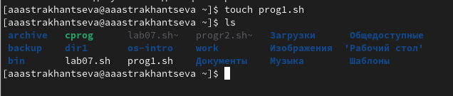{#fig:001 width=70%}

## Текст программы №1

В созданный файл записывам текст нашей програмы. Используем опреатор while test для получения или запрета доступа

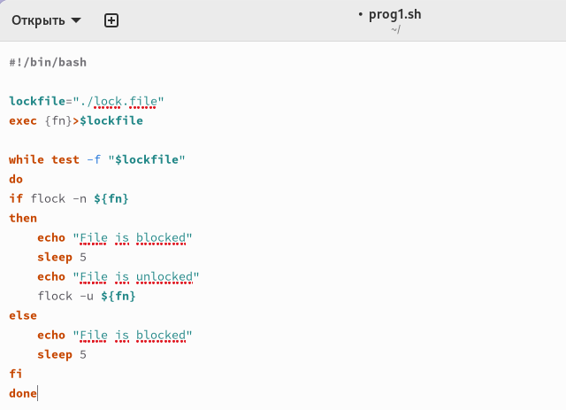{#fig:002 width=60%}

## Запуск и проверка программы №1

Проверяем, что работает корректно

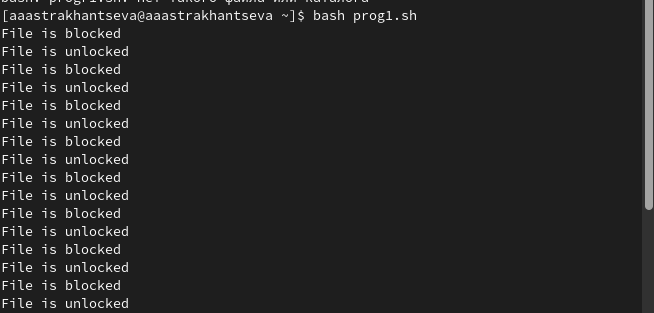{#fig:003 width=70%}

## Создание командного файла №2

Создаем командный файл №2

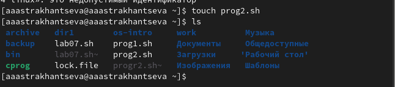{#fig:004 width=70%}

## Просмотр содержимого каталога /usr/share/man/man1 

Просматриваем содержимое каталога /usr/share/man/man1 

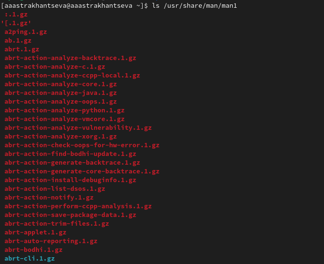{#fig:005 width=60%}

## Текст программы №2

В командный файл записываем текст программы. Используем опреатор test для проверки того, есть ли в данном каталоге справка для запрошенной команды

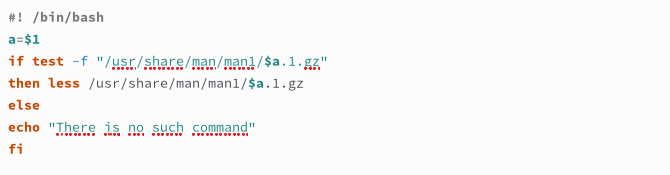{#fig:006 width=70%}

## Запуск и проверка программы №2

Проверяем, что работает корректно

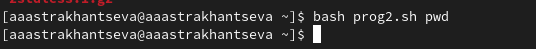{#fig:007 width=70%}

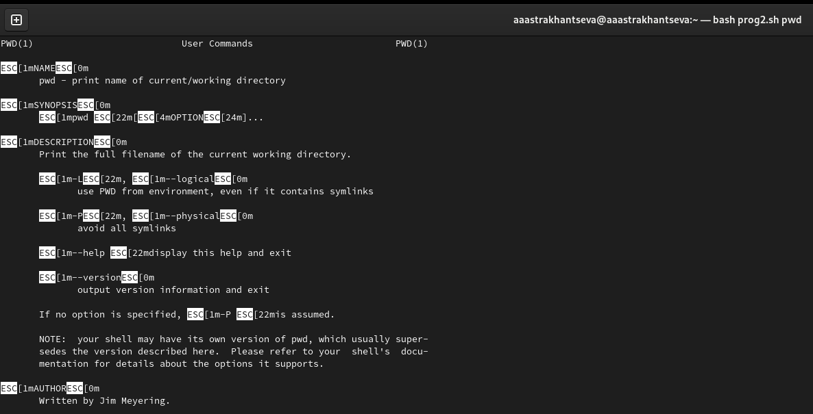{#fig:008 width=60%}

## Создание командного файла №3

Создаем командный файл №3 

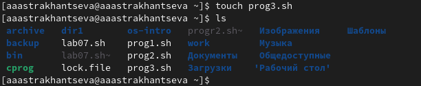{#fig:009 width=70%}

## Текст программы №3

В командный файл записываем текст программы. Используем цикл for и оператор case

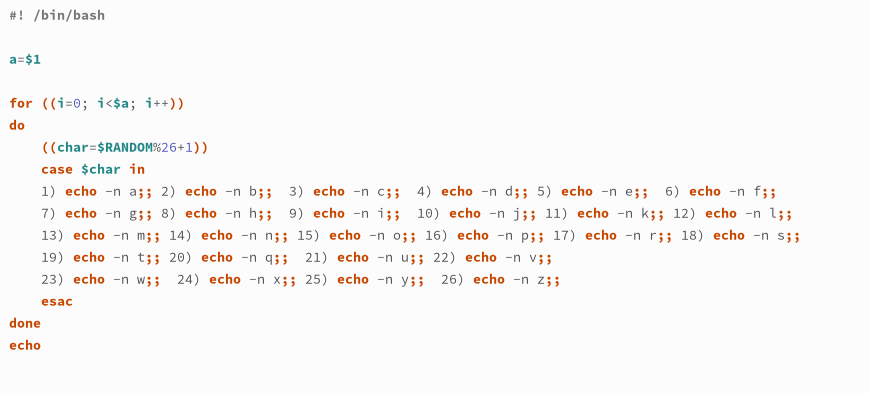{#fig:010 width=70%}

## Запуск и проверка программы №3

Проверяем, что работает корректно

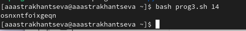{#fig:011 width=70%}

## Выводы

Я изучила основы программирования в оболочке ОС UNIX, научилась писать более сложные командные файлы с использованием логических управляющих конструкций и циклов.

