---
## Front matter
lang: ru-RU
title: "Отчет по выполнению лабораторной работы №13"
subtitle: "Дисциплина: операционные системы"
author:
  - Астраханцева А. А.
institute:
  - Российский университет дружбы народов, Москва, Россия
date: 3 мая 2023

## i18n babel
babel-lang: russian
babel-otherlangs: english

## Formatting pdf
toc: false
toc-title: Содержание
slide_level: 2
aspectratio: 169
section-titles: true
theme: metropolis
header-includes:
 - \metroset{progressbar=frametitle,sectionpage=progressbar,numbering=fraction}
 - '\makeatletter'
 - '\beamer@ignorenonframefalse'
 - '\makeatother'
---

## Докладчик

:::::::::::::: {.columns align=center}
::: {.column width="70%"}

  * Астраханцева Анастасия Александровна
  * студентка НКАбд-01-22
  * Студ. билет: 1132226437
  * Российский университет дружбы народов
  * <https://anastasiia7205.github.io/>

:::
::: {.column width="50%"}

:::
::::::::::::::

## Цель работы

Приобрести простейшие навыки разработки, анализа, тестирования и отладки приложений в ОС типа UNIX/Linux на примере создания на языке программирования С калькулятора с простейшими функциями.

## Задание

1. Ознакомиться с теоритиречским материалом
2. Выполнить все задания из "Последовательность выполения лабораторной работы"
3. Ответить на контрольные вопросы

# Выполнение лабораторной работы

## Создание каталога и файлов

Создаем каталог и нужные файлы в нем

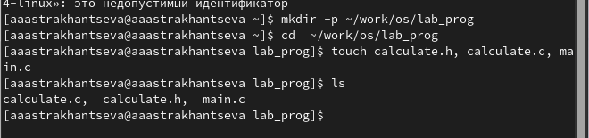{#fig:001 width=70%}

## Запись текста программы в файлы

В файл calculate.c, calculate.h и main.c записываем текст программы.

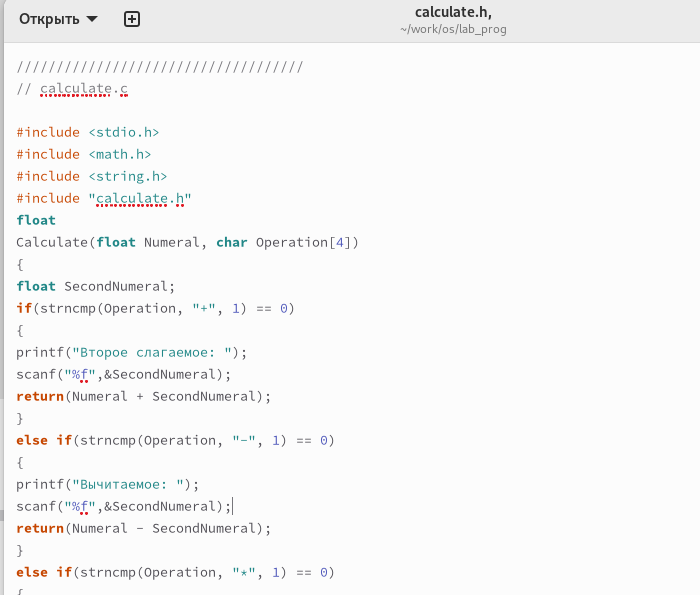{#fig:002 width=60%}

## Компиляция

Выполним компиляцию программы посредством gcc

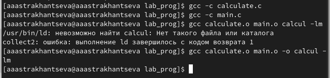{#fig:005 width=70%}

## Создание Makefile 

Создаем Makefile и записываем в него текст

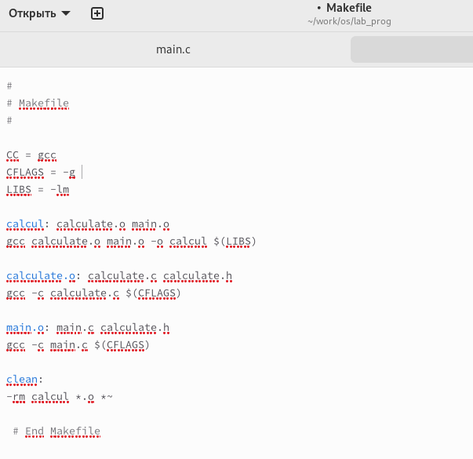{#fig:006 width=60%}

## Использование make для отладки

Далее использую make для отладки.

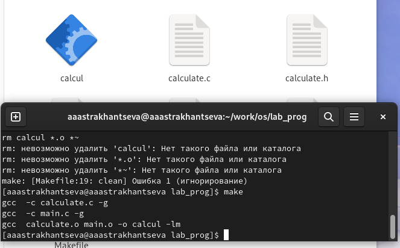{#fig:007 width=70%}

## Запуск программы

После этого запускаем gdb и вводим run, для того, чтобы запустить нашу программу.

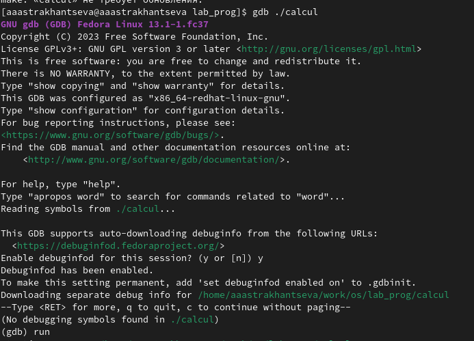{#fig:008 width=50%}

## Проверка работы

Проверяем, что все работает корректно.

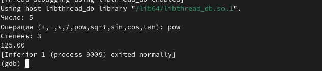{#fig:009 width=70%}

## Команды gdb: list

Для постраничного (по 9 строк) просмотра исходного код использую команду list:

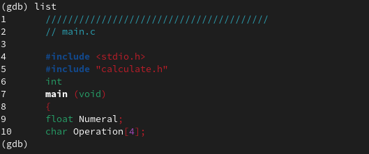{#fig:010 width=70%}

## Команды gdb: list с параметрами

Для просмотра строк с 12 по 15 основного файла используйую list с параметрами:

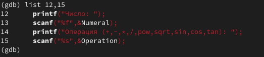{#fig:011 width=70%}

## Команды gdb: list с параметрами из другого файла

Для просмотра определённых строк не основного файла используйте list с параметрами:

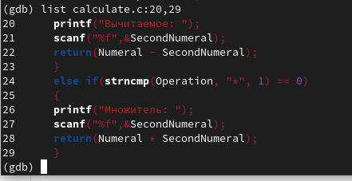{#fig:012 width=70%}

## Установка точки останова

Установлю точку останова в файле calculate.c на строке номер 21:

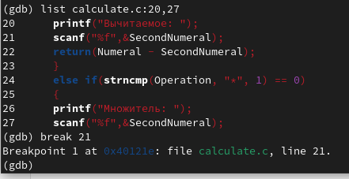{#fig:013 width=70%}

## Информация о точках останова

Выведу информацию об имеющихся в проекте точка останова

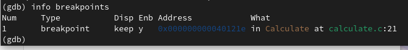{#fig:014 width=70%}

## Запуск программы с установленной точкой останова

Запускаем программу внутри отладчика и убеждаемся, что программа остановится в момент прохождения точки останова:

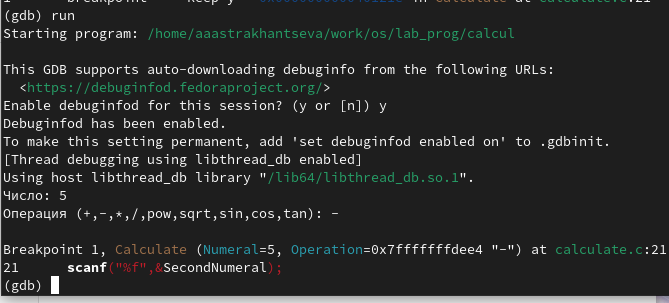{#fig:015 width=70%}

## Значение перемнной Numeral

Посмотрим, чему равно на этом этапе значение переменной Numeral и сравним с результатом вывода на экран после использования команды `display Numeral` 

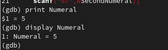{#fig:016 width=70%}

## Удаление точки останова

Уберем точки останова

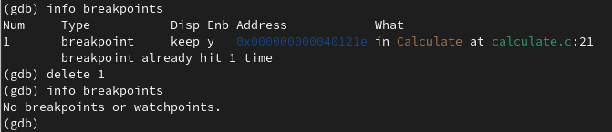{#fig:017 width=70%}

## Анализ код файлов calculate.c и main.c.

С помощью утилиты splint попробуем проанализировать коды файлов calculate.c и main.c. 

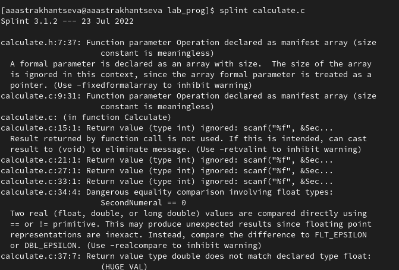{#fig:018 width=60%}

## Анализ код файлов calculate.c и main.c.

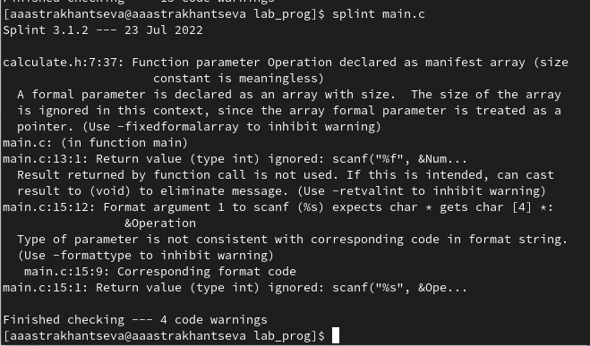{#fig:019 width=70%}

## Выводы

В ходе выполнения лабораторной работы №13 я приобрела простейшие навыки разработки, анализа, тестирования и отладки приложений в ОС типа UNIX/Linux на примере создания на языке программирования С калькулятора с простейшими функциями.

