---
## Front matter
title: "Отчет по выполенению лабораторной работы №13"
subtitle: "Дисциплина: операционные системы"
author: "Астраханцева А. А."

## Generic otions
lang: ru-RU
toc-title: "Содержание"

## Bibliography
bibliography: bib/cite.bib
csl: pandoc/csl/gost-r-7-0-5-2008-numeric.csl

## Pdf output format
toc: true # Table of contents
toc-depth: 2
lof: true # List of figures
lot: false # List of tables
fontsize: 12pt
linestretch: 1.5
papersize: a4
documentclass: scrreprt
## I18n polyglossia
polyglossia-lang:
  name: russian
  options:
	- spelling=modern
	- babelshorthands=true
polyglossia-otherlangs:
  name: english
## I18n babel
babel-lang: russian
babel-otherlangs: english
## Fonts
mainfont: PT Serif
romanfont: PT Serif
sansfont: PT Sans
monofont: PT Mono
mainfontoptions: Ligatures=TeX
romanfontoptions: Ligatures=TeX
sansfontoptions: Ligatures=TeX,Scale=MatchLowercase
monofontoptions: Scale=MatchLowercase,Scale=0.9
## Biblatex
biblatex: true
biblio-style: "gost-numeric"
biblatexoptions:
  - parentracker=true
  - backend=biber
  - hyperref=auto
  - language=auto
  - autolang=other*
  - citestyle=gost-numeric
## Pandoc-crossref LaTeX customization
figureTitle: "Рис."
tableTitle: "Таблица"
listingTitle: "Листинг"
lofTitle: "Список иллюстраций"
lotTitle: "Список таблиц"
lolTitle: "Листинги"
## Misc options
indent: true
header-includes:
  - \usepackage{indentfirst}
  - \usepackage{float} # keep figures where there are in the text
  - \floatplacement{figure}{H} # keep figures where there are in the text
---

# Цель работы

Приобрести простейшие навыки разработки, анализа, тестирования и отладки приложений в ОС типа UNIX/Linux на примере создания на языке программирования С калькулятора с простейшими функциями.

# Задание

1. Ознакомиться с теоритиречским материалом
2. Выполнить все задания из "Последовательность выполения лабораторной работы"
3. Ответить на контрольные вопросы

# Теоретическое введение

Процесс разработки программного обеспечения обычно разделяется на следующие
этапы:
1. планирование, включающее сбор и анализ требований к функционалу и другим ха-
рактеристикам разрабатываемого приложения;
2.  проектирование, включающее в себя разработку базовых алгоритмов и спецификаций,
определение языка программирования;
3. непосредственная разработка приложения:
4. кодирование — по сути создание исходного текста программы (возможно
в нескольких вариантах);
5. анализ разработанного кода;
6. сборка, компиляция и разработка исполняемого модуля;
7. тестирование и отладка, сохранение произведённых изменений;
8. документирование.

Для создания исходного текста программы разработчик может воспользоваться любым
удобным для него редактором текста: vi, vim, mceditor, emacs, geany и др.
После завершения написания исходного кода программы (возможно состоящей из
нескольких файлов), необходимо её скомпилировать и получить исполняемый модуль.

# Выполнение лабораторной работы

Создаем каталог и нужные файлы в нем (рис. @fig:001).

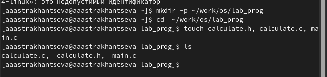{#fig:001 width=70%}


В файл calculate.c записываем текст программы (рис. @fig:002).

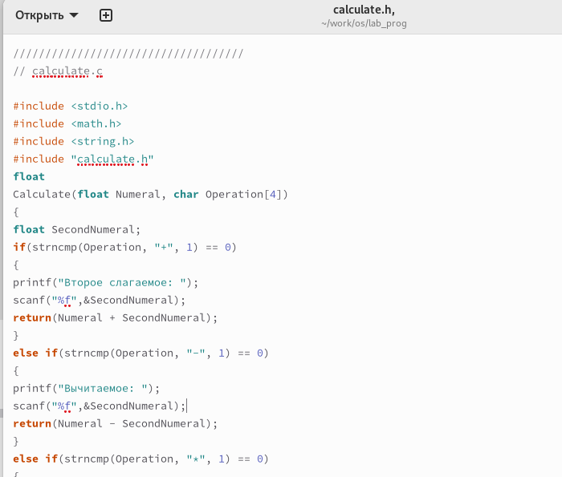{#fig:002 width=70%}

```C
////////////////////////////////////
// calculate.c

#include <stdio.h>
#include <math.h>
#include <string.h>
#include "calculate.h"
float
Calculate(float Numeral, char Operation[4])
{
float SecondNumeral;
if(strncmp(Operation, "+", 1) == 0)
{
printf("Второе слагаемое: ");
scanf("%f",&SecondNumeral);
return(Numeral + SecondNumeral);
}
else if(strncmp(Operation, "-", 1) == 0)
{
printf("Вычитаемое: ");
scanf("%f",&SecondNumeral);
return(Numeral - SecondNumeral);
}
else if(strncmp(Operation, "*", 1) == 0)
{
printf("Множитель: ");
scanf("%f",&SecondNumeral);
return(Numeral * SecondNumeral);
}
else if(strncmp(Operation, "/", 1) == 0)
{
printf("Делитель: ");
scanf("%f",&SecondNumeral);
if(SecondNumeral == 0)
{
printf("Ошибка: деление на ноль! ");
return(HUGE_VAL);
}
else
return(Numeral / SecondNumeral);
}
else if(strncmp(Operation, "pow", 3) == 0)
{
printf("Степень: ");
scanf("%f",&SecondNumeral);
return(pow(Numeral, SecondNumeral));
}
else if(strncmp(Operation, "sqrt", 4) == 0)
return(sqrt(Numeral));
else if(strncmp(Operation, "sin", 3) == 0)
return(sin(Numeral));
else if(strncmp(Operation, "cos", 3) == 0)
return(cos(Numeral));
else if(strncmp(Operation, "tan", 3) == 0)
return(tan(Numeral));
else
{
printf("Неправильно введено действие "); 
return(HUGE_VAL);
}
}

```


В файл calculate.h записываем текст программы (рис. @fig:003).

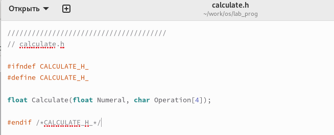{#fig:003 width=70%}

```C
///////////////////////////////////////
// calculate.h

#ifndef CALCULATE_H_
#define CALCULATE_H_

float Calculate(float Numeral, char Operation[4]);

#endif /*CALCULATE_H_*/
```
В файл main.c записываем текст программы (рис. @fig:004).

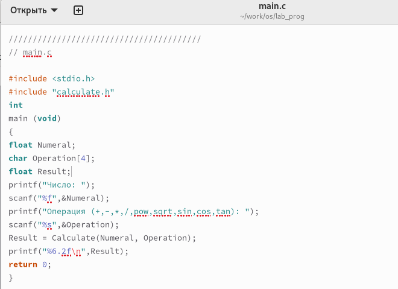{#fig:004 width=70%}

```C
////////////////////////////////////////
// main.c

#include <stdio.h>
#include "calculate.h"
int
main (void)
{
float Numeral;
char Operation[4];
float Result;
printf("Число: ");
scanf("%f",&Numeral);
printf("Операция (+,-,*,/,pow,sqrt,sin,cos,tan): ");
scanf("%s",&Operation);
Result = Calculate(Numeral, Operation);
printf("%6.2f\n",Result);
return 0;
}
```

Выполним компиляцию программы посредством gcc(рис. @fig:005).

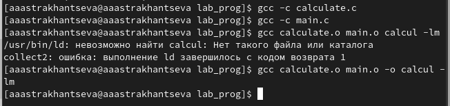{#fig:005 width=70%}


Создаем Makefile и записываем в него текст (рис. @fig:006).

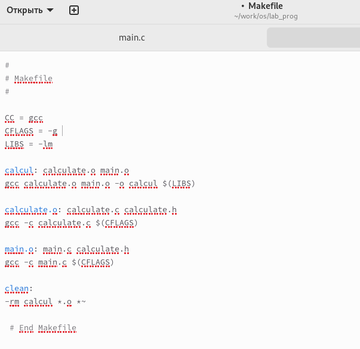{#fig:006 width=70%}

```

CC = gcc  # задаем 3 переменные 
CFLAGS = -g 
LIBS = -lm 
#Создаем файл calcul из файлов calculate.o main.o

calcul: calculate.o main.o  # цель - calcul, зависимость - calculate.o main.o
	$(CC) calculate.o main.o -o calcul $(LIBS)  #  команды
	


calculate.o: calculate.c calculate.h 
	$(CC) -c calculate.c $(CFLAGS) 

main.o: main.c calculate.h #gcc -c main.c -g
	$(CC) -c main.c $(CFLAGS) 

clean: #при вызове make clean будем удалять все файлы с разрешением .о
	-rm calcul *.o *~ 
```

Далее использую make для отладки (рис. @fig:007).

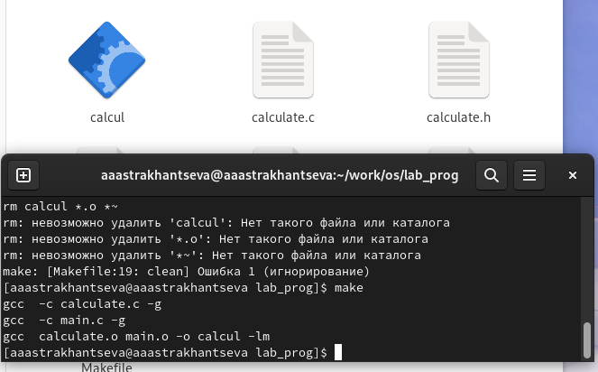{#fig:007 width=70%}

После этого запускаем gdb и вводим run, для того, чтобы запустить нашу программу (рис. @fig:008).

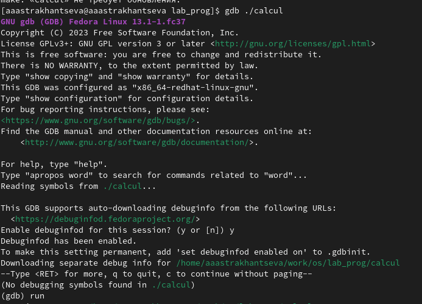{#fig:008 width=70%}

Проверяем, что все работает корректно. 5 в третьей степени действительно равно 125.(рис. @fig:009).

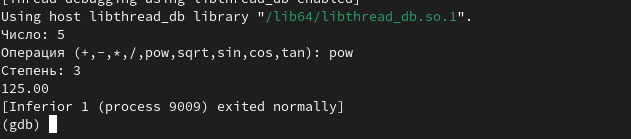{#fig:009 width=70%}

Для постраничного (по 9 строк) просмотра исходного код использую команду list: (рис. @fig:010).

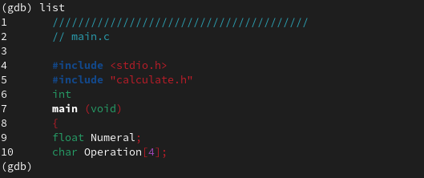{#fig:010 width=70%}

Для просмотра строк с 12 по 15 основного файла используйую list с параметрами: (рис. @fig:011).

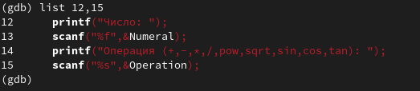{#fig:011 width=70%}

Для просмотра определённых строк не основного файла используйте list с параметрами: (рис. @fig:012).

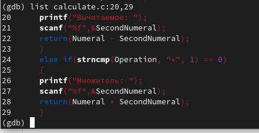{#fig:012 width=70%}

Установлю точку останова в файле calculate.c на строке номер 21: (рис. @fig:013).

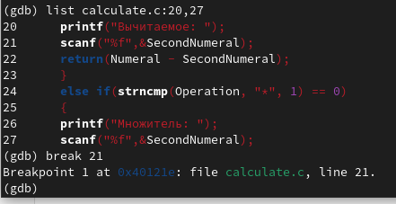{#fig:013 width=70%}

Выведу информацию об имеющихся в проекте точка останова (рис. @fig:014).

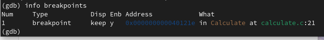{#fig:014 width=70%}

Запускаем программу внутри отладчика и убеждаемся, что программа остановится в момент прохождения точки останова: (рис. @fig:015).

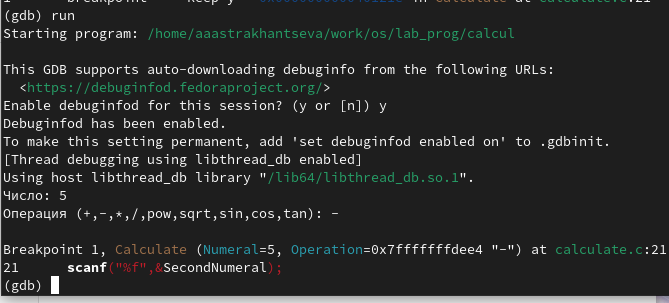{#fig:015 width=70%}

Посмотрим, чему равно на этом этапе значение переменной Numeral и сравним с результатом вывода на экран после использования команды `display Numeral` (рис. @fig:016).

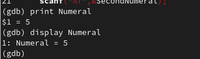{#fig:016 width=70%}

Уберем точки останова (рис. @fig:017).

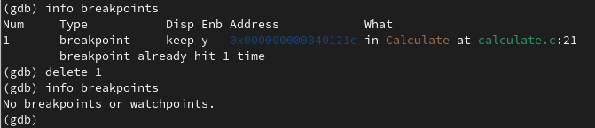{#fig:017 width=70%}

С помощью утилиты splint попробуем проанализировать коды файлов calculate.c и main.c. Мы получили несколько предупрежедений и советов по поводу того, как можно исправить текст программы(рис. @fig:018 - @fig:019).

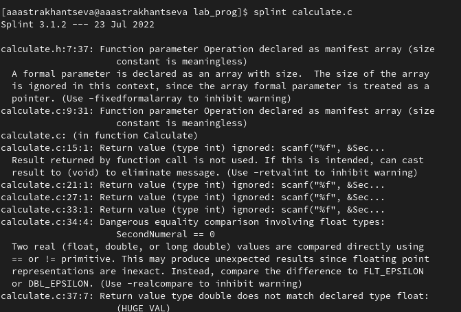{#fig:018 width=70%}

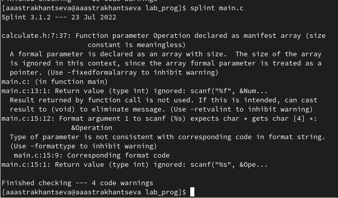{#fig:019 width=70%}

**Контрольные вопросы**

1. Как получить информацию о возможностях программ gcc, make, gdb и др.?

С помощью man или info 

2. Назовите и дайте краткую характеристику основным этапам разработки приложений
в UNIX.

Процесс разработки программного обеспечения обычно разделяется на следующие
этапы:
– планирование, включающее сбор и анализ требований к функционалу и другим ха-
рактеристикам разрабатываемого приложения;
– проектирование, включающее в себя разработку базовых алгоритмов и спецификаций,
определение языка программирования;
– непосредственная разработка приложения:
– кодирование — по сути создание исходного текста программы (возможно
в нескольких вариантах);
– анализ разработанного кода;
– сборка, компиляция и разработка исполняемого модуля;
– тестирование и отладка, сохранение произведённых изменений;
– документирование.
Для создания исходного текста программы разработчик может воспользоваться любым
удобным для него редактором текста: vi, vim, mceditor, emacs, geany и др.
После завершения написания исходного кода программы (возможно состоящей из
нескольких файлов), необходимо её скомпилировать и получить исполняемый модуль.

3. Что такое суффикс в контексте языка программирования? Приведите примеры ис-
пользования.

Суффикс это составная часть имени файла. Система сборки каких-либо программ (например язык java) требует, чтобы имена файлов исходного кода заканчивались на .java. 
Использование суффикса ".с" для имени файла с программой на языке Си отражает удобное и полезное соглашение, принятое в ОС UNIX. Для любого имени входного файла суффикс определяет какая компиляция требуется. Суффиксы и префиксы указывают тип объекта. Одно из полезных свойств компилятора Си — его способность по суффиксам определять типы файлов. По суффиксу .c компилятор распознает, что файл abcd.c должен компилироваться, а по суффиксу .o, что файл abcd.о является объектным модулем и для получения исполняемой программы необходимо выполнить редактирование связей. Простейший пример командной строки для компиляции программы abcd.c и построения исполняемого модуля abcd имеет вид: gcc -o abcd abcd.c. Некоторые проекты предпочитают показывать префиксы в начале текста изменений для старых (old) и новых (new) файлов. Опция – prefix может быть использована для установки такого префикса. Плюс к этому команда bzr diff -p1 выводит префиксы в форме которая подходит для команды patch -p1.

4. Каково основное назначение компилятора языка С в UNIX?

Основное назначение компилятора с языка Си заключается в компиляции всей программы в целом и получении исполняемого модуля.

5. Для чего предназначена утилита make?

Для сборки разрабатываемого приложения и собственно компиляции полезно вос-
пользоваться утилитой make. Она позволяет автоматизировать процесс преобразования
файлов программы из одной формы в другую, отслеживает взаимосвязи между файлами.
Для работы с утилитой make необходимо в корне рабочего каталога с Вашим проектом
создать файл с названием makefile или Makefile, в котором будут описаны правила
обработки файлов Вашего программного комплекса.

6. Приведите пример структуры Makefile. Дайте характеристику основным элементам
этого файла.

#
2 # Makefile
3 #
4
5 CC = gcc
6 CFLAGS =
7 LIBS = -lm
8
9 calcul: calculate.o main.o
10 gcc calculate.o main.o -o calcul $(LIBS)
11
12 calculate.o: calculate.c calculate.h
13 gcc -c calculate.c $(CFLAGS)
14
15 main.o: main.c calculate.h
16 gcc -c main.c $(CFLAGS)
17
18 clean:
19 -rm calcul *.o *~
20
21 # End Makefile

В этом примере в начале файла заданы три переменные: LIBS, CC и CFLAGS. Затем указаны
цели, их зависимости и соответствующие команды. В командах происходит обращение
к значениям переменных. Цель с именем clean производит очистку каталога от фай-
лов, полученных в результате компиляции. Для её описания использованы регулярные
выражения.

7. Назовите основное свойство, присущее всем программам отладки. Что необходимо
сделать, чтобы его можно было использовать?

Пошаговая отладка программ заключается в том, что выполняется один оператор программы и, затем контролируются те переменные, на которые должен был воздействовать данный оператор. Если в программе имеются уже отлаженные подпрограммы, то подпрограмму можно рассматривать, как один оператор программы и воспользоваться вторым способом отладки программ. Если в программе существует достаточно большой участок программы, уже отлаженный ранее, то его можно выполнить, не контролируя переменные, на которые он воздействует. Использование точек останова позволяет пропускать уже отлаженную часть программы. Точка останова устанавливается в местах, где необходимо проверить содержимое переменных или просто проконтролировать, передаётся ли управление данному оператору. Практически во всех отладчиках поддерживается это свойство (а также выполнение программы до курсора и выход из подпрограммы). Затем отладка программы продолжается в пошаговом режиме с контролем локальных и глобальных переменных, а также внутренних регистров микроконтроллера и напряжений на выводах этой микросхемы.

8. Назовите и дайте основную характеристику основным командам отладчика gdb.

backtrace – выводит весь путь к текущей точке останова, то есть названия всех функций, начиная от main(); иными словами, выводит весь стек функций;

break – устанавливает точку останова; параметром может быть номер строки или название функции;

clear – удаляет все точки останова на текущем уровне стека (то есть в текущей функции);

continue – продолжает выполнение программы от текущей точки до конца;

delete – удаляет точку останова или контрольное выражение;

display – добавляет выражение в список выражений, значения которых отображаются каждый раз при остановке программы;

finish – выполняет программу до выхода из текущей функции; отображает возвращаемое значение,если такое имеется;

info breakpoints – выводит список всех имеющихся точек останова;

info watchpoints – выводит список всех имеющихся контрольных выражений;

splist – выводит исходный код; в качестве параметра передаются название файла исходного кода, затем, через двоеточие, номер начальной и конечной строки;

next – пошаговое выполнение программы, но, в отличие от команды step, не выполняет пошагово вызываемые функции;

print – выводит значение какого-либо выражения (выражение передаётся в качестве параметра);

run – запускает программу на выполнение;

set – устанавливает новое значение переменной

step – пошаговое выполнение программы;

watch – устанавливает контрольное выражение, программа остановится, как только значение контрольного выражения изменится;


9. Опишите по шагам схему отладки программы, которую Вы использовали при выполнении лабораторной работы.

Выполнили компиляцию программы

Увидели ошибки в программе

Открыли редактор и исправили программу 

Загрузили программу в отладчик gdb run — отладчик выполнил программу, мы ввели требуемые значения. программа завершилась, gdb не видит ошибок.


10. Прокомментируйте реакцию компилятора на синтаксические ошибки в программе
при его первом запуске.

Отладчику не понравился формат %s для &Operation, т.к %s — символьный формат, а значит необходим только Operation.

11. Назовите основные средства, повышающие понимание исходного кода программы.

Если вы работаете с исходным кодом, который не вами разрабатывался, то назначение различных конструкций может быть не совсем понятным. Система разработки приложений UNIX предоставляет различные средства, повышающие понимание исходного кода. К ним относятся:

cscope - исследование функций, содержащихся в программе;

splint — критическая проверка программ, написанных на
языке Си.

12. Каковы основные задачи, решаемые программой splint?

Проверка корректности задания аргументов всех исполняемых функций , а также типов возвращаемых ими значений;

Поиск фрагментов исходного текста, корректных с точки зрения синтаксиса языка Си, но малоэффективных с точки зрения их реализации или содержащих в себе семантические ошибки;

Общая оценка мобильности пользовательской программы.

# Выводы

В ходе выполнения лабораторной работы №13 я приобрела простейшие навыки разработки, анализа, тестирования и отладки приложений в ОС типа UNIX/Linux на примере создания на языке программирования С калькулятора с простейшими функциями.


