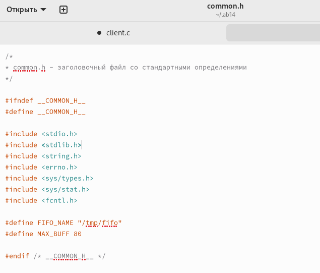

---
## Front matter
lang: ru-RU
title: "Отчет по выполнению лабораторной работы №14"
subtitle: "Дисциплина: операционные системы"
author:
  - Астраханцева А. А.
institute:
  - Российский университет дружбы народов, Москва, Россия
date: 7 мая 2023

## i18n babel
babel-lang: russian
babel-otherlangs: english

## Formatting pdf
toc: false
toc-title: Содержание
slide_level: 2
aspectratio: 169
section-titles: true
theme: metropolis
header-includes:
 - \metroset{progressbar=frametitle,sectionpage=progressbar,numbering=fraction}
 - '\makeatletter'
 - '\beamer@ignorenonframefalse'
 - '\makeatother'
---

## Докладчик

:::::::::::::: {.columns align=center}
::: {.column width="70%"}

  * Астраханцева Анастасия Александровна
  * студентка НКАбд-01-22
  * Студ. билет: 1132226437
  * Российский университет дружбы народов
  * <https://anastasiia7205.github.io/>

:::
::: {.column width="50%"}

:::
::::::::::::::

## Цель работы

Приобретение практических навыков работы с именованными каналами.

## Задание

Изучите приведённые в тексте программы server.c и client.c. Взяв данные примеры
за образец, напишите аналогичные программы, внеся следующие изменения:
1. Работает не 1 клиент, а несколько (например, два).
2. Клиенты передают текущее время с некоторой периодичностью (например, раз в пять
секунд). Используйте функцию sleep() для приостановки работы клиента.
3. Сервер работает не бесконечно, а прекращает работу через некоторое время (напри-
мер, 30 сек). Используйте функцию clock() для определения времени работы сервера.
Что будет в случае, если сервер завершит работу, не закрыв канал?

# Выполнение лабораторной работы 

## Создание файлов 

Создаем нужные файлы и записываем в них текст прогаммы

{#fig:001 width=70%}

## Текст файла client.c

Исправленный текст файла client.c 

{#fig:002 width=70%}

## Текст файла common.h

Текст файла common.h 

{#fig:003 width=70%}

## Текст файла server.c

Исправленный текст файла server.c 

{#fig:004 width=70%}

## Текст файла Makefile

Тектс файла Makefile

{#fig:005 width=70%}

## Текст файла client2.c 

Текст файла client2.c 

{#fig:006 width=70%}

## Исполняемые файлы

Далее прописываем в консоли команду `make` и получаем исполняемые файлы 

{#fig:007 width=70%}

## Исполняемые проверка работы 

Проверка работы 

{#fig:008 width=70%}

## Выводы 

В ходе выполнения лабораторной работы №14 я приобрела практические навыки работы с именованными каналами.

