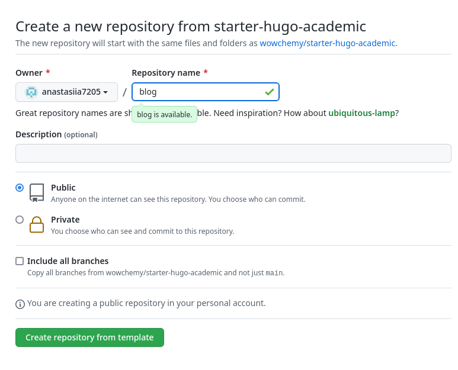
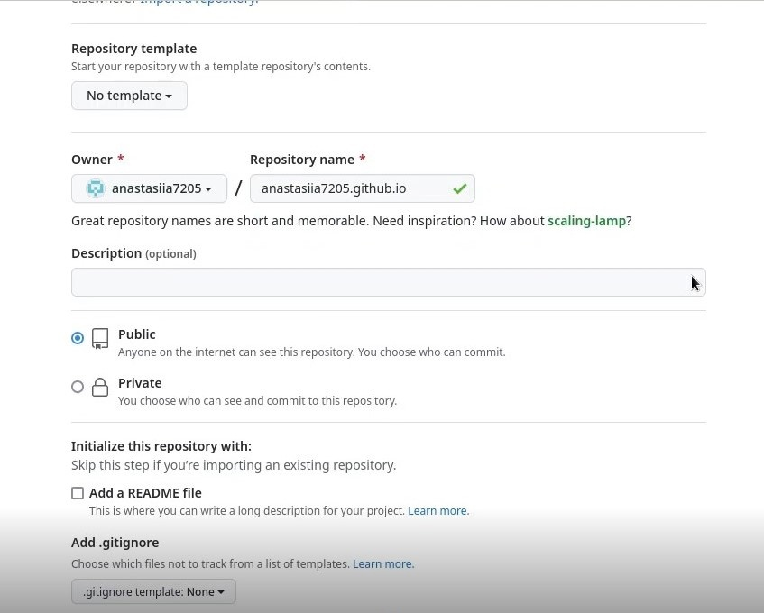
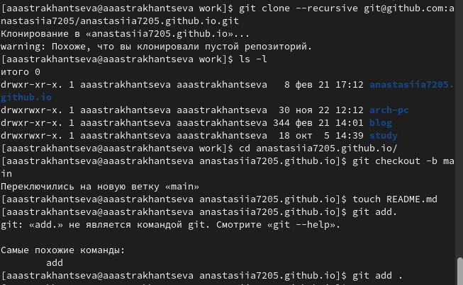

---
## Front matter
lang: ru-RU
title: "Отчет по выполнению первого этапа индивидуального проекта"
subtitle: "Дисциплина: Операционные системы"
author:
  - Астраханцева А. А.
institute:
  - Российский университет дружбы народов, Москва, Россия
 
date: 23 февраля 2023

## i18n babel
babel-lang: russian
babel-otherlangs: english

## Formatting pdf
toc: false
toc-title: Содержание
slide_level: 2
aspectratio: 169
section-titles: true
theme: metropolis
header-includes:
 - \metroset{progressbar=frametitle,sectionpage=progressbar,numbering=fraction}
 - '\makeatletter'
 - '\beamer@ignorenonframefalse'
 - '\makeatother'
---

# Информация

## Докладчик

:::::::::::::: {.columns align=center}
::: {.column width="70%"}

  * Астраханцева Анастасия Александровна
  * студентка группы НКАбд-01-22
  * Российский университет дружбы народов
  * <https://anastasiia7205.github.io/>

:::
::: {.column width="50%"}

:::
::::::::::::::

## Цель работы

Создать сайт на Hugo.

## Задачи

1. Установить необходимое программное обеспечение.
2. Создать репозиторий на основе шаблона.
3. Подключить его к git.
4. Разместить заготовку сайта на Githyb pages.

# Выполнение 

## Шаг №1

Для начала нам нужно установить необходимое ПО, а именно hugo. Выбираем версию  extended и новейшее обновление (у меня 0.110.0)

{#fig:001 width=70%}

## Шаг №2

У нас есть шаблон репозитория, на основе которго мы будем создавать сайт. Нам необходимо добавить данный репозиторий к себе, назвать его можно как "blog" 

{#fig:004 width=45%}

## Шаг №3

Далее на сайте Github создаем новый пустой репозиторий. Имя репозитория должно быть в таком формате: <название аккаунта на Github>.github.io

{#fig:013 width=45%}

## Шаг №4

Далее клонируем созданный репозиторий с помощью ссылки, которую мы скопировали ранее. Проверяем то, что наш каталог с репозиторием появился с помощью команды `ls -l`. Переходим в созданный каталог и создаем ветку "main". Создаем файл "README.md" 

{#fig:015 width=50%}

## Шаг №5

Переходим на сайт Github в репозиторий для нашего сайта. Копируем из основной ссылки часть ссылки "<имя пользователя на Github>.github.io". С помощью данной ссылки мы можем попасть на наш сайт. Теперь он доступен не только на нашем компьютере, но и абсолютно любому пользователю 

{#fig:022 width=40%}

## Выводы 

В ходе выполения первого этапа индивидуального проекта мною было установлено необходимое ПО. Выполены необходимые действия для создания сайта на Hugo.

## Список литературы

1. Сайт [электронный ресурс] - Режим доступа: https://www.calltouch.ru/blog/glossary/sajt/
2. Статический генератор сайтов Hugo. Фронтенд реалии [электронный ресурс] - Режим доступа: https://habr.com/ru/post/532738/
