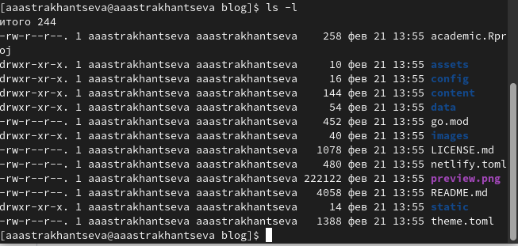

---
## Front matter
title: "Отчет по выполнению первого этапа индивидуального проекта"
subtitle: "Дисциплина: Операционные системы"
author: "Анастасия Александровна Астраханцева"

## Generic otions
lang: ru-RU
toc-title: "Содержание"

## Bibliography
bibliography: bib/cite.bib
csl: pandoc/csl/gost-r-7-0-5-2008-numeric.csl

## Pdf output format
toc: true # Table of contents
toc-depth: 2
lof: true # List of figures

fontsize: 12pt
linestretch: 1.5
papersize: a4
documentclass: scrreprt
## I18n polyglossia
polyglossia-lang:
  name: russian
  options:
	- spelling=modern
	- babelshorthands=true
polyglossia-otherlangs:
  name: english
## I18n babel
babel-lang: russian
babel-otherlangs: english
## Fonts
mainfont: PT Serif
romanfont: PT Serif
sansfont: PT Sans
monofont: PT Mono
mainfontoptions: Ligatures=TeX
romanfontoptions: Ligatures=TeX
sansfontoptions: Ligatures=TeX,Scale=MatchLowercase
monofontoptions: Scale=MatchLowercase,Scale=0.9
## Biblatex
biblatex: true
biblio-style: "gost-numeric"
biblatexoptions:
  - parentracker=true
  - backend=biber
  - hyperref=auto
  - language=auto
  - autolang=other*
  - citestyle=gost-numeric
## Pandoc-crossref LaTeX customization
figureTitle: "Рис."

listingTitle: "Листинг"
lofTitle: "Список иллюстраций"
lotTitle: "Список таблиц"
lolTitle: "Листинги"
## Misc options
indent: true
header-includes:
  - \usepackage{indentfirst}
  - \usepackage{float} # keep figures where there are in the text
  - \floatplacement{figure}{H} # keep figures where there are in the text
---

# Цель работы

Создать сайт на Hugo.

# Задание

1. Установить необходимое программное обеспечение.
2. Создать репозиторий на основе шаблона.
3. Подключить его к git.
4. Разместить заготовку сайта на Githyb pages.

# Теоретическое введение

Сайт – это информационный, коммерческий или развлекательный ресурс в интернете, который состоит из страничек с разнообразным контентом. Чтобы «завести» веб-сайт необходимо зарегистрировать доменное имя, привязать его к хостингу – сервису, который размещает страницы в сети.

Hugo — один из самых популярных генераторов статических сайтов с открытым исходным кодом, написан на языке Go. Благодаря своей удивительной скорости и гибкости, Hugo делает создание веб-сайтов увлекательным.

Он подойдет как для создания лендингов, «многостраничников» — так и для создания более сложных продуктов: блог, новостной портал и даже интернет-магазин.

# Выполнение лабораторной работы

Для начала нам нужно установить необходимое ПО, а именно hugo. Выбираем версию  extended и новейшее обновление (у меня 0.110.0) (рис. @fig:001).

{#fig:001 width=70%}

Мы устанавиваем пакет, далее нам необходимо разархивировать его и исполняющий файл hugo перенести в каталог `~/bin`, который мы создаем с помощтю коамнды `mkdir` (рис. @fig:002 - @fig:003).

{#fig:002 width=70%}

{#fig:003 width=70%}

У нас есть шаблон репозитория, на основе которго мы будем создавать сайт. Нам необходимо добавить данный репозиторий к себе, назвать его можно как "blog"  (рис. @fig:004).

{#fig:004 width=70%}

Далее нам необходимо клонировать созданный ранее репозиторий (рис. @fig:005).

{#fig:005 width=70%}

После этого переходим в каталог "blog", который был создан при клонировании репозитория. Проверяем наличие всех файлов в данном каталоге (рис. @fig:006).

{#fig:006 width=70%}

Запускаем hugo в каталоге "blog". После этого проверяем содержимое каталога: у нас появился каталог "public", который нам нужно удалить. Сделаем мы это с помощью mc. В дальнейшем мы создадим его снова (рис. @fig:007 - @fig:009).

{#fig:007 width=70%}

{#fig:008 width=70%}

{#fig:009 width=70%}

Далее нужно запросить ссылку на наш сайт с помощью команды `~/bin/hugo server`. По данной ссылке мы переходим на наш сайт. Этот сайт пока что виден только на моем компьютере (рис. @fig:010 - @fig:012).

{#fig:010 width=70%}

{#fig:011 width=70%}

{#fig:012 width=70%}

Далее на сайте Github создаем новый пустой репозиторий. Имя репозитория должно быть в таком формате: <название аккаунта на Github>.github.io (рис. @fig:013).

{#fig:013 width=70%}

После того, как мы создали репозиторий, нам нужно скопировать ссылку на него (рис. @fig:014).

{#fig:014 width=70%}

Далее клонируем созданный репозиторий с помощью ссылки, которую мы скопировали ранее. Проверяем то, что наш каталог с репозиторием появился с помощью команды `ls -l`. Переходим в созданный каталог и создаем ветку "main". Создаем файл "README.md" (рис. @fig:015).

{#fig:015 width=70%}

Далее отправляем изменения на git (рис. @fig:016).

{#fig:016 width=70%}

Переходим в каталог "blog". Привязыываем наш сайт к каталогу "public". Все изменения, которые мы бедм производить в папке "public" будут отображаться на нашем сайте. 
С первого раза у меня не получилось это сделать, потому что "public" игнорируеся. Чтобы исправить это нужно в файле ".gitignore" закоментировать "public". Я сделала это с помощью mc (рис. @fig:017 - @fig:018).

{#fig:017 width=70%}

{#fig:018 width=70%}

После того, как мы закоментрвали public, повторяем команду. Далее запускаем hugo и видим, что все файлы для редактированиия нашего сайта сохраняются в каталог public (рис. @fig:019).

{#fig:019 width=70%}

Переходим в каталог public и проверяем подключенние. После этого отправляем все изменения на Git (рис. @fig:020 - @fig:021).

{#fig:020 width=70%}

{#fig:021 width=70%}

Переходим на сайт Github в репозиторий для нашего сайта. Копируем из основной ссылки часть ссылки "<имя пользователя на Github>.github.io". С помощью данной ссылки мы можем попасть на наш сайт. Теперь он доступен не только на нашем компьютере, но и абсолютно любому пользователю (рис. @fig:022).

{#fig:022 width=70%}

# Выводы

В ходе выполения первого этапа индивидуального проекта мною было установлено необходимое ПО. Выполены необходимые действия для создания сайта на Hugo.

# Список литературы{.unnumbered}

1. Сайт [электронный ресурс] - Режим доступа: https://www.calltouch.ru/blog/glossary/sajt/
2. Статический генератор сайтов Hugo. Фронтенд реалии [электронный ресурс] - Режим доступа: https://habr.com/ru/post/532738/
