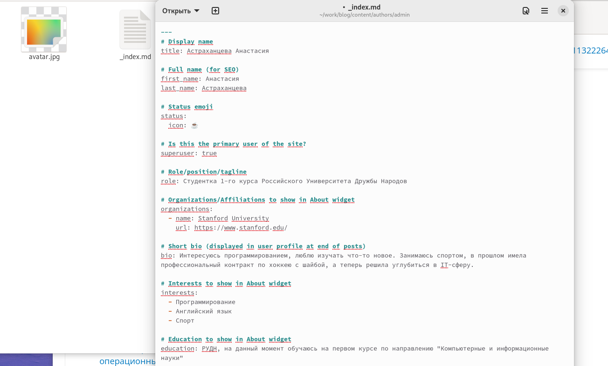
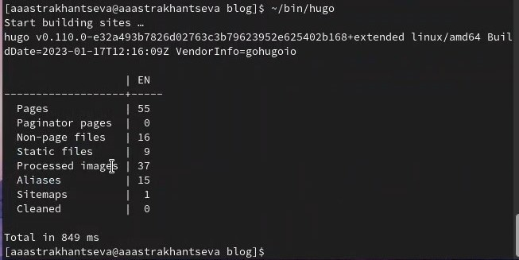
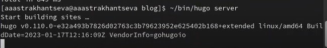
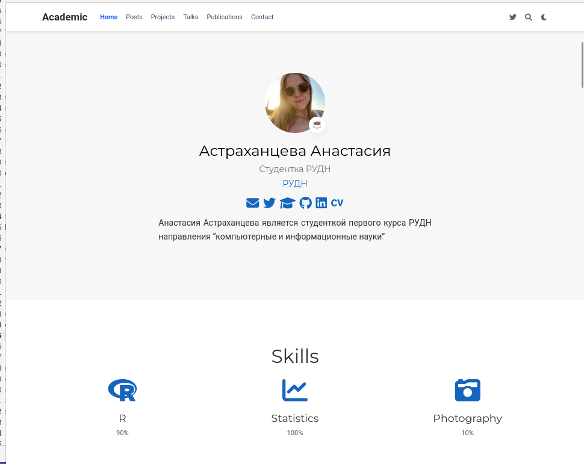
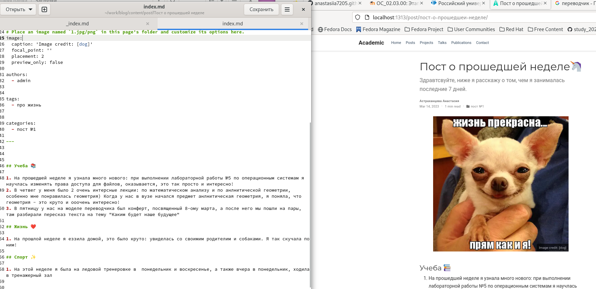
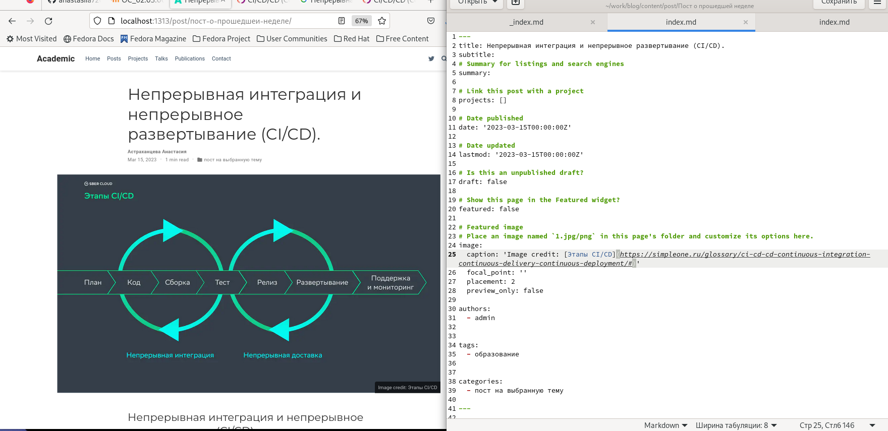
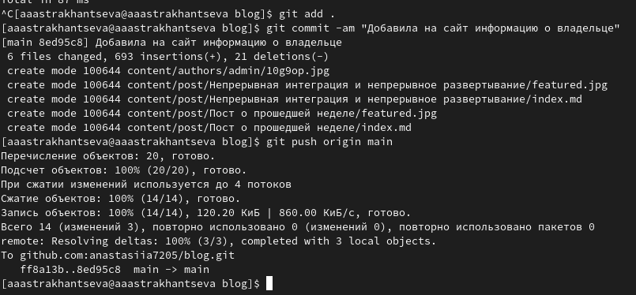

---
## Front matter
lang: ru-RU
title: "Отчет о выполнении второго этапа индивидуального проекта"
subtitle: "Дисциплина: опреационные системы"
author:
  - Астраханцева А. А.
institute:
  - Российский университет дружбы народов, Москва, Россия

date: 15 марта 2023

## i18n babel
babel-lang: russian
babel-otherlangs: english

## Formatting pdf
toc: false
toc-title: Содержание
slide_level: 2
aspectratio: 169
section-titles: true
theme: metropolis
header-includes:
 - \metroset{progressbar=frametitle,sectionpage=progressbar,numbering=fraction}
 - '\makeatletter'
 - '\beamer@ignorenonframefalse'
 - '\makeatother'
---

# Информация

## Докладчик

:::::::::::::: {.columns align=center}
::: {.column width="70%"}

  * Астраханцева А. А.
  * Студентка группы НКАбд-01-22
  * Российский университет дружбы народов
  * <https://anastasiia7205.github.io/>

:::
::: {.column width="50%"}

:::
::::::::::::::

## Цель работы

Приобрести практические навыки в редактировании информации о владельце сайта, а также  в написании постов.

## Задание 

Добавить к сайту данные о себе.

    1. Список добавляемых данных:
        1. Разместить фотографию владельца сайта.
        2. Разместить краткое описание владельца сайта (Biography).
        3. Добавить информацию об интересах (Interests).
        4. Добавить информацию от образовании (Education).
    2. Сделать пост по прошедшей неделе.
    3. Добавить пост на тему по выбору:
        1. Управление версиями. Git.
        2. Непрерывная интеграция и непрерывное развертывание (CI/CD).

# Ход выполнения

## Размещение фото

Первым делом нам требовалось разместить фотографию владельца сайта, после этого, заполнить основную информацию о владельце.

{width=50%}

## Запуск hugo

После этого в терминале нужно запустить hugo, получить ссылку на сайт с помощью hugo server 

{width=60%}

## Запуск hugo

{width=70%}

## Сайт

Перейдя по ссылке, которую мы получили с помощью hugo server маы попадем на наш сайт

{width=50%}

## Пост о прощедшей неделе

После этого нужно написать пост о прошедщей неделе. 

{width=60%}

## Пост на выбранную тему

Далее нужно написать пост на выбранную тему. Я решила написать пост на тему "Непрерывная интеграция и непрерывное развертывание (CI/CD)".

{width=70%}

Сохраняем и проверяем, что пост появился на сайте.

## Отправка на гит

Далее нужно загрузить наши изменениея на гит

{width=70%}

## Выводы

В ходе выполнения второго этапа индивидуального проекта я приобрела практические навыки в редактировании информации о владельце сайта, а также  в написании постов.

