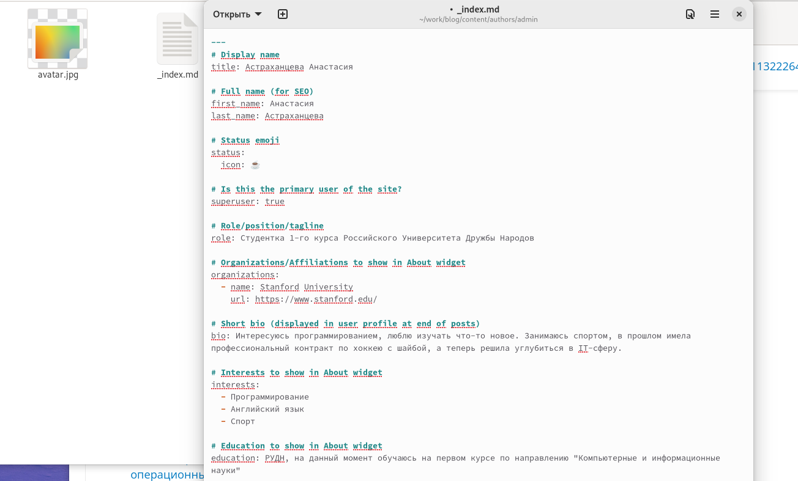
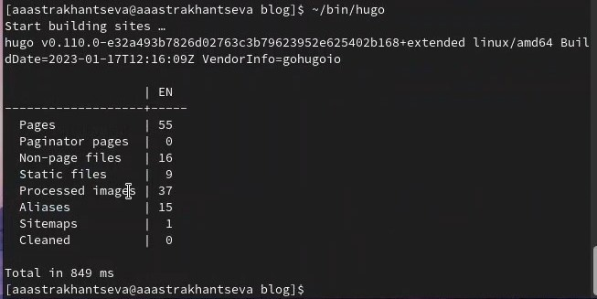
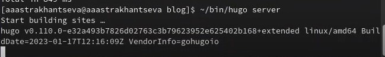
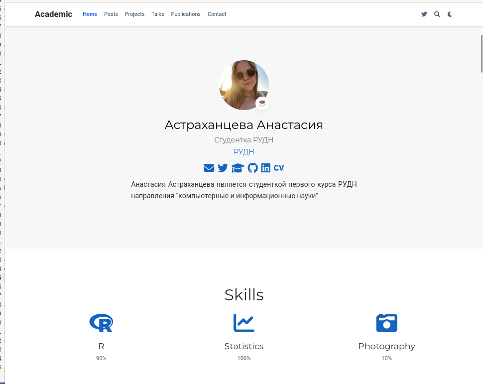
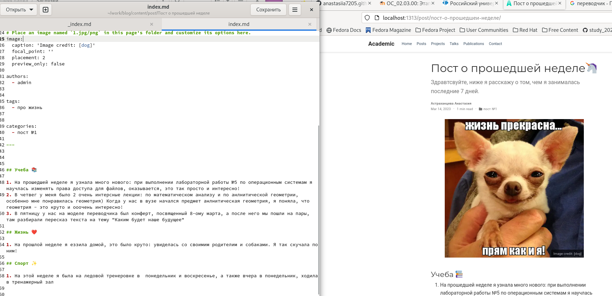
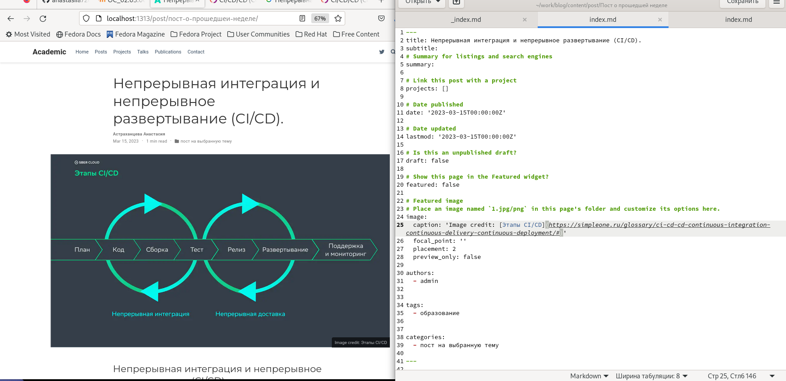
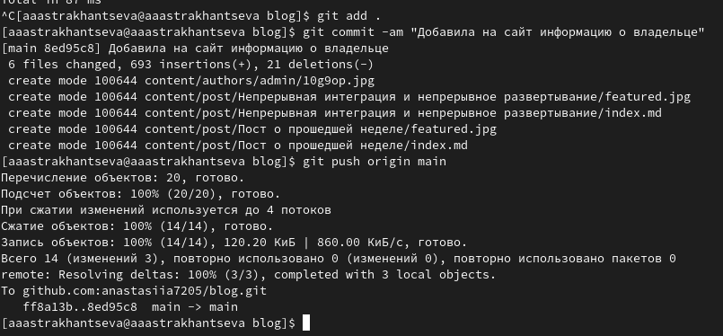

---
## Front matter
title: "Отчет о выполнении второго этапа индивидуального проекта"
subtitle: "Дисциплина: опреционные системы"
author: "Астраханцева Анастасия Александровна"

## Generic otions
lang: ru-RU
toc-title: "Содержание"

## Bibliography
bibliography: bib/cite.bib
csl: pandoc/csl/gost-r-7-0-5-2008-numeric.csl

## Pdf output format
toc: true # Table of contents
toc-depth: 2
lof: true # List of figures
lot: false # List of tables
fontsize: 12pt
linestretch: 1.5
papersize: a4
documentclass: scrreprt
## I18n polyglossia
polyglossia-lang:
  name: russian
  options:
	- spelling=modern
	- babelshorthands=true
polyglossia-otherlangs:
  name: english
## I18n babel
babel-lang: russian
babel-otherlangs: english
## Fonts
mainfont: PT Serif
romanfont: PT Serif
sansfont: PT Sans
monofont: PT Mono
mainfontoptions: Ligatures=TeX
romanfontoptions: Ligatures=TeX
sansfontoptions: Ligatures=TeX,Scale=MatchLowercase
monofontoptions: Scale=MatchLowercase,Scale=0.9
## Biblatex
biblatex: true
biblio-style: "gost-numeric"
biblatexoptions:
  - parentracker=true
  - backend=biber
  - hyperref=auto
  - language=auto
  - autolang=other*
  - citestyle=gost-numeric
## Pandoc-crossref LaTeX customization
figureTitle: "Рис."
tableTitle: "Таблица"
listingTitle: "Листинг"
lofTitle: "Список иллюстраций"
lotTitle: "Список таблиц"
lolTitle: "Листинги"
## Misc options
indent: true
header-includes:
  - \usepackage{indentfirst}
  - \usepackage{float} # keep figures where there are in the text
  - \floatplacement{figure}{H} # keep figures where there are in the text
---

# Цель работы

Приобрести практические навыки в редактировании информации о владельце сайта, а также  в написании постов.

# Задание

Добавить к сайту данные о себе.

    1. Список добавляемых данных:
        1. Разместить фотографию владельца сайта.
        2. Разместить краткое описание владельца сайта (Biography).
        3. Добавить информацию об интересах (Interests).
        4. Добавить информацию от образовании (Education).
    2. Сделать пост по прошедшей неделе.
    3. Добавить пост на тему по выбору:
        1. Управление версиями. Git.
        2. Непрерывная интеграция и непрерывное развертывание (CI/CD).

# Теоретическое введение

Сайт – это информационный, коммерческий или развлекательный ресурс в интернете, который состоит из страничек с разнообразным контентом. Чтобы «завести» веб-сайт необходимо зарегистрировать доменное имя, привязать его к хостингу – сервису, который размещает страницы в сети.

Hugo — один из самых популярных генераторов статических сайтов с открытым исходным кодом, написан на языке Go. Благодаря своей удивительной скорости и гибкости, Hugo делает создание веб-сайтов увлекательным.

Он подойдет как для создания лендингов, «многостраничников» — так и для создания более сложных продуктов: блог, новостной портал и даже интернет-магазин.

# Выполнение 

Первым делом нам требовалось разместить фотографию владельца сайта, после этого, заполнить основную информацию о владельце, а именно: информация об интересах, об образовании.
Для того, чтоюы разместить фото на сайте, необходимо перенести нужно фото в каталог ~/work/blog/content/authors/admin. Далее нужно было править файл _index.md из этого же каталога (рис. @fig:001).

{#fig:001 width=70%}

После этого в терминале нужно запустить hugo, получить ссылку на сайт с помощью hugo server (рис. @fig:002 - рис. @fig:003)

{#fig:002 width=70%}

{#fig:003 width=70%}

Перейдя по ссылке, которую мы получили с помощью hugo server маы попадем на наш сайт

{#fig:004 width=70%}

После этого нужно написать пост о прошедщей неделе. Для этого переходим в каталог ~/work/blog/content/post, создаем в нем каталог с именем "Пост о прошедщей неделе". Пример поста мы копируем из каталога  ~/work/blog/content/post/getting-started. Копируем содержимое этого каталога с наш каталог с именем "Пост о прошедщей неделе" и начинаем править файл index.md (рис. @fig:005).

{#fig:005 width=70%}

Сохраняем и проверяем, что пост появился на сайте.

Далее нужно написать пост на выбранную тему. Я решила написать пост на тему "Непрерывная интеграция и непрерывное развертывание (CI/CD)". Снова в каталоге ~/work/blog/content/post создаю новый каталог, который будет называться "Непрерывная интеграция и непрерывное развертывание" (рис. @fig:006).

{#fig:006 width=70%}

Сохраняем и проверяем, что пост появился на сайте.

Далее нужно загрузить наши изменениея на гит (рис. @fig:007).

{#fig:007 width=70%}

# Выводы

В ходе выполнения второго этапа индивидуального проекта я приобрела практические навыки в редактировании информации о владельце сайта, а также  в написании постов.

