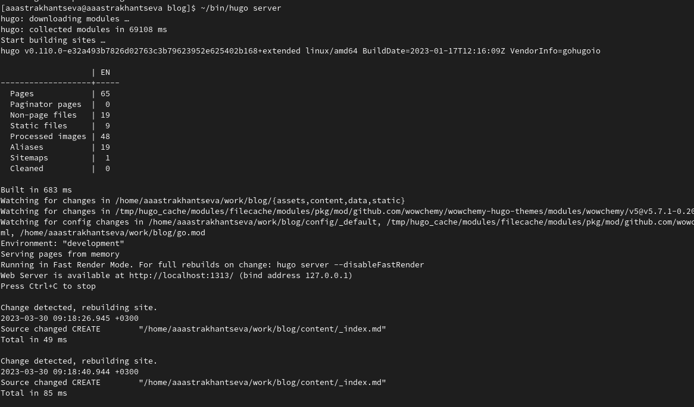
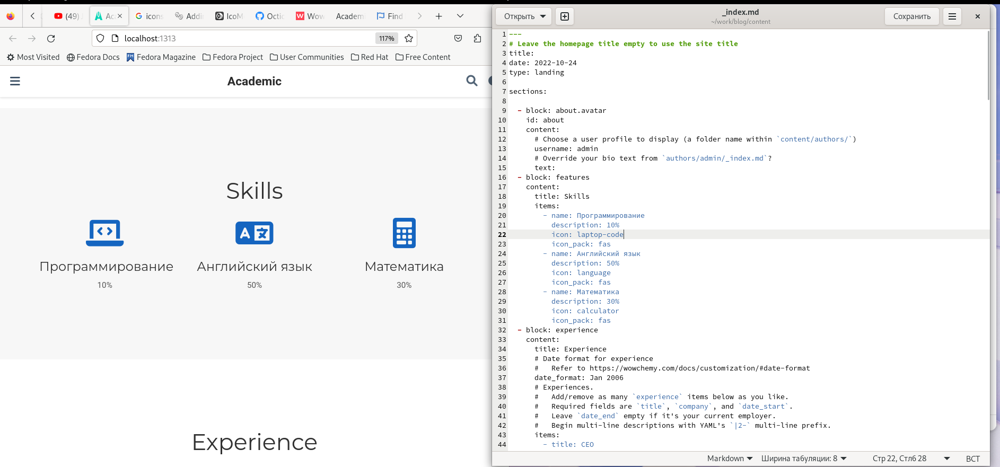
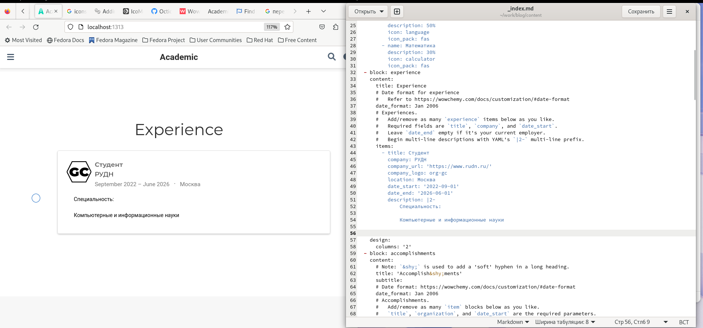
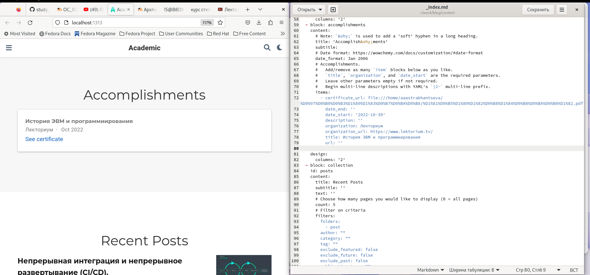
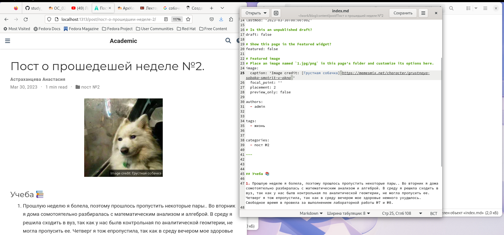
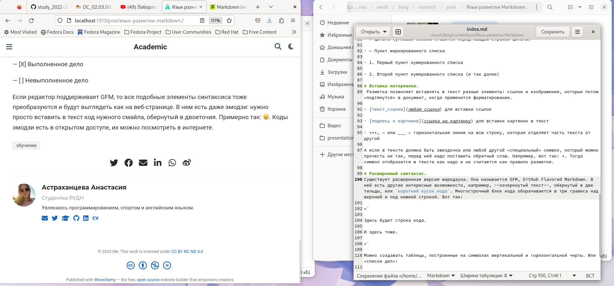
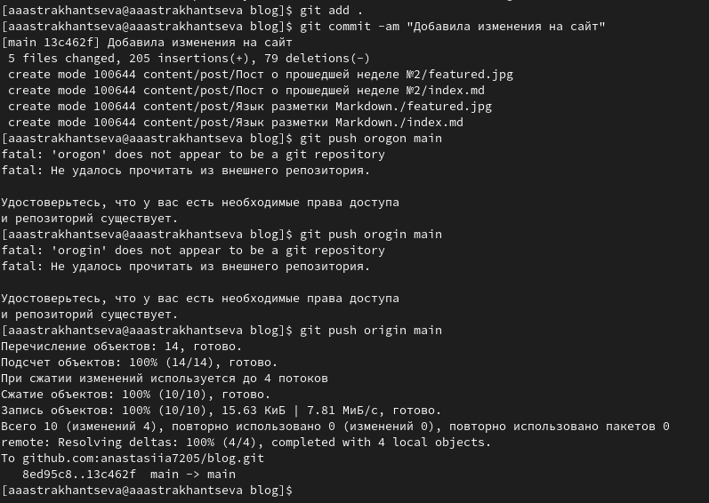

---
## Front matter
lang: ru-RU
title: "Отчет о выполнении третьего этапа индивидуального проекта"
subtitle: "Дисциплина: опреационные системы"
author:
  - Астраханцева А. А.
institute:
  - Российский университет дружбы народов, Москва, Россия
date: 30 марта 2023

## i18n babel
babel-lang: russian
babel-otherlangs: english

## Formatting pdf
toc: false
toc-title: Содержание
slide_level: 2
aspectratio: 169
section-titles: true
theme: metropolis
header-includes:
 - \metroset{progressbar=frametitle,sectionpage=progressbar,numbering=fraction}
 - '\makeatletter'
 - '\beamer@ignorenonframefalse'
 - '\makeatother'
---

# Информация

## Докладчик

:::::::::::::: {.columns align=center}
::: {.column width="70%"}

  * Астраханцева А. А.
  * Студентка группы НКАбд-01-22
  * Российский университет дружбы народов
  * <https://anastasiia7205.github.io/>

:::
::: {.column width="50%"}

:::
::::::::::::::

## Цель работы

Приобрести практические навыки в редактировании информации о владельце сайта, а также  в написании постов.

## Задание

Добавить к сайту достижения. Список достижений:

        1. Добавить информацию о навыках (Skills).
        2. Добавить информацию об опыте (Experience).
        3. Добавить информацию о достижениях (Accomplishments).
        
    Сделать пост по прошедшей неделе.
    
    Добавить пост на тему по выбору:
        1. Легковесные языки разметки.
        2. Языки разметки. LaTeX.
        3. Язык разметки Markdown.

# Выполнение 

## Получим ссылку на сайт

Для начала перейдем в каталог work/blog и запросим ссылку на наш сайт с помощью команды ~/bin/hugo sеrver 

{width=60%}

## Правка информации о себе, часть 1

Далее переходим в каталог work/blog/content и открываем файл _index.md. Находим блок "Skills" и правим информацию о себе. После нажатия на кнопку "сохранть" изменения автоматически появляются на сайте 

{width=70%}

## Правка информации о себе, часть 2

Правим информацию в блоке "Experience" в том же файле 

{width=70%}

## Правка информации о себе, часть 3

Правим информацию в блоке "Accomplishments" в том же файле 

{width=70%}

## Пост о прошедшей неделе

Далее нужно было написать пост о прошедшей неделе. Для этого переходим в каталог ~/work/blog/content/post, создаем в нем каталог с именем "Пост о прошедщей неделе №2". 

{width=70%}

## Пост на выбранную тему

Далее нужно написать пост на выбранную тему. Я решила написать пост на тему "Язык разметки Markdown". Снова в каталоге ~/work/blog/content/post создаю новый каталог, который будет называться "Язык разметки Markdown"

{width=70%}

## Отпавка изменений на гит

После завершения изменений сайта отправляем изменения на гит, сначала делаем это из каталога blog, потом из public 

{ width=60%}

## Выводы

В ходе выполнения третьего этапа индивидуального проекта я приобрела практические навыки в редактировании информации о владельце сайта, а также  в написании постов.

