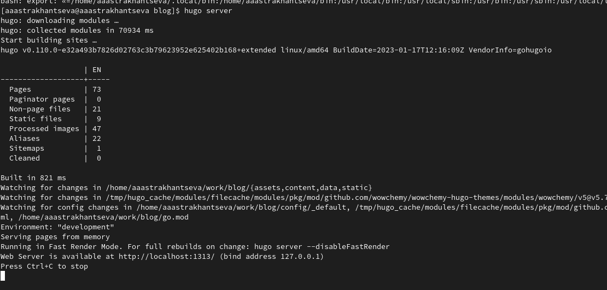
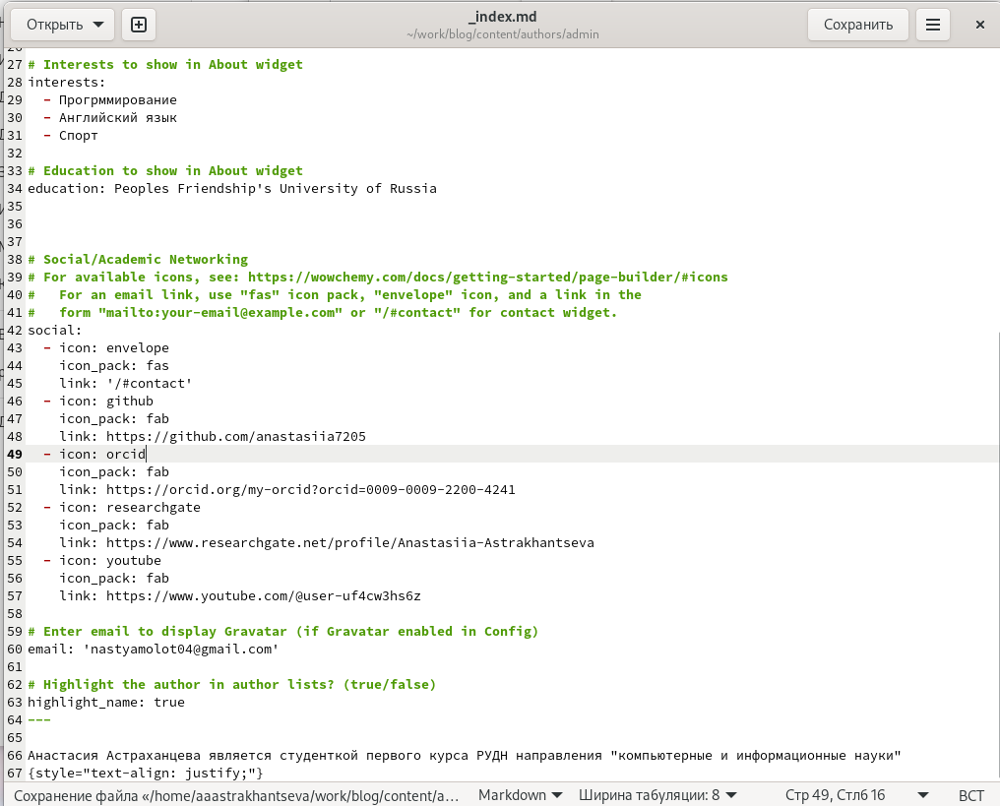
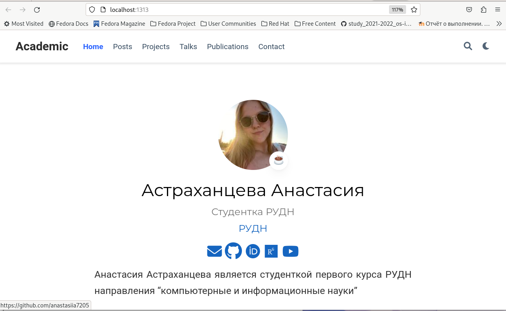
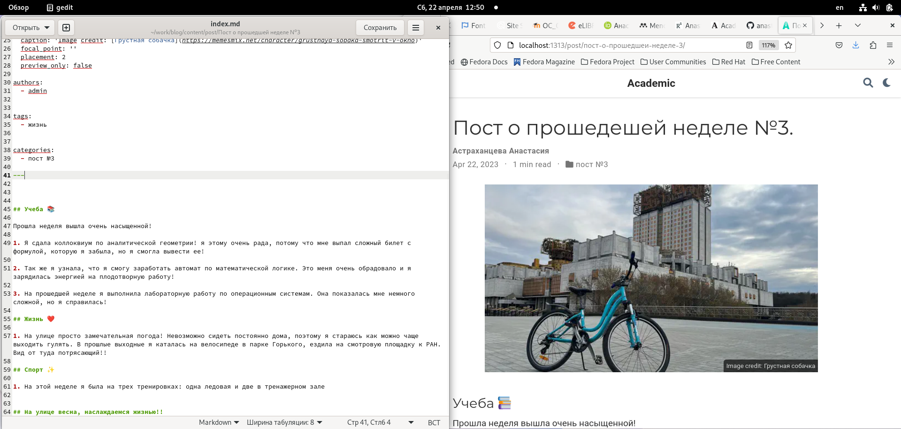
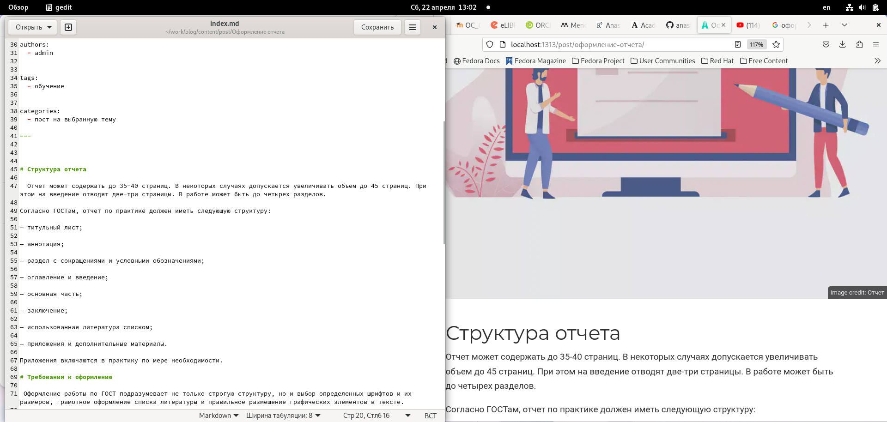
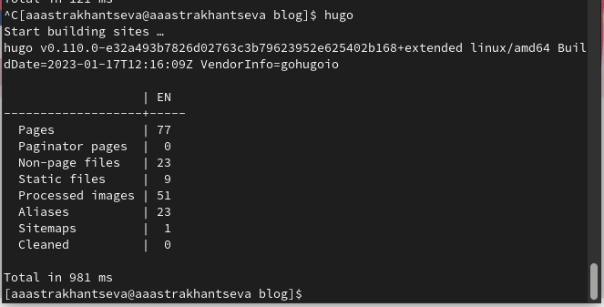
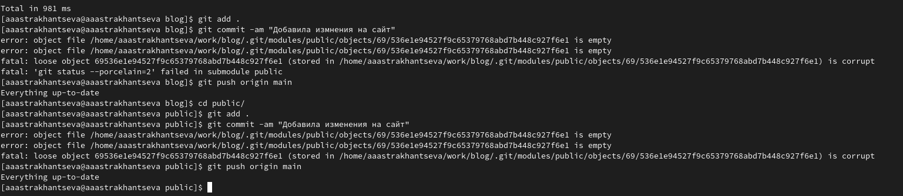

---
## Front matter
lang: ru-RU
title: "Отчет о выполнении четвертого этапа индивидуального проекта"
subtitle: "Дисциплина: опреационные системы"
author:
  - Астраханцева А. А.
institute:
  - Российский университет дружбы народов, Москва, Россия
date: 22 апреля 2023

## i18n babel
babel-lang: russian
babel-otherlangs: english

## Formatting pdf
toc: false
toc-title: Содержание
slide_level: 2
aspectratio: 169
section-titles: true
theme: metropolis
header-includes:
 - \metroset{progressbar=frametitle,sectionpage=progressbar,numbering=fraction}
 - '\makeatletter'
 - '\beamer@ignorenonframefalse'
 - '\makeatother'
---

# Информация

## Докладчик

:::::::::::::: {.columns align=center}
::: {.column width="70%"}

  * Астраханцева А. А.
  * Студентка группы НКАбд-01-22
  * Российский университет дружбы народов
  * <https://anastasiia7205.github.io/>

:::
::: {.column width="50%"}

:::
::::::::::::::

## Цель работы

Приобрести практические навыки в редактировании информации о владельце сайта, а также  в написании постов.

# Выполнение 

## Получим ссылку на сайт

Для начала с помощью команды `hugo server` получаем сслыку на наш сайт.

{#fig:001 width=70%}

## Правка информации о себе

После регистрации на указанных сервисах прикрепляем ссылки на наш аккаунт на сайт. Для этого редактируем файл "_index.md", который находится в каталоге`~/work/blog/content/authors/admin`.

{#fig:002 width=55%}

## Проверка изменений на сайте

Проверяем, что на сайте отображается вся информация, которую мы добавили.

{#fig:003 width=70%}

## Пост о прошедшей неделе

Далее пишем пост о прошедшей неделе.

{#fig:004 width=80%}

## Пост на выбранную тему

Пишем пост на тему по выбору. Мой пост на тему "оформление отчета".

{#fig:005 width=80%}

## Сборка сайта

После этого собираем наш сайт с помощью команды `hugo`.

{#fig:006 width=80%}

## Отпавка изменений на гит

Отправляем изменения на гит из каталога blog и из каталога public.

{#fig:007 width=80%}

## Выводы

В ходе выполнения четвертого этапа индивидуального проекта я приобрела практические навыки в редактировании информации о владельце сайта, а также  в написании постов.
