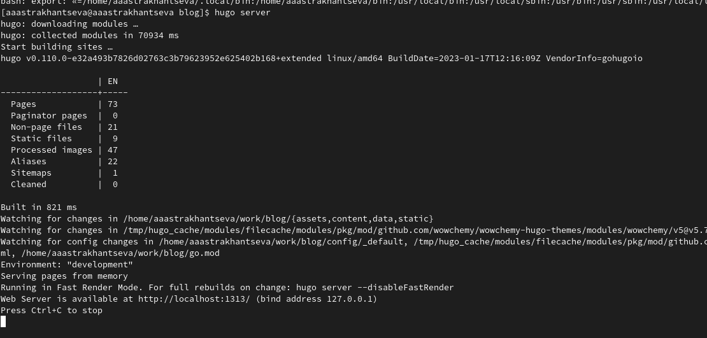
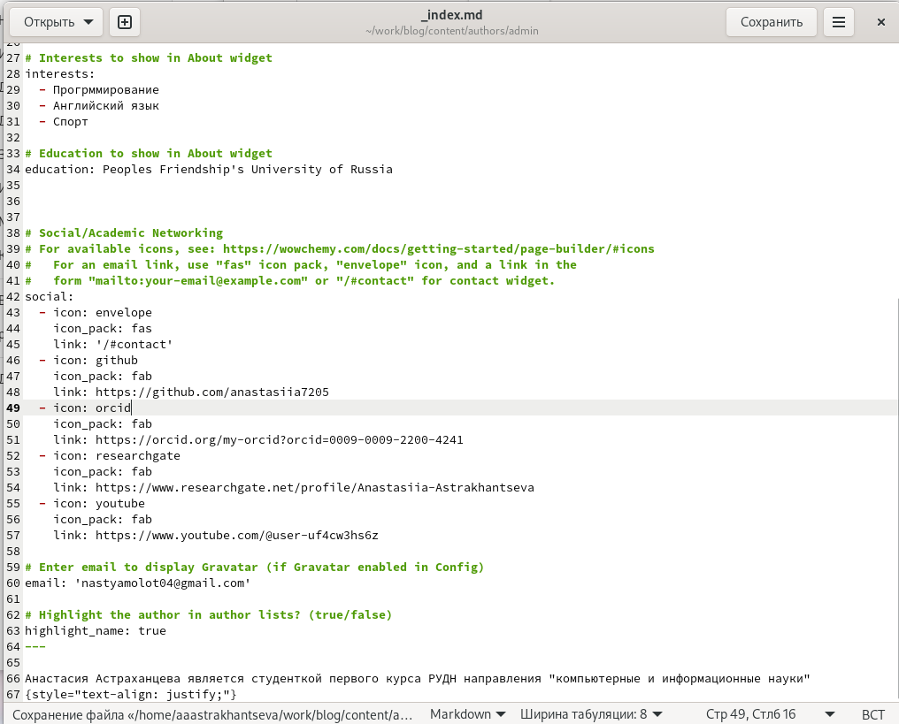
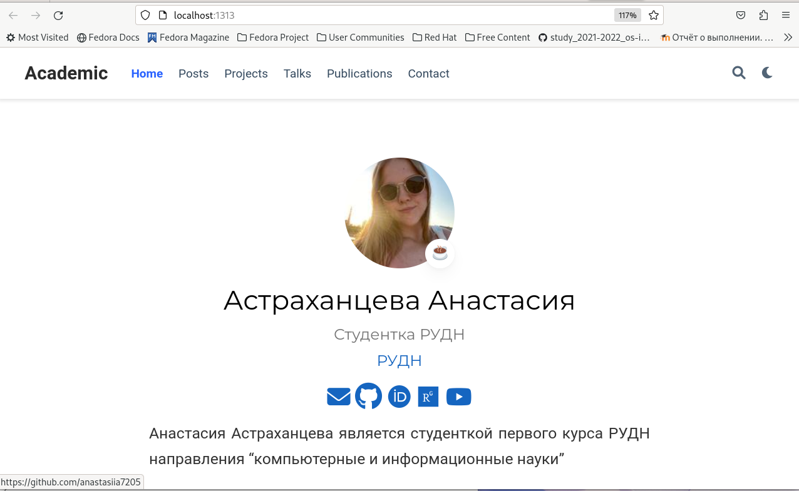
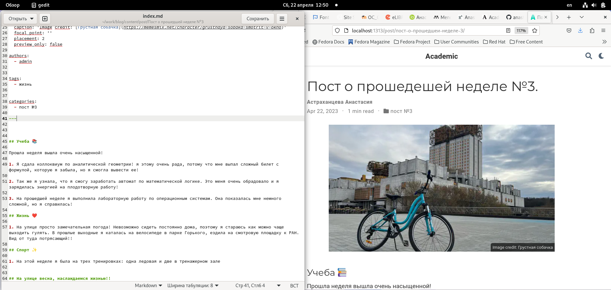
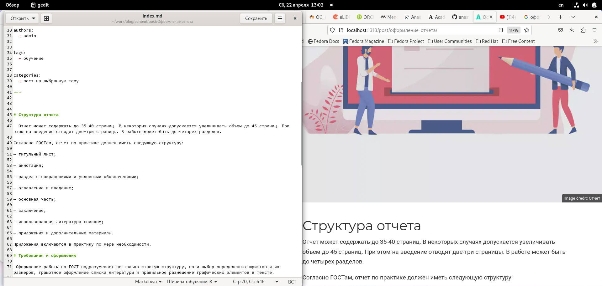
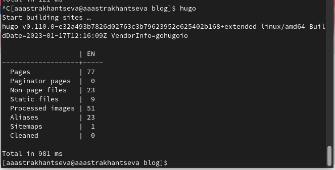
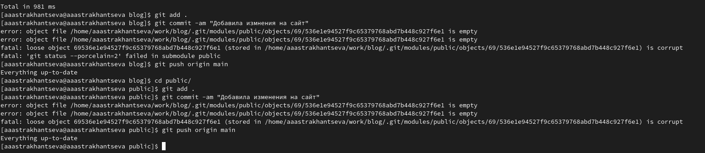

---
## Front matter
title: "Четвертый этап индивидульного проекта"
subtitle: "Дисциплина: операционные системы"
author: "Астраханцева А. А."

## Generic otions
lang: ru-RU
toc-title: "Содержание"

## Bibliography
bibliography: bib/cite.bib
csl: pandoc/csl/gost-r-7-0-5-2008-numeric.csl

## Pdf output format
toc: true # Table of contents
toc-depth: 2
lof: true # List of figures
lot: false # List of tables
fontsize: 12pt
linestretch: 1.5
papersize: a4
documentclass: scrreprt
## I18n polyglossia
polyglossia-lang:
  name: russian
  options:
	- spelling=modern
	- babelshorthands=true
polyglossia-otherlangs:
  name: english
## I18n babel
babel-lang: russian
babel-otherlangs: english
## Fonts
mainfont: PT Serif
romanfont: PT Serif
sansfont: PT Sans
monofont: PT Mono
mainfontoptions: Ligatures=TeX
romanfontoptions: Ligatures=TeX
sansfontoptions: Ligatures=TeX,Scale=MatchLowercase
monofontoptions: Scale=MatchLowercase,Scale=0.9
## Biblatex
biblatex: true
biblio-style: "gost-numeric"
biblatexoptions:
  - parentracker=true
  - backend=biber
  - hyperref=auto
  - language=auto
  - autolang=other*
  - citestyle=gost-numeric
## Pandoc-crossref LaTeX customization
figureTitle: "Рис."
tableTitle: "Таблица"
listingTitle: "Листинг"
lofTitle: "Список иллюстраций"
lotTitle: "Список таблиц"
lolTitle: "Листинги"
## Misc options
indent: true
header-includes:
  - \usepackage{indentfirst}
  - \usepackage{float} # keep figures where there are in the text
  - \floatplacement{figure}{H} # keep figures where there are in the text
---

# Цель работы

Приобрести практические навыки в редактировании информации о владельце сайта, а также в написании постов.

# Задание

Добавить к сайту ссылки на научные и библиометрические ресурсы:

    1. Зарегистрироваться на соответствующих 
    ресурсах и разместить на них ссылки на сайте:
        eLibrary : https://elibrary.ru/;
        Google Scholar : https://scholar.google.com/;
        ORCID : https://orcid.org/;
        Mendeley : https://www.mendeley.com/;
        ResearchGate : https://www.researchgate.net/;
        Academia.edu : https://www.academia.edu/;
        arXiv : https://arxiv.org/;
        github : https://github.com/.
    2. Сделать пост по прошедшей неделе.
    3. Добавить пост на тему по выбору:
        Оформление отчёта.
        Создание презентаций.
        Работа с библиографией.

# Теоретическое введение

Сайт – это информационный, коммерческий или развлекательный ресурс в интернете, который состоит из страничек с разнообразным контентом. Чтобы «завести» веб-сайт необходимо зарегистрировать доменное имя, привязать его к хостингу – сервису, который размещает страницы в сети.

Hugo — один из самых популярных генераторов статических сайтов с открытым исходным кодом, написан на языке Go. Благодаря своей удивительной скорости и гибкости, Hugo делает создание веб-сайтов увлекательным.

Он подойдет как для создания лендингов, «многостраничников» — так и для создания более сложных продуктов: блог, новостной портал и даже интернет-магазин.

# Выполнение 

Для начала с помощью команды `hugo server` получаем сслыку на наш сайт (рис. @fig:001).

{#fig:001 width=70%}

После регистрации на указанных сервисах прикрепляем ссылки на наш аккаунт на сайт. Для этого редактируем файл "_index.md", который находится в каталоге`~/work/blog/content/authors/admin`  (рис. @fig:002).

{#fig:002 width=70%}

Проверяем, что на сайте отображается вся информация, которую мы добавили (рис. @fig:003).

{#fig:003 width=80%}

Далее пишем пост о прошедшей неделе (рис. @fig:004).

{#fig:004 width=80%}

Пишем пост на тему по выбору. Мой пост на тему "оформление отчета" (рис. @fig:005).

{#fig:005 width=80%}

После этого собираем наш сайт с помощью команды `hugo` (рис. @fig:006).

{#fig:006 width=80%}

Отправляем изменения на гит из каталога blog и из каталога public (рис. @fig:007).

{#fig:007 width=80%}

# Выводы

В ходе выполнения второго этапа индивидуального проекта я приобрела практические навыки в редактировании информации о владельце сайта, а также  в написании постов.

