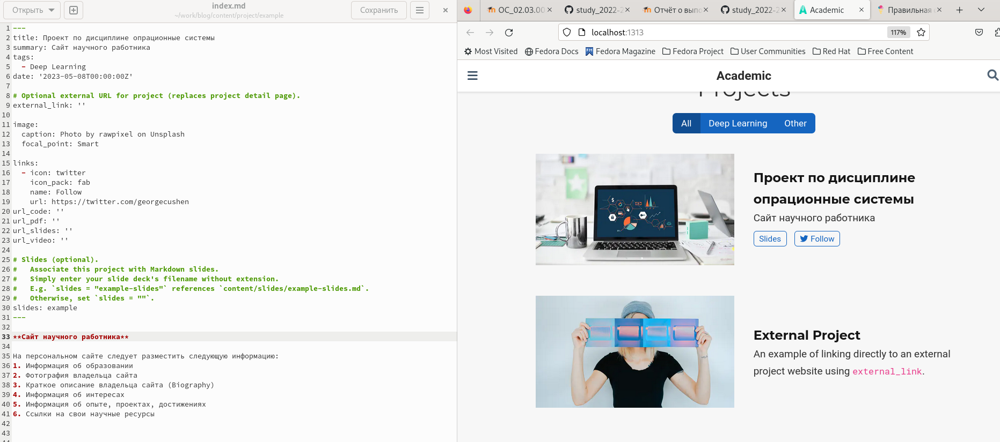
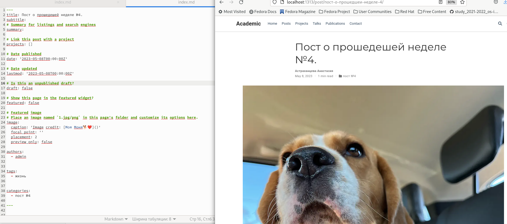
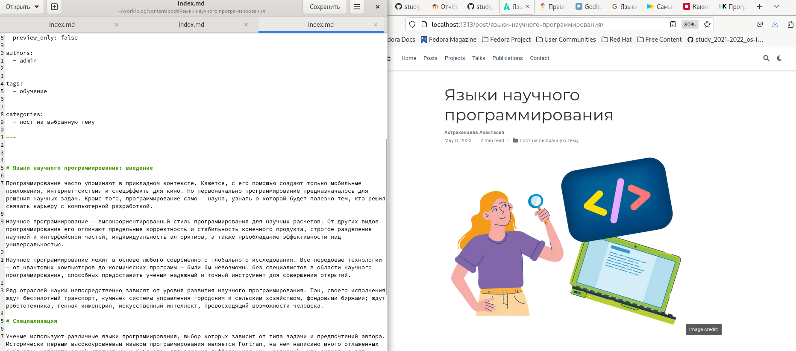
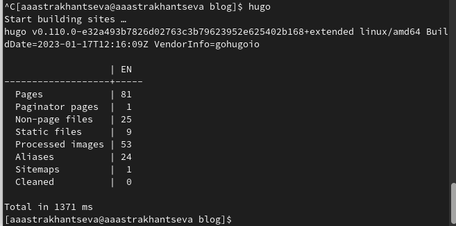
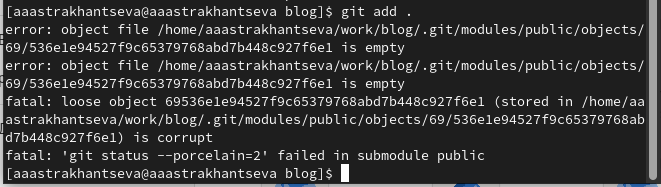

---
## Front matter
lang: ru-RU
title: "Отчет о выполнении пятого этапа индивидуального проекта"
subtitle: "Дисциплина: опреационные системы"
author:
  - Астраханцева А. А.
institute:
  - Российский университет дружбы народов, Москва, Россия
date: 8 мая 2023

## i18n babel
babel-lang: russian
babel-otherlangs: english

## Formatting pdf
toc: false
toc-title: Содержание
slide_level: 2
aspectratio: 169
section-titles: true
theme: metropolis
header-includes:
 - \metroset{progressbar=frametitle,sectionpage=progressbar,numbering=fraction}
 - '\makeatletter'
 - '\beamer@ignorenonframefalse'
 - '\makeatother'
---

## Докладчик

:::::::::::::: {.columns align=center}
::: {.column width="70%"}

  * Астраханцева А. А.
  * Студентка группы НКАбд-01-22
  * Российский университет дружбы народов
  * <https://anastasiia7205.github.io/>

:::
::: {.column width="50%"}

:::
::::::::::::::

## Цель работы

Приобрести практические навыки в редактировании информации о владельце сайта, а также  в написании постов.

## Задание

1. Добавить с сайту все остальные элементы.
2. Сделать записи для персональных проектов.
3. Сделать пост по прошедшей неделе.
4. Добавить пост на тему: "Языки научного программирования."

# Выполнение 

## Заполение информации о проекте 

Запускаем сайт и запрашиваем ссылку с помощью команды `hugo server`. После этого в каталоге ~/work/blog/content/project/example редакттруем файл index.md, проверяем, что изменения появились на сайте

{#fig:001 width=70%}

## Пост о прошедшей неделе

Далее наужно написать пост о прошедшей неделе

{#fig:002 width=70%}

## Пост на выбранную тему

Написание поста на тему по выбору

{#fig:003 width=70%}

## Сборка сайта

Собираем наш сайт, для этого прописываем `hugo` 

{#fig:004 width=70%}

## Отпавка изменений на гит

Отправляем изменеия на гит 

{#fig:005 width=70%}

## Выводы

В ходе выполнения третьего этапа индивидуального проекта я приобрела практические навыки в редактировании информации о владельце сайта, а также  в написании постов.

